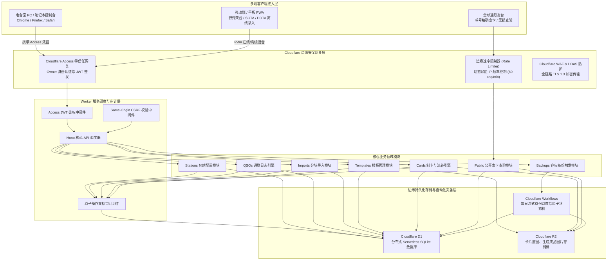
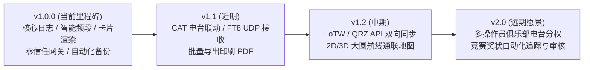

# myQSL 产品需求规格与系统技术白皮书 (PRD)

> **版本**：v1.0.0 (Release Candidate to General Availability)  
> **状态**：已正式投产并在全球边缘网络上线运行  
> **更新日期**：2026-09-05  
> **生产域名**：`https://myqsl.203031.xyz`  
> **项目代码库**：[neilshare/myQSL](https://github.com/neilshare/myQSL)

---

## 目录

- [1. 产品愿景与业务全景](#1-产品愿景与业务全景)
  - [1.1 业务背景与用户痛点](#11-业务背景与用户痛点)
  - [1.2 产品核心定位](#12-产品核心定位)
  - [1.3 v1.0.0 核心价值主张](#13-v100-核心价值主张)
- [2. 系统架构与工程设计](#2-系统架构与工程设计)
  - [2.1 整体架构拓扑](#21-整体架构拓扑)
  - [2.2 客户端接入与边缘安全网关](#22-客户端接入与边缘安全网关)
  - [2.3 Modular Worker Monolith 业务运行时](#23-modular-worker-monolith-业务运行时)
  - [2.4 边缘持久化与对象存储分层](#24-边缘持久化与对象存储分层)
  - [2.5 Monorepo 模块分层与单向依赖守则](#25-monorepo-模块分层与单向依赖守则)
- [3. 技术方案选型决策推演](#3-技术方案选型决策推演)
  - [3.1 行业典型方案对比矩阵](#31-行业典型方案对比矩阵)
  - [3.2 为什么选择 Cloudflare 全 Serverless 边缘栈](#32-为什么选择-cloudflare-全-serverless-边缘栈)
  - [3.3 数据库选型：Cloudflare D1 (Serverless SQLite)](#33-数据库选型cloudflare-d1-serverless-sqlite)
  - [3.4 媒体存储选型：Cloudflare R2 (零出口费)](#34-媒体存储选型cloudflare-r2-零出口费)
  - [3.5 自动化工作流与灾备选型：Cloudflare Workflows](#35-自动化工作流与灾备选型cloudflare-workflows)
  - [3.6 前端与渲染引擎：React 19 + Canvas 2D / SVG](#36-前端与渲染引擎react-19--canvas-2d--svg)
  - [3.7 缓存与更新策略演进：Network-First PWA](#37-缓存与更新策略演进network-first-pwa)
- [4. 当前已完成工作与核心特性 (v1.0.0)](#4-当前已完成工作与核心特性-v100)
  - [4.1 全生命周期 QSO 日志管理与回收站](#41-全生命周期-qso-日志管理与回收站)
  - [4.2 智能波段与频率双向联动选择器](#42-智能波段与频率双向联动选择器)
  - [4.3 像素级平齐表单与外部平台反查](#43-像素级平齐表单与外部平台反查)
  - [4.4 高性能流式 ADIF 3.1.4 导入与四分桶算法](#44-高性能流式-adif-314-导入与四分桶算法)
  - [4.5 可视化 QSL 卡片设计、渲染与快照冻结](#45-可视化-qsl-卡片设计渲染与快照冻结)
  - [4.6 公开卡片查验、即时吊销与防枚举安全防护](#46-公开卡片查验即时吊销与防枚举安全防护)
  - [4.7 零信任安全网关与不可篡改原子审计](#47-零信任安全网关与不可篡改原子审计)
  - [4.8 自动化流式备份与离线清单验证](#48-自动化流式备份与离线清单验证)
  - [4.9 知觉心理学三色调系统与零依赖双语国际化](#49-知觉心理学三色调系统与零依赖双语国际化)
  - [4.10 运行时稳定性与 D1 绑定防呆彻底根除](#410-运行时稳定性与-d1-绑定防呆彻底根除)
- [5. 下一步规划与产品路线图 (Roadmap)](#5-下一步规划与产品路线图-roadmap)
  - [5.1 近期里程碑 (v1.1 - v1.2)](#51-近期里程碑-v11---v12)
  - [5.2 中期规划 (v1.3 - v1.5)](#52-中期规划-v13---v15)
  - [5.3 远期愿景 (v2.0)](#53-远期愿景-v20)
- [6. 数据字典与数据库模型规范](#6-数据字典与数据库模型规范)
  - [6.1 台站表 (stations)](#61-台站表-stations)
  - [6.2 通联记录表 (qsos)](#62-通联记录表-qsos)
  - [6.3 卡片模板表 (card_templates)](#63-卡片模板表-card_templates)
  - [6.4 电子卡片表 (cards)](#64-电子卡片表-cards)
  - [6.5 审计日志表 (audit_events)](#65-审计日志表-audit_events)
- [7. 质量门禁与工程指标](#7-质量门禁与工程指标)

---

## 1. 产品愿景与业务全景

### 1.1 业务背景与用户痛点

业余无线电（Amateur Radio / HAM）活动的核心是电波通联（QSO）。通联凭据（QSL 卡片）是业余无线电爱好者互相确认通联、申请各国/国际无线电联盟（IARU）竞赛奖状（如 DXCC、WAS、WAC）的重要法定证明文件。

在传统的业务流程与现有数字化方案中，HAM 群体普遍面临三大核心痛点：

1. **传统纸质 QSL 卡片流通成本高昂、时效极低**：
   - 通过各地无线电协会卡片局交换往往需要数月至数年；国际直邮单张邮资高昂且丢件风险极大。
2. **商业/集中式平台样式单一、数据不受自主控制**：
   - 传统平台（如 eQSL.cc、QRZ.com Logbook）排版固定、样式老旧、广告繁杂，且卡片设计自由度极低；
   - 个人核心无线电资产长期锁死在第三方商业平台服务器，一旦平台停止维护或调整服务政策，历史记录随时面临灭失风险。
3. **传统开源自建系统维护负担过重**：
   - 现有的知名自建系统（如 Wavelog、Cloudlog）基于传统的 PHP + MySQL 架构，需要购买独立云主机（VPS）或在本地常年开启家庭 NAS/软路由，并需配置复杂的端口映射、动态域名（DDNS）与反向代理，电费、硬件损耗与运维复杂度居高不下。

### 1.2 产品核心定位

**myQSL** 是一个**单所有者完全自主掌控、云原生 Serverless 架构**的高保真电子通联记录管理与电子 QSL 卡片设计渲染平台。

- **所有权**：数据 100% 归个人所有，原生支持 ADIF 3.1.4 格式全量无损导入导出与 SQLite 备份；
- **免维护**：完全运行在 Cloudflare 全球边缘网络，零常开物理硬件依赖，零云服务器租金开销；
- **体验极致**：响应式单页架构（SPA）结合现代 PWA，多端即开即用，秒级首屏加载；
- **防伪查验**：提供不可枚举、带盐哈希限流的公开查验页，方便通联友台随时快速验证 QSO 并下载无损卡片原图。

### 1.3 v1.0.0 核心价值主张

经过数十轮迭代与严格的生产架构重构，myQSL 正式发布 **v1.0.0** 生产就绪版本：
- **零成本高可用**：全面基于 Cloudflare 免费层（Workers + D1 + R2 + Access + Workflows），终身免服务器月租；
- **全波段智能协同**：涵盖 UV 段中继与短波（HF）全频段，波段与频率毫秒级双向自动换算；
- **视觉设计心理学**：融入知觉心理学三色调体系（Ocean Blue / Clean White / ClaudeCode Amber）与中英无感双语国际化；
- **严密安全体系**：Cloudflare Access 零信任身份保护、CSRF 跨域阻断、操作双轨原子审计、清单驱动备份校验。

---

## 2. 系统架构与工程设计

### 2.1 整体架构拓扑

myQSL 采用 **Modular Worker Monolith（模块化边缘单体）** 架构。前端静态资源与后端 API 完全挂载在同一自定义主域名下，前后端同源协作，无跨域损耗。



### 2.2 客户端接入与边缘安全网关

1. **管理后台（Admin Console）**：
   - 保护在 Cloudflare Access 零信任应用后面；
   - 必须通过已配置的团队验证规则（如邮箱单次验证码 PIN、GitHub 账户认证）；
   - 边缘网关向合法请求注入 `Cf-Access-Jwt-Assertion` 请求头，Worker 内部通过 Cloudflare 公钥证书集离线验证签名，确保未授权流量在边缘直接丢弃。
2. **公开查验端（Public Lookup）**：
   - 开放无需登录的查询路径 `/c/:callsign` 与 API 接口 `/api/v1/public/cards`；
   - 受到独立配置的 `PUBLIC_RATE_LIMITER` 保护（60 请求/60 秒），结合哈希盐值对 IP 与查询频次进行动态抑制；
   - 不提供全量日志分页遍历接口，强制要求输入“对方呼号”及可选通联日期进行精确命中，严格防止全库通联被爬取。

### 2.3 Modular Worker Monolith 业务运行时

Worker 端基于现代超轻量框架 **Hono 4.x** 驱动：
- **微内核单体模式**：避免微服务网络跳转与复杂部署，所有领域模块同进程协同，冷启动时间控制在 **30ms 以内**；
- **同源防护**：变动性请求（POST/PUT/PATCH/DELETE）强制校验 `PUBLIC_ORIGIN`，防止跨站伪造请求；
- **双轨审计**：所有管理端写操作在同一 D1 事务中原子记录到 `audit_events`，确保审计链路不可篡改。

### 2.4 边缘持久化与对象存储分层

- **Cloudflare D1 (myqsl-prod)**：
  - 存放结构化数据：台站配置、QSO 日志、卡片图层元数据、审计轨迹；
  - 具备近源缓存读取能力与严格的事务 ACID 特性。
- **Cloudflare R2 (myqsl-media)**：
  - 存放非结构化资产：用户上传的背景图片（JPEG/PNG/WebP）与渲染生成的最终 QSL 卡片文件；
  - 对象通过内容哈希（SHA-256）寻址去重，零出口流量费用（Zero Egress Fee）。
- **Cloudflare Workflows (myqsl-d1-backup)**：
  - 定时触发器（每日 UTC 20:00，即北京时间 04:00）；
  - 异步分步执行 D1 导出、上传 R2 归档以及生成防篡改 Manifest 校验清单。

### 2.5 Monorepo 模块分层与单向依赖守则

整个项目采用 **pnpm monorepo** 管理，架构边界由 `dependency-cruiser` 强力守护：

```
packages/domain (唯一业务真理源，纯 TS，0 外部重依赖)
       ▲
       │──────────────┐
       │              │
packages/adif-codec   packages/card-renderer
       ▲              ▲
       │              │
       └──────┬───────┘
              │
         apps/web  &  apps/worker
```

- **禁止跨层反向引用**：底层核心包绝不依赖上层业务或 UI 组件；
- **单源类型推导**：所有 API 接口类型、参数校验 Schema、OpenAPI 3.1 规格均直接由 `packages/domain` 导出，消除前后端接口不一致风险。

---

## 3. 技术方案选型决策推演

### 3.1 行业典型方案对比矩阵

| 评估维度 | 方案 A: Wavelog 容器化自建 | 方案 B: 传统离线桌面日志 (Log4OM) | 方案 C: 商业平台 (eQSL/QRZ) | 方案 D (myQSL): Cloudflare Serverless 原生 |
|---|---|---|---|---|
| **托管成本** | 需 VPS 或家庭 NAS（电费/硬件） | 0 元（仅单机） | 免费版有广告/高级版收费 | **终身 0 元（充分利用 CF 免费层）** |
| **多端访问** | 需配置反向代理/公网 IP | 无法远程手机访问 | 任意浏览器 | **移动端/平板/PC 任意浏览器即开即用** |
| **数据掌控** | 100% 物理掌控 | 单机文件掌控 | 托管在第三方平台 | **100% 自主掌控（D1/R2/ADIF随时导出）** |
| **卡片设计** | 内置固定模板设计器 | 依赖外部设计软件 | 早期样式不可自定义 | **自由多图层 Canvas 画布 + 高清渲染** |
| **公开查验** | 需配置访客权限 | 无公开查验能力 | 公开页面广告杂乱 | **不可伪造防爬查验页 + 实时无损原图** |
| **运维负担** | 需维护 MySQL、Docker、OS 补丁 | 需手动同步文件 | 0 运维 | **全托管 Serverless，0 系统运维负担** |

### 3.2 为什么选择 Cloudflare 全 Serverless 边缘栈

1. **全球就近接入，超低延迟**：Cloudflare 节点分布在全球 300 多个城市，无论电台操作员在居家电台室还是在野外架台，均能获得毫秒级首屏与 API 响应。
2. **零闲置成本与充裕免费额度**：
   - D1 免费额度提供 5GB 存储空间与每日 500 万次行读取，足以承载百万条通联记录；
   - R2 免费提供 10GB 存储与零出口费，能长期存储数万张高清 QSL 卡片底图；
   - 彻底摆脱传统云服务器每年几百上千元的续费支出。
3. **高韧性基础设施**：无单点物理服务器故障隐患，无操作系统补丁维护负担。

### 3.3 数据库选型：Cloudflare D1 (Serverless SQLite)

业余无线电通联属于**单用户高频写入/检索、结构规范**的典型场景：
- SQLite 原生具备极高的读写性能与可靠的数据一致性；
- D1 与 Cloudflare Worker 深度原生绑定，调用延迟在 1-3ms 级别；
- 支持随时全量导出为标准的 `.sqlite` 文件，具备极强的数据便携性。

### 3.4 媒体存储选型：Cloudflare R2 (零出口费)

QSL 卡片由高清图片合成，文件体积从几百 KB 到数 MB 不等。传统云厂商的对象存储（AWS S3、阿里云 OSS）会产生高昂的外网流出流量费（Egress Fees）。Cloudflare R2 实行 **免流出流量费（Zero Egress Fees）** 政策，即便公开查验端被大量友台并发下载卡片，也不会产生意外账单。

### 3.5 自动化工作流与灾备选型：Cloudflare Workflows

相比于传统的外部 Cron 定时轮询，Cloudflare Workflows 具备**内置持久化状态机、步骤重试与超时防护机制**。系统使用 Workflow 编排异步 D1 备份导出与多文件校验，确保流式归档在边缘安全闭环。

### 3.6 前端与渲染引擎：React 19 + Canvas 2D / SVG

- **响应式 UI**：采用最新的 React 19 核心与 Vite 打包器，界面交互丝滑；
- **渲染引擎**：`packages/card-renderer` 采用 Headless 设计，支持纯 Canvas 2D 像素操作与矢量 SVG 双通道生成，既保证在前端实现 60FPS 实时预览，又能生成 300 DPI 的高清印刷级原图。
- **视觉系统**：拒绝泛滥的浅色/单调配色，基于认知工效学引入三色调系统与纯 TypeScript 零依赖国际化字典。

### 3.7 缓存与更新策略演进：Network-First PWA

早期的 PWA 方案若采用 Cache-First 策略，极易导致主页 `index.html` 被永久锁死在客户端缓存中（缓存截胡陷阱）。myQSL v1.0.0 确立了**现代导航网络优先原则**：
- HTML 导航请求必须 **Network-First**，网络在线时直接拉取边缘最新资源；
- 静态资产（JS/CSS/字体）通过 Vite 自动计算内容 Hash，配合 Worker 端对入口文件注入 `Cache-Control: no-cache, no-store, must-revalidate`，实现代码更新秒级推达全网。

---

## 4. 当前已完成工作与核心特性 (v1.0.0)

### 4.1 全生命周期 QSO 日志管理与回收站

- **全字段支持**：涵盖呼号、日期（UTC）、时间（UTC）、波段、频率（MHz）、模式（SSB/CW/FT8/FM等）、信号报告（RST Sent/Rcvd）、网格（Gridsquare）、QTH、操作员等全套字段；
- **乐观并发控制**：基于 ETag（`version`）机制，在编辑修改时防范并发脏写；
- **安全回收站机制**：删除操作默认执行软删除（`deleted_at`），通联记录转入回收站；支持单条恢复、批量恢复及彻底粉碎清除。

### 4.2 智能波段与频率双向联动选择器

- **全波段覆盖**：支持业余无线电全频段下拉与手动输入（2M、70CM、40M、20M、15M、10M、6M、80M、160M、1.25M、23CM）；
- **双向智能换算**：
  - 输入/选择频率（如 145.000 MHz）-> 系统自动精准推导并填入波段（2M）；
  - 选择波段（如 70CM）-> 系统自动填入该波段呼叫频点（438.500 MHz）；
- **波段动态频点推荐**：选定波段后，频率下拉框置顶展示【当前波段推荐频点】，未选波段时聚合常用中继与短波中心频点；
- **历史频率自学习**：用户手动输入的新频点自动沉淀至本地 LocalStorage 历史频点库，后续一键直选。

### 4.3 像素级平齐表单与外部平台反查

- **严格顶端对齐**：通过抽象统一高度的 `fieldHeaderStyle`（固定 26px 弹性居中高度），彻底解决各字段上方控件导致的错落下沉问题，所有 7 个输入框顶边缘达到 **100% 水平像素级平齐**；
- **外部呼号一键反查**：呼号输入框上方深度集成 **QRZ.com** 与 **eQSL.cc** 外部快速反查链接；
- **当前 UTC 一键同步**：首屏自动获取当前系统标准 UTC 时间，并提供一键刷新时钟按钮。

### 4.4 高性能流式 ADIF 3.1.4 导入与四分桶算法

- **独立线程解析**：通过 Web Worker 解析超大 ADIF 文件，主界面交互保持 60FPS 零卡顿；
- **四分桶智能分流**：
  1. `accepted`：正常有效且无冲突的全新通联；
  2. `duplicate`：与历史库中台站、对方呼号、时间、波段、模式完全一致的记录，支持序数（`duplicate_ordinal`）追踪；
  3. `quarantine`：字段格式存在瑕疵（如日期时间越界、未知模式），隔离并保留原始 ADIF 额外标签供人工复核；
  4. `rejected`：核心必填字段缺失的无效数据；
- **分块流式提交**：按 500 条分块事务批量入库，严格适配 Cloudflare D1 参数绑定配额。

### 4.5 可视化 QSL 卡片设计、渲染与快照冻结

- **多模板支持**：支持维护横版、竖版、明信片（140x90mm / 6寸）等多种规格模板；
- **拖拽排版与多图层**：支持自由配置背景、主呼号字体、QSO 核心参数表、操作员签名及防伪查验二维码；
- **快照数据冻结**：制卡一旦发布，当时的通联数据与模板排版以 JSON 快照永久固化，不受后续 QSO 修改或模板变更影响。

### 4.6 公开卡片查验、即时吊销与防枚举安全防护

- **公开安全索卡**：全球友台访问 `/c/:callsign`，输入通联日期即可查验自己的卡片并下载高清无损图片；
- **不可伪造凭证**：公开路径使用基于不可预测哈希生成的 Public ID；
- **即时吊销（Revocation）**：卡片一旦被管理员标记作废（Revoked），所有公开请求立即返回 410 Gone，并强刷 `Cache-Control: no-store`，彻底失效。

### 4.7 零信任安全网关与不可篡改原子审计

- **Cloudflare Access 零信任**：集成团队身份认证，严格校验 JWT 签名；
- **Same-Origin CSRF 阻断**：所有数据变更请求严格校验来源域名；
- **原子审计日志**：业务操作与审计事件在同一数据库事务中提交，确保可追溯性。

### 4.8 自动化流式备份与离线清单验证

- **Cloudflare Workflows 每日备份**：定时调度，自动将 D1 数据导出压缩包转存至 R2 备份专用前缀；
- **清单驱动离线恢复校验**：编写离线校验沙箱（`scripts/verify-backup.test.ts`），全量比对 SQLite 行级哈希，确保备份文件不仅“能备份”，更能“100% 成功还原”。

### 4.9 知觉心理学三色调系统与零依赖双语国际化

- **认知工效三色调系统**：
  - **经典蓝 (Tech Ocean Blue - 默认暗色)**：专业稳健，长波守听防眩光与视疲劳；
  - **纯净白 (Clean Minimal White - 明亮模式)**：还原传统纸质电台日志阅读心流；
  - **ClaudeCode (Warm Terracotta - 暖调深色)**：陶土橙与暖碳黑，营造温暖极客沉浸感。
- **纯 TypeScript 零依赖国际化**：中/英双语覆盖所有路由与错误提示，编译期类型级键对齐，首屏体积零额外膨胀。

### 4.10 运行时稳定性与 D1 绑定防呆彻底根除

- 针对 SQLite/D1 原生不兼容 JavaScript `undefined` 的问题，在数据访问层全面实施 null-coalescing（`?? null`）防御，彻底杜绝 `D1_TYPE_ERROR: Type 'undefined' not supported` 异常；
- 改造 PWA `sw.js`，加入 `skipWaiting`、激活清理缓存与网络优先导航策略，彻底解决浏览器刷新仍加载旧版本的问题。

---

## 5. 下一步规划与产品路线图 (Roadmap)



### 5.1 近期里程碑 (v1.1 - v1.2)

1. **WSJT-X (FT8) 与 N1MM UDP 实时推送监听器**：
   - 编写轻量级本地推送代理工具（`myqsl-agent`），接收局域网内 WSJT-X 完成通联后发出的 UDP 数据包，秒级直推云端 D1 数据库，实现 FT8 无感实时入库。
2. **批量卡片印刷排版引擎 (Batch PDF Generation)**：
   - 支持勾选多条通联，一键排版生成标准 A4（每页 4 张标准 140x90mm QSL 卡片）的高清矢量 PDF，方便送印刷厂或家用打印机批量印制。
3. **批量邮件一键发卡 (Direct Email Dispatch)**：
   - 利用 Cloudflare Workers 原生 Email Routing 或集成 Resend API，在制卡后一键将电子 QSL 卡片发送至对方在 QRZ 登记的邮箱。

### 5.2 中期规划 (v1.3 - v1.5)

1. **国际三大公共确认平台自动双向同步**：
   - **ARRL Logbook of The World (LoTW)**：集成 TQSL 签名与 API 自动化上传/下载确认状态；
   - **QRZ.com Logbook API**：双向增量同步 QSO 数据；
   - **Club Log**：自动更新实时通联日志。
2. **通联地理可视化与大圆航线地图 (Great-Circle QSO Map)**：
   - 基于梅登黑德网格（Grid Locator）自动计算两台站之间的真实地理距离与大圆航线方位角（Azimuth）；
   - 在前端渲染交互式 2D/3D 通联轨迹地球仪，直观展现全球通联传播战报。

### 5.3 远期愿景 (v2.0)

1. **业余无线电国际奖状进度雷达 (Awards Tracker)**：
   - 自动统计已确认通联的 DXCC 实体数量、CQ 分区、WAS（美国各州）、WAE（欧洲）进度；
   - 识别稀有网格与新 DXCC 实体并发出高亮提示。
2. **集体台与车队俱乐部多操作员支持 (Club Station Multi-Operator)**：
   - 支持同一台站下分配多个操作员（Operator Callsign）账号，实现独立日志归属与权限审计。

---

## 6. 数据字典与数据库模型规范

数据库采用 Cloudflare D1 (SQLite)，遵循严格的三范式与索引优化：

### 6.1 台站表 (stations)

| 字段名 | 类型 | 约束 | 说明 |
|---|---|---|---|
| `id` | INTEGER | PRIMARY KEY AUTOINCREMENT | 台站自增主键 |
| `callsign` | TEXT | NOT NULL UNIQUE | 本台呼号（大写规范） |
| `station_callsign` | TEXT | NULL | 电台执照呼号（如携带移动后缀） |
| `operator_callsign` | TEXT | NULL | 默认操作员呼号 |
| `grid_square` | TEXT | NULL | 6位梅登黑德网格（如 PM96ex） |
| `qth` | TEXT | NULL | 电台物理位置描述（如 上海普陀） |
| `rig` | TEXT | NULL | 常用电台设备（如 ICOM IC-7300） |
| `antenna` | TEXT | NULL | 常用天线系统（如 正V天线 / 偶极） |
| `power_w` | INTEGER | NULL | 常用发射功率（瓦） |
| `is_default` | INTEGER | NOT NULL DEFAULT 0 | 是否为默认台站（系统全局唯一为 1） |
| `version` | INTEGER | NOT NULL DEFAULT 1 | 乐观锁版本号 |
| `created_at` | INTEGER | NOT NULL | 创建时间戳 (ms) |
| `updated_at` | INTEGER | NOT NULL | 更新时间戳 (ms) |

### 6.2 通联记录表 (qsos)

| 字段名 | 类型 | 约束 | 说明 |
|---|---|---|---|
| `id` | INTEGER | PRIMARY KEY AUTOINCREMENT | QSO 自增主键 |
| `station_id` | INTEGER | NOT NULL REFERENCES stations(id) | 所属台站外键 |
| `station_callsign` | TEXT | NOT NULL | 通联时使用的本台呼号 |
| `call` | TEXT | NOT NULL | 对方呼号（大写索引） |
| `qso_date` | TEXT | NOT NULL | 通联日期 UTC（YYYYMMDD） |
| `time_on` | TEXT | NOT NULL | 通联开始时间 UTC（HHMMSS） |
| `qso_at` | INTEGER | NOT NULL | 通联准确绝对时间戳 (ms) |
| `band` | TEXT | NOT NULL | 波段（如 2M, 20M, 40M） |
| `freq_hz` | INTEGER | NULL | 频率（精确赫兹，如 14270000） |
| `mode` | TEXT | NOT NULL | 调制模式（如 SSB, CW, FT8, FM） |
| `submode` | TEXT | NULL | 子模式 |
| `rst_sent` | TEXT | NULL | 发送信号报告（如 59, 599） |
| `rst_rcvd` | TEXT | NULL | 接收信号报告 |
| `gridsquare` | TEXT | NULL | 对方网格位置 |
| `name` | TEXT | NULL | 对方操作员姓名/昵称 |
| `qth` | TEXT | NULL | 对方地理位置 |
| `comment` | TEXT | NULL | 备注 |
| `adif_extra_json` | TEXT | NOT NULL DEFAULT '{}' | ADIF 原始扩展字段 JSON |
| `dedupe_key` | TEXT | NOT NULL | 去重哈希键（`callsign+call+date+time+band+mode`） |
| `duplicate_ordinal` | INTEGER | NOT NULL DEFAULT 0 | 重复通联序号 |
| `source` | TEXT | NOT NULL DEFAULT 'manual' | 来源（manual / adif / wsjtx） |
| `version` | INTEGER | NOT NULL DEFAULT 1 | 乐观锁版本号 |
| `deleted_at` | INTEGER | NULL | 软删除时间戳（非空表示在回收站） |
| `created_at` | INTEGER | NOT NULL | 记录入库时间戳 |
| `updated_at` | INTEGER | NOT NULL | 记录修改时间戳 |

### 6.3 卡片模板表 (card_templates)

| 字段名 | 类型 | 约束 | 说明 |
|---|---|---|---|
| `id` | INTEGER | PRIMARY KEY AUTOINCREMENT | 模板主键 |
| `name` | TEXT | NOT NULL | 模板名称 |
| `spec_json` | TEXT | NOT NULL | 模板尺寸与图层 JSON 配置 |
| `background_r2_key` | TEXT | NULL | R2 背景图片对象路径 |
| `version` | INTEGER | NOT NULL DEFAULT 1 | 乐观锁版本号 |
| `created_at` | INTEGER | NOT NULL | 创建时间戳 |
| `updated_at` | INTEGER | NOT NULL | 更新时间戳 |

### 6.4 电子卡片表 (cards)

| 字段名 | 类型 | 约束 | 说明 |
|---|---|---|---|
| `id` | INTEGER | PRIMARY KEY AUTOINCREMENT | 卡片主键 |
| `qso_id` | INTEGER | NOT NULL REFERENCES qsos(id) | 关联通联记录 |
| `template_id` | INTEGER | NOT NULL REFERENCES card_templates(id) | 渲染使用的模板 |
| `public_id` | TEXT | NOT NULL UNIQUE | 不可伪造的公开索卡凭证 ID |
| `status` | TEXT | NOT NULL DEFAULT 'published' | 状态（published / revoked / draft） |
| `snapshot_json` | TEXT | NOT NULL | 通联数据与图层排版不可变快照 |
| `rendered_r2_key` | TEXT | NULL | 最终渲染图片在 R2 中的存储键 |
| `created_at` | INTEGER | NOT NULL | 生成时间戳 |
| `updated_at` | INTEGER | NOT NULL | 状态流转时间戳 |

### 6.5 审计日志表 (audit_events)

| 字段名 | 类型 | 约束 | 说明 |
|---|---|---|---|
| `id` | INTEGER | PRIMARY KEY AUTOINCREMENT | 审计自增主键 |
| `actor` | TEXT | NOT NULL | 操作者标识（Access 邮箱或系统） |
| `action` | TEXT | NOT NULL | 操作动作（create/update/delete/restore） |
| `entity` | TEXT | NOT NULL | 目标实体类型（qso/station/template/card） |
| `entity_id` | INTEGER | NOT NULL | 目标实体 ID |
| `request_id` | TEXT | NOT NULL | 唯一请求跟踪 ID |
| `detail_json` | TEXT | NOT NULL | 变更前后明细 JSON |
| `ip_hash` | TEXT | NULL | 加盐脱敏后的客户端 IP 哈希 |
| `created_at` | INTEGER | NOT NULL | 操作发生时间戳 |

---

## 7. 质量门禁与工程指标

myQSL 建立了工业级的持续集成与自动化质量门禁体系：

```
================================================================================
GATE 1: Workspace TypeScript Typecheck (5 of 5 workspace projects pass, 0 errors)
GATE 2: ESLint 9 + Dependency Cruiser (0 architecture violations, strict layers)
GATE 3: Automated Vitest Suites (98/98 tests passed across 27 suites)
GATE 4: Web Bundle Budget (Initial Gzip JS: 139.79 KB < 250 KB Budget Limit)
GATE 5: Disaster Recovery Proof (scripts/verify-backup.test.ts 100% hash tie-out)
================================================================================
```

---
*文档版本：v1.0.0 | 状态：正式发布 | 编制者：myQSL 核心架构团队*
