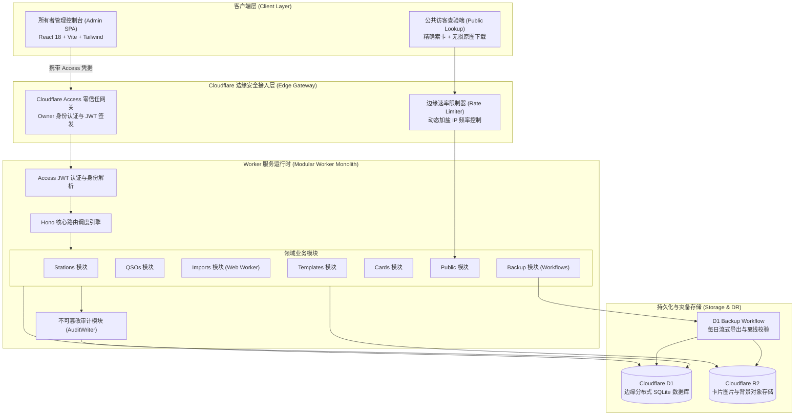
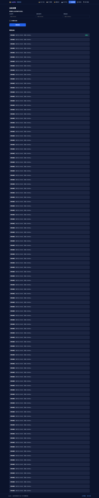
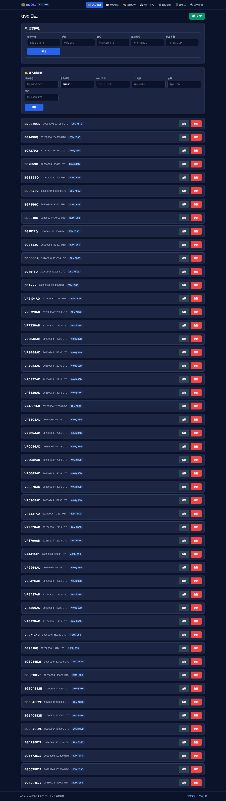
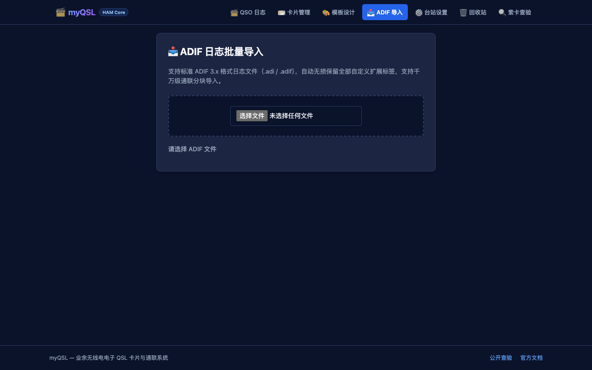
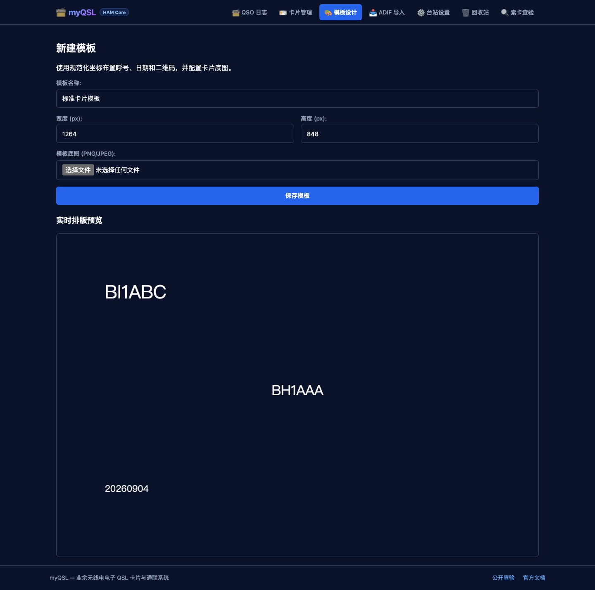
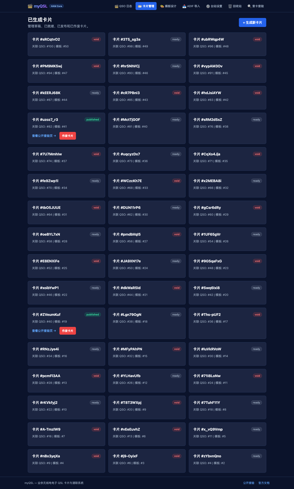
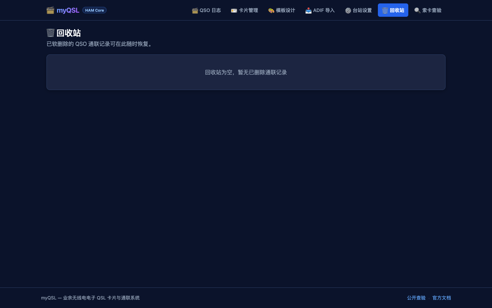
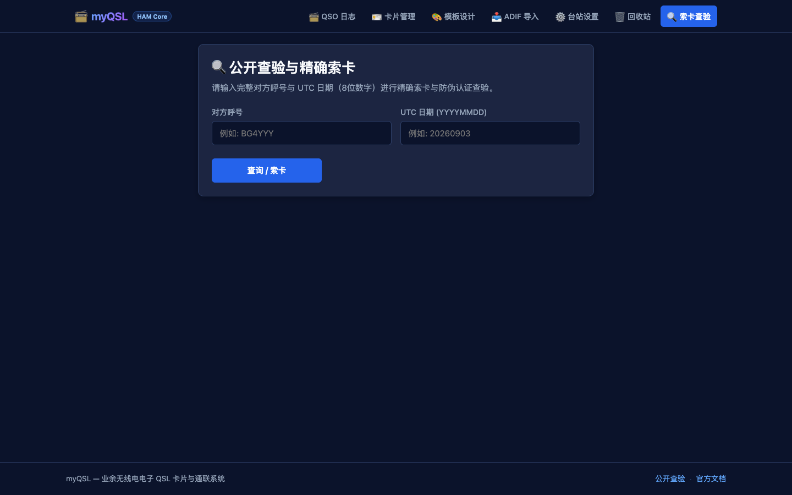

# myQSL (Electronic QSO & QSL Record) - v1.0.0

[](package.json)
[](PRD.md)
[](LICENSE)
[](https://workers.cloudflare.com/)

> **myQSL** 是专为业余无线电爱好者（HAM）打造的单所有者、云原生电子通联日志（QSO）管理与 QSL 卡片设计、渲染与防伪查验平台。系统深度融合 Cloudflare 边缘计算与存储基础设施，具备高保真 ADIF 3.1.4 互通、智能波段/频率双向联动、像素级平齐表单、非阻塞 Web Worker 导入、认知工效三色调系统、不可枚举防爬查验以及清单驱动的离线容灾校验能力。完整产品架构与技术白皮书详见 [PRD.md](PRD.md)。

---

## 目录

- [1. 功能概述](#1-功能概述)
  - [1.1 项目背景](#11-项目背景)
  - [1.2 主要用途](#12-主要用途)
  - [1.3 核心功能矩阵](#13-核心功能矩阵)
- [2. 系统架构](#2-系统架构)
  - [2.1 整体架构设计](#21-整体架构设计)
  - [2.2 Monorepo 模块划分](#22-monorepo-模块划分)
  - [2.3 关键组件交互链路](#23-关键组件交互链路)
- [3. 操作方法](#3-操作方法)
  - [3.1 台站配置与默认呼号管理](#31-台站配置与默认呼号管理)
  - [3.2 QSO 通联日志管理与检索](#32-qso-通联日志管理与检索)
  - [3.3 ADIF 日志文件高保真导入](#33-adif-日志文件高保真导入)
  - [3.4 卡片模板设计与实时预览](#34-卡片模板设计与实时预览)
  - [3.5 电子 QSL 卡片制作与发布流转](#35-电子-qsl-卡片制作与发布流转)
  - [3.6 回收站与软删除数据恢复](#36-回收站与软删除数据恢复)
  - [3.7 公开卡片安全查验（访客端）](#37-公开卡片安全查验访客端)
- [4. 安装部署](#4-安装部署)
  - [4.1 技术依赖与环境要求](#41-技术依赖与环境要求)
  - [4.2 本地开发环境初始化](#42-本地开发环境初始化)
  - [4.3 质量门禁与全量测试验证](#43-质量门禁与全量测试验证)
  - [4.4 生产部署流程 (Cloudflare Workers Builds)](#44-生产部署流程-cloudflare-workers-builds)
  - [4.5 灾难恢复演练与故障回滚](#45-灾难恢复演练与故障回滚)

---

## 1. 功能概述

### 1.1 项目背景

在业余无线电通联活动中，通联凭据（QSL 卡片）的确认是申请各类竞赛奖状、确认有效通联记录的重要法定凭据。传统纸质 QSL 卡片通过各国无线电运动协会卡片局或国际直邮交换，往往耗时数月甚至数年，且国际航空邮资日益昂贵；而现有的通用电子日志系统（如 LotW、eQSL 等）存在样式单一、依赖第三方托管、不可自主控制数据与排版等限制。

**myQSL** 应运而生。它是一个**单所有者自主托管**的云原生电子通联确认系统，旨在让每位无线电台长既能以极高自主权管理自己的全量无线电日志，又能为全球通联通友提供精美、即时、不可伪造且符合现代 Web 安全标准的电子 QSL 卡片查验与下载体验。

### 1.2 主要用途

1. **台站集中日志管理**：支持维护本台多个电台执照呼号（含多后缀、移动台、远征台）及通联日志，提供基于波段、模式、日期范围的毫秒级检索。
2. **行业标准互联互通**：遵循 ADIF 3.1.7 标准，保证日常日志在第三方电台日志软件（如 N1MM、Log4OM、WSJT-X）与 myQSL 之间无损双向导入导出。
3. **高自由度卡片个性化设计**：内嵌富交互式 Canvas 编辑器，支持操作员上传背景、自由布局通联参数字段与个性化印记。
4. **不可伪造与防枚举公开验证**：通联对方通过“呼号 + 通联日期”即可精确查验并下载无损卡片图片，系统通过带盐哈希与动态限流严格防止恶意爬取与日志遍历。
5. **极低成本且高可靠的云原生托管**：依托 Cloudflare 全球边缘网络，利用边缘 SQLite（D1）、对象存储（R2）与无服务器执行环境（Workers），实现零闲置成本、毫秒级冷启动与自动化流式灾备。

### 1.3 核心功能矩阵

| 功能模块 | 核心能力 | 关键实现机制 |
|---|---|---|
| **台站管理** | 多台站配置、单默认台站排他切换、呼号与网格管理 | 原子事务与单语句互斥更新，杜绝多默认台站并发竞争 |
| **QSO 日志与录入** | 增删改查、波段/频率双向换算、像素级平齐表单、QRZ/eQSL反查、软删除回收站 | 26px 统一 Header、全波段谱系自动映射、严格 PATCH 契约与单行原子审计 |
| **ADIF 编解码** | ADIF 3.1.4 格式导入/导出、四分桶智能判定、扩展标签保留 | 异步 Web Worker 解析、内存 Transferable 零拷贝、D1 参数配额预算分块提交 |
| **智能频段系统** | UV 段常用中继与 HF 短波中心频点直选、历史频点记忆 | 本地 LocalStorage 持久化、波段推荐频点动态置顶、双向互推换算 |
| **知觉主题与双语** | 认知工效三色调系统（经典蓝、纯净白、典雅黄）、中英双语国际化 | 0 依赖纯 TypeScript 编译期键对齐字典、CSS 自定义属性挂载、0 闪烁持久化 |
| **PWA 缓存穿透** | 离线缓存、网络优先导航、秒级版本检测更新 | `skipWaiting`、激活清理历史缓存、Worker 强制 `no-cache` 响应头杜绝旧版死锁 |
| **卡片模板** | 自定义尺寸（6寸/明信片等）、多图层排版、字体内嵌 | 响应式动态自适应画布、像素级文本对齐、快照数据冻结 |
| **制卡与发布** | 单通联/批量制卡、草稿/就绪/已发布/已作废生命周期流转 | 状态优先原则、R2 内容哈希寻址（SHA-256）存储与不可伪造 Public ID |
| **公开安全查验** | 呼号+日期精确索卡、`Cache-Control: no-store` 实时吊销 | 作废状态 410 优先于 304 缓存、服务端动态加盐限流、公开路径防枚举保护 |
| **安全与审计** | Cloudflare Access 零信任认证、全量写操作原子审计 | 系统与管理员双轨审计日志（`audit_events`）、敏感凭据自动脱敏 |
| **容灾与恢复** | D1 自动化每日流式备份、月度归档、独立清单恢复校验 | D1 Export API 异步轮询、Manifest 驱动的离线 SQLite 内存沙箱确定性行散列校验 |

---

## 2. 系统架构

### 2.1 整体架构设计

myQSL 采用 **Modular Worker Monolith（模块化 Worker 单体）** 架构。前端为高性能单页应用（SPA），后端为部署于 Cloudflare 边缘的轻量级 API 服务，前后端通过同源协议挂载在同一专属域名下，彻底免去跨域配置（CORS）与网关转发损耗。



### 2.2 Monorepo 模块划分

代码仓库采用 pnpm workspace 进行严格分层管理，禁止模块间逆向依赖与循环引用：

```
eqsr/
├── apps/
│   ├── web/                     # 前端 React 18 SPA（管理后台与公共查验端）
│   └── worker/                  # Cloudflare Worker 后端 API 服务（基于 Hono）
├── packages/
│   ├── domain/                  # 唯一业务真理源：实体模型、Zod 严格 Schema、OpenAPI 规格
│   ├── adif-codec/              # ADIF 3.1.7 格式解析器与高保真序列化器
│   └── card-renderer/           # Canvas 核心卡片渲染与图层合成管线
├── scripts/                     # 生产静态预检、清单驱动恢复校验、API Client 自动生成工具
├── openapi/                     # 从领域模型单源导出的 OpenAPI 3.1 YAML 规范
├── docs/                        # 架构设计记录（ADR）与运维手册（Runbooks）
└── tests/                       # Playwright 端到端全视口回归与跨端自动化测试
```

### 2.3 关键组件交互链路

1. **单源 OpenAPI 驱动与零代码漂移**：
   `packages/domain` 中的 Zod 契约是全系统的唯一真理源。运行 `pnpm generate:openapi` 生成规范文档，继而由 `pnpm generate:api` 自动为前端生成强类型的 `api-types.ts`。CI 流水线中通过 `git diff --exit-code` 强制校验，从源头杜绝接口字段不一致。
2. **非阻塞大文件导入与参数配额预算**：
   前端 ADIF 文件直接通过 Transferable ArrayBuffer 零拷贝转交至独立 Web Worker，主线程绝对不卡顿。Worker 批处理后分块提交后端；后端严格控制每批次 SQL 语句数（$\le 17$ 句）与绑定参数数（$\le 88$ 个），在 D1 单事务配额内保证原子写入。
3. **状态优先的公开卡片寻址与即时吊销**：
   公开查询仅暴露不可枚举的 `public_id` 与精准日期参数。所有公开卡片元数据与图片均显式标注 `Cache-Control: no-store`；当卡片被所有者执行 Void 作废操作时，服务保证优先返回 HTTP 410 Gone，永远不向下游缓存返回 HTTP 304。

---

## 3. 操作方法

### 3.1 台站配置与默认呼号管理

台站配置定义了所有者发射时使用的呼号、地理网格与电台设备信息。系统保证全局有且仅有一个处于激活状态的默认台站。

#### 操作步骤：
1. 打开所有者后台，在侧边导航栏点击 **台站管理**（`/admin/stations`）。
2. 在界面右上角点击 **新增台站** 按钮，弹出台站配置对话框。
3. 填入台站呼号（如 `BA4RC`）、网格坐标（如 `PM01aa`）、设备描述（Rig）及天线（Antenna）参数。
4. 如需将当前台站作为日常通联的缺省台站，勾选 **设为默认台站**。
5. 点击 **保存**，系统将在单次原子事务中将其他台站的默认标识自动清空，并激活当前台站。

> [!TIP]
> **界面交互配图说明（必须配图）**：
> - **配图文件**：`docs/screenshots/admin-stations-desktop.png`
> - **展示区域**：页面主表格区及右侧台站属性栏，重点突出“默认台站”绿色激活徽章及设备信息列。
> - **预期交互效果**：表格中当前台站显示绿色“默认”标签，其他台站的默认状态自动关闭；操作栏提供编辑与配置变更入口。



---

### 3.2 QSO 通联日志管理、高效录入与多维检索

支持全量无线电通联记录的快速录入、智能波段/频率联动、像素级平齐表单、多条件复合检索、乐观并发编辑以及回收站安全删除。

#### 操作步骤：
1. 点击侧边栏 **通联日志**（`/admin/qsos`）进入日志总览。
2. **高效录入新通联**：
   - **对方呼号与外部平台反查**：输入对方呼号（如 `BG4YYY`），输入框上方提供 **QRZ ↗** 与 **eQSL ↗** 快捷外链，点击即可一键跳转对应平台查验友台电台信息。
   - **智能波段与频率双向联动**：
     - **波段选择**：支持直接输入或从下拉菜单选择（涵盖 2M、70CM、40M、20M、15M、10M、6M、80M、160M 等全波段）；选择波段时，系统自动填充该波段中心推荐频点；
     - **频率选择**：支持直接输入或下拉选取常用中继与短波频点；下拉框将**动态置顶展示【当前波段推荐频点】**；选择或输入频率时，系统自动反向推导并填入匹配波段；
     - **历史频点自记忆**：输入过的非默认频点会自动沉淀至下拉菜单的“我的历史输入”分组中，后续无需重复键入。
   - **严格顶边缘对齐设计**：表单采用统一高度的 26px Header 容器，对方呼号、本台呼号、UTC 日期、UTC 时间、波段、频率、模式 7 个输入框的上边框完全在同一水平线严格像素级平齐。
   - **当前 UTC 一键同步**：页面加载时自动从系统获取当前的 UTC 日期（YYYYMMDD）与时间（HHMMSS）；亦可随时点击“⏱️ 当前 UTC”按钮一键校准。
3. **多条件复合检索与频率过滤**：在顶部检索工具栏中，支持按对方呼号、工作波段、工作频率（MHz）或通信模式（如 `FT8` / `SSB`）发起毫秒级过滤响应。
4. **修改通联数据**：点击指定 QSO 记录右侧的 **编辑** 图标，在弹窗中修正信号报告（RST）、QTH 或留言信息。保存时后端通过 `If-Match` 乐观锁版本号校验，防止覆盖并发更新。
5. **软删除操作**：点击记录操作栏的 **删除** 图标，确认后记录移入回收站，并不破坏底层唯一性校验与审计链。

> [!TIP]
> **界面交互配图说明（必须配图）**：
> - **配图文件**：`docs/screenshots/admin-qsos-desktop.png`
> - **展示区域**：顶部检索筛选栏、下方 QSO 数据列表（涵盖时间、对方呼号、波段、模式、RST 等关键列）以及右侧快速制卡操作按钮。
> - **预期交互效果**：通联记录以清晰卡片或表格形态排列，支持按呼号快速跳转；操作栏提供“快速制卡”快捷动作。



---

### 3.3 ADIF 日志文件高保真导入

支持将第三方电台日志软件导出的 `.adi` / `.adif` 文件无损批量同步至 myQSL。

#### 操作步骤：
1. 在侧边栏导航点击 **日志导入**（`/admin/import`）。
2. 将本地 ADIF 日志文件拖拽至中央上传区域，或点击选择本地文件。
3. **后台解析与分块传输**：前端自动唤起独立 Web Worker 进行后台流式分词，页面显示进度条，主界面操作完全无阻塞。
4. **四分桶状态审计**：解析完成后，页面清晰展示分类审计面板：
   - **就绪记录 (Ready)**：格式规范、无冲突的有效通联；
   - **警告记录 (Warning)**：字段缺失非核心信息但可容错入库的通联；
   - **重复记录 (Duplicate)**：时间与对方呼号在软阈值（$\pm 180\text{s}$）内完全重合的记录；
   - **异常拒绝 (Rejected)**：核心字段（如时间、呼号、频段）缺失或损坏的记录。
5. 点击 **确认导入入库**，系统分批提交至 D1 数据库并返回入库总结报告。

> [!TIP]
> **界面交互配图说明（必须配图）**：
> - **配图文件**：`docs/screenshots/admin-import-desktop.png`
> - **展示区域**：文件上传拖拽卡片、解析进度条以及 4 个颜色区分的分桶统计卡片（就绪、警告、重复、拒绝）。
> - **预期交互效果**：清晰呈现不同分桶的数量对比与详情折叠面板，上传按钮在校验完成后点亮并显示待导入条数。



---

### 3.4 卡片模板设计与实时预览

通过内置的响应式 Canvas 渲染管线，用户可以自由定制个性化 QSL 卡片，支持自适应比例与字体内嵌。

#### 操作步骤：
1. 侧边栏进入 **卡片模板**（`/admin/templates`），点击 **新建模板** 或选择已有模板点击 **编辑**。
2. 进入全屏模板编辑器（`/admin/templates/:id`）：
   - **画布尺寸配置**：设置基准宽度与高度（如 $1800 \times 1200$ 像素对应标准明信片规格）。
   - **背景图片管理**：点击背景图上传按钮，选取电台环境或外景摄影作品上传至 R2。
   - **字段图层排版**：在左侧图层面板中添加或拖动本台呼号、对方呼号、QSO 日期时间、频率、信号报告等参数，配置文字字体、字号、颜色及对齐方式。
3. **实时预览与多端适配**：右侧画布区域毫秒级响应属性变化，自适应缩放呈现真实排版效果。
4. 点击右上角 **保存模板**，模板数据以版本递增机制原子持久化。

> [!TIP]
> **界面交互配图说明（必须配图）**：
> - **配图文件**：`docs/screenshots/admin-template-edit-desktop.png`
> - **展示区域**：左侧属性与图层调整列表、中央核心 Canvas 画布实时渲染区、顶部尺寸切换与保存操作栏。
> - **预期交互效果**：中央画布真实渲染背景图与矢量文本，调整左侧字号或对齐时画布即刻呈现变动。



---

### 3.5 电子 QSL 卡片制作与发布流转

将实际的通联数据与选定模板合成渲染，完成卡片的快照冻结与正式发布。

#### 操作步骤：
1. 侧边栏进入 **卡片管理**（`/admin/cards`），点击右上角 **新建卡片**（`/admin/cards/new`）。
2. **通联与模板绑定**：从已有的 QSO 列表中选取目标通联（如与 `BG4YYY` 的通联），并在模板下拉框中选取适配的模板。
3. **草稿生成 (Draft)**：系统自动加载通联参数并完成初始渲染预览，生成状态为 `draft` 的卡片记录。
4. **图像生成与校验 (Ready)**：Canvas 引擎将通联与模板生成全分辨率 PNG 图像，计算其 SHA-256 哈希并转储至 R2 存储桶，卡片进入 `ready` 状态。
5. **正式发布 (Publish)**：点击 **发布卡片**，系统生成全局唯一的公开查验标识符（`Public ID`），卡片状态变更为 `published`，通联对方即可公开查验。

> [!TIP]
> **界面交互配图说明（必须配图）**：
> - **配图文件**：`docs/screenshots/admin-cards-desktop.png`
> - **展示区域**：卡片管理主界面，展示卡片缩略图、对应通联信息、状态流转徽章（草稿/就绪/已发布/已作废）及操作动作按钮。
> - **预期交互效果**：已发布卡片呈现醒目“Published”蓝色标签，并提供复制公开查验链接及作废（Void）按钮。



---

### 3.6 回收站与软删除数据恢复

软删除机制保证误操作的 QSO 数据能够安全回退，不影响任何已发布的外部卡片有效性。

#### 操作步骤：
1. 侧边栏点击 **回收站**（`/admin/trash`）。
2. 页面列出所有已软删除的 QSO 记录，展示删除时间及原本的通联摘要。
3. 找到目标记录，点击右侧 **恢复** 按钮。
4. 系统以原子事务形式清空 `deleted_at` 标记，版本号自动累加，通联记录即刻重新回归日常日志列表。

> [!TIP]
> **界面交互配图说明（必须配图）**：
> - **配图文件**：`docs/screenshots/admin-trash-desktop.png`
> - **展示区域**：回收站通联列表卡片、删除时间指示标签、右侧绿色的“恢复通联”操作按钮。
> - **预期交互效果**：点击恢复后记录平滑移出列表，页面提示“恢复成功”通知吐司。



---

### 3.7 公开卡片安全查验（访客端）

无需登录即可供全球通友快速查验并下载由所有者签发的官方高保真电子 QSL 卡片。

#### 操作步骤：
1. 外部通友通过浏览器直接访问系统公共首页或查验端（`/` 或 `/c`）。
2. 在查验表单中输入：
   - **通友自身呼号 (Your Callsign)**：例如 `BG4YYY`；
   - **通联日期 (QSO Date)**：例如 `2026-09-03`。
3. 点击 **查询卡片** 按钮：
   - 系统根据“呼号 + 日期”进行严格等值索卡，杜绝全库遍历攻击；
   - 查询成功后，界面即刻展示官方卡片高清大图、本台签名标识与详细通联快照；
   - 提供 **下载原图 (PNG)** 按钮，可直接保存无损画质卡片用于打印或集卡。

> [!TIP]
> **界面交互配图说明（必须配图）**：
> - **配图文件**：`docs/screenshots/public-lookup-desktop.png`
> - **展示区域**：公共查询卡片表单区域、成功检索后的高清 QSL 卡片展示容器、底部的无损图片下载动作按钮。
> - **预期交互效果**：未查询前展示简洁的呼号与日期输入框；提交后卡片平滑展开，提供直接下载原图操作。



---

## 4. 安装部署

### 4.1 技术依赖与环境要求

| 技术栈组件 | 推荐版本 | 说明 |
|---|---|---|
| **Node.js** | `>= 24 < 25` | 推荐使用 Node.js 24 LTS 运行时 |
| **包管理工具** | `pnpm 10.15+` | 启用 Corepack：`corepack enable` |
| **CLI 基础设施** | `wrangler 4.128+` | Cloudflare 官方多环境命令行部署工具 |
| **端到端测试** | `@playwright/test` | 配合 Chromium 无头浏览器执行全链路验证 |
| **云平台服务** | Cloudflare 账号 | 需开通 Workers, D1, R2, Access 与 Workflows 服务 |

### 4.2 本地开发环境初始化

#### 1. 克隆代码仓库并安装依赖
```bash
git clone https://github.com/your-org/myqsl.git
cd myqsl

# 启用 corepack 并严格通过 lockfile 安装依赖
corepack enable
pnpm install --frozen-lockfile
```

#### 2. 初始化本地隔离 D1 数据库
```bash
# 应用全部底层增量数据库迁移到本地测试环境
pnpm db:migrate:local
```

#### 3. 启动本地全栈开发环境
```bash
# 自动执行前端构建并在本地同时拉起 Vite 与 Wrangler 边缘模拟器
pnpm dev
```
启动完成后，可在浏览器中访问：
- **公共查验端**：`http://localhost:8787/`
- **后台管理台**：`http://localhost:8787/admin/qsos`（本地开发自动注入测试所有者身份）

---

### 4.3 质量门禁与全量测试验证

在发起任何代码合并前，必须在本地依次执行通过全量严格质量门禁：

```bash
# 1. 验证 OpenAPI 契约与生成的 API Client 完全零漂移
pnpm generate:openapi
pnpm generate:api
git diff --exit-code -- openapi/myQSL-v1.yaml apps/web/src/lib/api-types.ts

# 2. 运行静态代码检查与依赖环路巡检
pnpm lint

# 3. 运行 TypeScript 全工作区类型检查
pnpm typecheck

# 4. 执行单元测试与 Worker 模拟集成测试
pnpm test

# 5. 执行前端生产构建并校验打包体积预算 (< 175KB Gzip)
pnpm check:bundle

# 6. 静态扫描生产敏感占位符
pnpm check:placeholders

# 7. 运行本地备份离线恢复与行散列清单校验
pnpm verify:backup --sql apps/worker/test/fixtures/backup.sql --database test-db --manifest apps/worker/test/fixtures/backup.manifest.json

# 8. 运行跨视口 (桌面/平板/移动端) Playwright 端到端全景测试
CI=1 pnpm test:e2e
```

---

### 4.4 生产部署流程 (Cloudflare Workers Builds)

myQSL 生产环境严禁通过个人本地终端随意推送上线，必须通过受保护的 `main` 分支结合 **Cloudflare Workers Builds** 自动化构建流水线发布。

#### 1. 生产基础资源创建与绑定
在目标 Cloudflare 账户执行以下初始化命令：
```bash
# 创建生产亚太区域 D1 数据库并记录生成的真实 UUID
wrangler d1 create myqsl-prod --location=apac

# 创建 QSL 卡片与图片资源 R2 存储桶
wrangler r2 bucket create myqsl-media
```
将返回的实际 D1 UUID 与账户 ID 填入 `wrangler.jsonc` 顶层生产配置。

#### 2. 生产必需密钥注入 (Cloudflare Secrets)
通过 Wrangler CLI 向目标生产 Worker 注入私密凭据（严禁提交进 Git 仓库）：
```bash
# D1 REST API 访问令牌（用于后台定时灾备 Workflow 调用导出接口）
wrangler secret put D1_REST_API_TOKEN

# Cloudflare Access 应用程序唯一保护凭据 (Application AUD)
wrangler secret put ACCESS_AUD

# 公开查询接口速率限制器动态加盐 Salt
wrangler secret put RATE_LIMIT_SALT
```

#### 3. Cloudflare Access 访问控制策略配置
在 Cloudflare Zero Trust 控制台创建 Access 应用程序，保护以下所有者专属路径：
- 保护路径：`/admin/*`、`/api/v1/stations*`、`/api/v1/qsos*`、`/api/v1/imports*`、`/api/v1/card-templates*`、`/api/v1/cards*`、`/api/v1/backups*`、`/readyz`。
- 策略规则：仅允许台长本人的认证邮箱或私有凭据登录。
- 公开免认证放行路径：`/`、`/assets/*`、`/c/*`、`/api/v1/public/*`、`/healthz`。

#### 4. Workers Builds 自动化部署流水线配置
在 Cloudflare 控制台导航至 **Workers & Pages -> Overview -> Connect to Git**：
- **Production branch**: `main`
- **Build system**: Cloudflare Workers Builds
- **Root directory**: `/`
- **Build command**: `corepack enable && pnpm install --frozen-lockfile && pnpm run check`
- **Deploy command**: `pnpm verify:production --strict && pnpm db:migrate:prod && pnpm deploy:prod`

> [!IMPORTANT]
> 流水线中的 `pnpm verify:production --strict` 是强制前置防呆门禁。若存在占位 UUID、缺少必要生产 Secret 或误开启了测试身份旁路，发布过程将立即阻断并退出，绝不将缺陷带到生产环境。

#### 5. 部署后冒烟检测
```bash
# 运行生产自动化连通性与健康状态探针
MYQSL_PRODUCTION_ORIGIN=https://<your-operator-domain> pnpm tsx scripts/smoke.mts --origin "$MYQSL_PRODUCTION_ORIGIN"

# 校验基础探针状态
curl -f -s -S "https://<your-operator-domain>/healthz"
```

---

### 4.5 灾难恢复演练与故障回滚

#### 1. D1 数据库自动化流式备份
系统配置了每日 UTC 20:00 自动触发的 `myqsl-d1-backup` Workflow，由边缘工作流调用 Cloudflare Export 引擎，将数据库快照流式转储至 R2：
- **每日归档路径**：`backups/daily/YYYY/MM/DD/{workflow_instance_id}.sql`（保留 30 天）
- **每月全量归档**：`backups/monthly/YYYY/MM/{workflow_instance_id}.sql`（保留 365 天）
- **手动触发与防重保护**：所有者可通过 `POST /api/v1/backups/run` 立即触发备份；若当前已有活跃备份正在执行，系统返回 HTTP 409 冲突，且绝不影响正在运行的有效任务。

#### 2. 清单驱动的离线恢复演练 (Disaster Recovery Verification)
每次恢复前必须在受控沙箱环境下运行清单校验工具：
```bash
# 从 R2 提取目标 SQL 备份与对应同版本清单文件
pnpm verify:backup --sql path/to/backup.sql --database myqsl-restore-check --manifest path/to/backup.manifest.json
```
**校验标准**：
- 离线内存 SQLite 成功应用所有 DDL 与 DML；
- 9 张核心数据表行数与清单 `expected_counts` 100% 严格一致；
- 指定抽样通联与台站行通过 `canonicalRowHash` 校验，内容哈希无篡改；
- 输出 `RESTORE_VERIFIED tables=9 ... counts_matched=9 samples_verified=2` 证据。

#### 3. 生产秒级版本回滚 (Zero-Downtime Rollback)
若新发布版本发生不可预期的运行时异常：
1. 登录 Cloudflare 控制台，进入 **Workers & Pages -> myqsl -> Deployments**；
2. 找到上一个稳定运行的历史版本；
3. 点击右侧菜单并选择 **Rollback to this deployment**；
4. 全球边缘节点将在秒级内将 100% 流量切回历史稳定镜像。
5. **数据库前向兼容原则**：严禁逆向回滚 D1 数据库迁移；若涉及结构缺陷，必须编写前向兼容补丁迁移脚本并通过正向流水线发布。

---

## 许可证

本项目基于 [MIT License](LICENSE) 开源发布。

