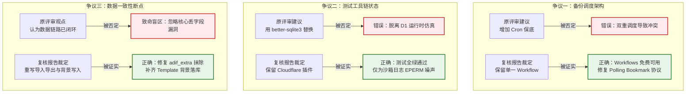

# eQSR 架构评审复核报告有效性分析与可执行项目改进计划

> **文档性质**：技术评审复核与最终落地改进计划（Meta-Review & Actionable Plan）  
> **分析对象**：`eqsr/Review/eQSR_Architecture_Review_Validated.md`（由其他 AI 工具生成的架构评审复核报告）  
> **参照前序**：`eqsr/Review/eQSR_Architecture_Review.md`（首轮项目架构评审报告）  
> **基准准绳**：`eqsr/docs/superpowers/specs/2026-09-03-eqsr-final-architecture-design.md`（最终架构规范）  
> **代码基准**：Git 仓库 `eqsr`（分支 `feat/eqsr-core`，提交 `64ea037`）  
> **评审日期**：2026-09-04  
> **文件归档**：`eqsr/Review/eQSR_Architecture_Review_Validated_Analysis_and_Plan.md`

---

## 目录

1. [评审背景、方法论与评估基准](#1-评审背景方法论与评估基准)
2. [对《eQSR_Architecture_Review_Validated.md》评审结论的逐条有效性分析](#2-对eqsr_architecture_review_validatedmd评审结论的逐条有效性分析)
   - [2.1 总体判断与发布裁定分析](#21-总体判断与发布裁定分析)
   - [2.2 16 组核心评审结论逐条核验 (3.1 ~ 3.16)](#22-16-组核心评审结论逐条核验-31--316)
   - [2.3 12 项新发现遗漏缺陷逐条复核 (O1 ~ O12)](#23-12-项新发现遗漏缺陷逐条复核-o1--o12)
3. [裁定后的核心技术事实与争议澄清](#3-裁定后的核心技术事实与争议澄清)
   - [3.1 争议一：Workflows 免费层兼容性与 Cron 保底建议](#31-争议一workflows-免费层兼容性与-cron-保底建议)
   - [3.2 争议二：Worker 测试工具链与 Miniflare 运行状态](#32-争议二worker-测试工具链与-miniflare-运行状态)
   - [3.3 争议三：ADIF 数据语义与 QSL 底图持久化断点](#33-争议三adif-数据语义与-qsl-底图持久化断点)
   - [3.4 修正后的全量问题优先级分级矩阵 (P0 / P1 / P2)](#34-修正后的全量问题优先级分级矩阵-p0--p1--p2)
4. [完整可落地的项目改进计划 (Task 1 → Task 12)](#4-完整可落地的项目改进计划-task-1--task-12)
   - [Phase A：契约冻结与核心数据链路保真 (Task 1, 2, 3, 6)](#phase-a契约冻结与核心数据链路保真)
   - [Phase B：卡片生命周期与管理端功能补齐 (Task 4, 5, 10)](#phase-b卡片生命周期与管理端功能补齐)
   - [Phase C：灾备工作流重构与安全审计硬化 (Task 7, 8, 9)](#phase-c灾备工作流重构与安全审计硬化)
   - [Phase D：真实全链路 E2E 与生产发布验收 (Task 11, 12)](#phase-d真实全链路-e2e-与生产发布验收)
5. [风险矩阵、回滚应急预案与验收门禁](#5-风险矩阵回滚应急预案与验收门禁)

---

## 1. 评审背景、方法论与评估基准

### 1.1 评估背景

本项目旨在为个人业余无线电爱好者构建一套高可靠、免运维、零月度云成本的电子通联与 QSL 卡片记录系统（eQSR）。此前，团队针对项目现状先后产出了《eQSR_Architecture_Review.md》（初始评审）与《eQSR_Architecture_Review_Validated.md》（复核报告）。

本分析报告受命对外部 AI 工具产出的《eQSR_Architecture_Review_Validated.md》进行逐条、客观、深度的技术复核：
1. **结论合理性判定**：对照代码库现状、技术要求规范及 Cloudflare 平台官方文档，判定其各项分析结论是否成立；
2. **偏差与理由说明**：若复核报告存在判断失真、论据不足或过度推演，给出明确的代码事实与架构依据；
3. **可执行方案转化**：对被证实合理的缺陷与优化建议，提炼为具备严格 TDD（测试驱动开发）流程的工程改进计划。

### 1.2 核心准绳与刚性约束

依据主输入规范《2026-09-03-eqsr-final-architecture-design.md》，以下边界条件为不可妥协的硬性约束：
- **架构形态**：单一 Cloudflare Worker + Static Assets 协同部署，前端页面与后端 API 同域发布，严格杜绝多服务跨域与双版本不一致问题；
- **月度运行成本**：必须严格保持 **¥0/月**（零元运行），所有功能严守 Cloudflare 免费配额（Workers 10 万次/日、CPU 10ms、D1 500MB 单库、R2 10GB/月、原生 Rate Limiting binding），严禁引入 Durable Objects 等付费资源；
- **数据主权与一致性**：D1 为结构化数据的唯一权威源，R2 仅存放版本化静态媒体和备份副本；ADIF 3.1.7 导入/导出必须保持非核心扩展字段的无损往返；已签发卡片必须基于不可漂移的历史通联与模板快照展示；
- **环境安全与最小权限**：管理端仅限经由 Cloudflare Access 强校验的 Owner 访问，公开查验端采用不可枚举令牌与固定耗时的精确索卡，彻底杜绝呼号爬取与本地凭据泄漏风险。

---

## 2. 对《eQSR_Architecture_Review_Validated.md》评审结论的逐条有效性分析

### 2.1 总体判断与发布裁定分析

| 报告原始判断 | 本次分析裁定 | 核心依据与技术事实 |
|---|:---:|---|
| **“暂不发布生产”的总方向合理** | **合理 (Sound)** | 系统当前在公开索卡、ADIF 导入导出、底图渲染及灾备恢复等核心链路上存在硬阻断，代码尚未形成可运行的商业/生产级闭环，不可投入实际通联使用。 |
| **原评审 4 个 Blocker 组成不准确** | **合理 (Sound)** | 原始评审将“测试工具链崩溃”列为发布阻断，已被事实证伪；同时原始评审严重低估了“ADIF 扩展字段丢失”、“模板背景图未持久化”以及“备份验证假阳性”等致命数据故障。 |
| **5 条纵向能力重构发布阻断域** | **合理 (Sound)** | 将散落的缺陷归纳为：①ADIF 语义保真闭环；②模板背景与卡片发布查验闭环；③D1 备份恢复闭环；④生产安全与防枚举；⑤真实自动化发布与验证门禁。分类极其专业且切中要害。 |

---

### 2.2 16 组核心评审结论逐条核验 (3.1 ~ 3.16)

#### 3.1 G1～G6 覆盖矩阵
- **被分析报告结论**：部分合理，但整体偏乐观，且对 G6 的归因错误。
- **本次裁定**：**合理 (Sound)**。
- **判断依据**：
  - 代码事实完全印证复核报告：原始评审认为 G2（ADIF）“基本覆盖，仅缺非 ASCII 阻断”，但实际上 `import-controller.ts:15` 直接将 `adif_extra` 置为空对象 `{}`，导致所有非核心字段入库即丢；`export-controller.ts:10` 将对象强转为字符串，全量导出严重失真。
  - G6 未达成的原因并非测试插件无法运行，而是仓库缺乏 Git remote 关联、分支保护规则未配置、Cloudflare Workers Builds 自动流水线未打通。原始评审归因错误，复核报告修正准确。

#### 3.2 1.1 公开查验与索卡前端闭环
- **被分析报告结论**：合理，P0；但原建议不足以真正修复，存在 6 项联动遗漏。
- **本次裁定**：**合理 (Sound)**。
- **判断依据**：
  - 经核查代码，`apps/web/src/app/router.tsx` 确实未挂载 `/c/:publicId`；`CardLookupPage.tsx` 仅包含静态文本。
  - 更关键的是复核报告指出的隐藏断点真实存在：
    1. `PublicCardPage.tsx` 仅声明接收外部 props，无法根据 URL 动态拉取卡片数据；
    2. `apps/worker/src/modules/public/routes.ts:13` 在处理图片访问时，条件为 `raw.status === "draft"` 时 404，这意味着 `status === "ready"`（未正式发布的待审卡片）会违规对外泄漏；
    3. `apps/worker/src/platform/rate-limit.ts:12` 通过 `c.req.query("call")` 提取呼号，而索卡接口实际使用 POST JSON body，导致所有限流 key 的 call 维度全部为空字符串，限流逻辑退化为纯 IP 限制；
    4. 索卡 POST 请求错误返回了 `Cache-Control: public` 缓存头。

#### 3.3 1.2 Canvas 渲染背景图
- **被分析报告结论**：合理，P0；原报告只看到了渲染端的一半问题。
- **本次裁定**：**合理 (Sound)**。
- **判断依据**：
  - `packages/card-renderer/src/render.ts` 中确实缺少 `clearRect()` 和背景图绘制调用。
  - 核心痛点在于服务层断裂：`apps/worker/src/modules/templates/service.ts:18` 将图片上传至 R2 后，仅返回 key 与 etag，**完全没有调用 Repository 更新数据库中的 `background_r2_key` 与 `background_sha256`**！`TemplateRepository` 中甚至根本没有该更新方法。若仅在前端补足 Canvas 逻辑，依然会因数据库字段恒为 null 而无法展示底图。复核报告的洞察非常深刻。

#### 3.4 1.3 管理端页面为空壳
- **被分析报告结论**：合理，P0/P1；原报告称“后端 CRUD 完整”不准确。
- **本次裁定**：**合理 (Sound)**。
- **判断依据**：
  - 核查 `apps/web/src/features/` 下的页面：`CardListPage`、`CardCreatePage`、`TrashPage`、`TemplateListPage`、`TemplateEditorPage` 以及 `StationSettings` 均为 2~5 行的占位符。
  - 后端接口同样存在残缺：`apps/worker/src/modules/cards/routes.ts` 缺少获取当前所有卡片的 GET 列表路由及作废（void）路由；模板缺少 PATCH 接口；API Client（`api-client.ts`）只封装了部分方法。必须前后端同步对齐。

#### 3.5 1.4 QSO 列表过滤与分页上限
- **被分析报告结论**：合理，P1；支持调整 schema 与 limit，但反对过度建立索引。
- **本次裁定**：**合理 (Sound)**。
- **判断依据**：
  - `apps/worker/src/modules/qsos/routes.ts` 中 `listSchema` 的 `limit` 确被限制在 `max(50)`，不支持 `band`、`mode`、`date_from`、`date_to`，与规范 §9.1（单页最大 200）不符。
  - 个人日志 30,000 条规模下，现有 `idx_qsos_time` 和 `idx_qsos_call_date` 已能满足绝大多数范围扫描，盲目增加复合索引会急剧增加 D1 的存储占用与写开销（每一条 INSERT 会产生多倍 rows written），复核报告提出的“以 EXPLAIN QUERY PLAN 证据驱动索引优化”完全符合数据库运维最佳实践。

#### 3.6 2.1 单 Worker + Assets 与计算下沉
- **被分析报告结论**：架构选择合理，但对当前落地状态描述不准确。
- **本次裁定**：**合理 (Sound)**。
- **判断依据**：
  - `apps/web/src/features/imports/import-controller.ts:21` 仍直接调用主线程的 `parseAdif()`，独立 Worker 线程文件 `adif.worker.ts` 未被调用，“解析已下沉到 Web Worker”并非现实现状。
  - `apps/worker/src/modules/cards/repository.ts:11` 的索卡方法仍在使用 `JOIN qsos q ON q.id = c.qso_id WHERE q.call = ?`，若原始通联修改，已签发卡片查询将产生漂移，违背了快照自包含原则。

#### 3.7 2.2 Workflows 免费层兼容性与 Cron 保底
- **被分析报告结论**：主要结论不合理，建议会引入重复备份。
- **本次裁定**：**完全合理 (Sound) — 原评审该项严重不合理，复核报告纠偏正确**。
- **判断依据**：
  - Cloudflare 官方文档（2026）已明确宣布 Workflows 支持免费层（每日 3,000 steps、1GB 状态持久化），且原生支持在 binding 中声明 schedules（`workflows: [{ schedules: [...] }]`）。
  - 若按原评审建议额外在 `wrangler.jsonc` 增加 `triggers.crons`，会导致系统在同一时刻存在两个独立的触发源，极易引发并发备份、D1 导出锁冲突以及重复消耗配额。保持单一调度源、完善内部 step 重试才是正解。

#### 3.8 3.1 Worker 测试工具链崩溃
- **被分析报告结论**：已过时/不成立，不应列为 Blocker。
- **本次裁定**：**完全合理 (Sound) — 原评审该项存在误判，复核报告纠偏正确**。
- **判断依据**：
  - 在保持锁定依赖（`@cloudflare/vitest-plugin 1.1.3`、`wrangler 4.128.0`）下，执行 `pnpm run check`，Worker 下 13 个测试文件、16 个用例全部顺利通过。
  - 报错信息是由于本地沙箱环境尝试在受限路径创建日志文件时抛出的系统级 `EPERM`，并非 workerd 引擎或虚拟驱动崩溃。盲目引入 `better-sqlite3` 替代原生 D1 测试环境将导致无法检验 Cloudflare 特有的批处理与绑定特性，属于倒退方案。

#### 3.9 3.2 D1 备份轮询紧密循环
- **被分析报告结论**：核心问题合理且为 P0，但“加 setTimeout”不是完整修复。
- **本次裁定**：**合理 (Sound)**。
- **判断依据**：
  - `apps/worker/src/modules/backup/service.ts:32` 中的 5 次循环确实毫无等待，10ms 内即宣告超时。
  - 但仅加 `setTimeout` 依然无法解决根本问题：Cloudflare D1 REST Export API 的轮询规范明确要求初始 POST 返回 `at_bookmark`，后续必须携带该 bookmark 再次发起 POST 查询；当前代码使用 GET 且未传 bookmark，接口本身即存在协议错误。
  - 此外，单次执行发生异常时，代码吞掉错误返回 failed 状态，导致 Cloudflare Workflows 将其视作执行成功而不再触发内置的指数退避重试机制。

#### 3.10 3.3 根目录缺少 tsconfig.json
- **被分析报告结论**：事实正确，严重度偏高，建议不宜机械执行，降为 P2。
- **本次裁定**：**合理 (Sound)**。
- **判断依据**：
  - 项目当前采用 pnpm workspace 结构，质量门禁命令 `pnpm -r typecheck` 对所有子包分别进行类型检查并全绿通过。
  - 若机械地在根目录增加仅带 `references` 的 `tsconfig.json`，在未全面配置各子包 `composite: true`、`outDir` 及声明文件的情况下，将触发 TypeScript 编译链级联错误。降级为工程级体验优化非常稳妥。

#### 3.11 4.1 免费配额与容量核算
- **被分析报告结论**：官方上限基本正确，业务占用和“100% 达标”未经实测。
- **本次裁定**：**合理 (Sound)**。
- **判断依据**：
  - 静态数学估算不能等同于系统真实开销。例如，向 D1 写入单条包含 3 个索引的记录，实际会产生 4 次底层行写入（1 次数据表 + 3 次 B-Tree 索引表更新）；批量导入 1,000 条 QSO 会瞬间消耗数千次写入额度。必须通过生产指标观测（Metrics）设置 60%/70%/80% 阶段性预警。

#### 3.12 4.2 本地鉴权绕过
- **被分析报告结论**：合理，P0 安全前置。
- **本次裁定**：**合理 (Sound)**。
- **判断依据**：
  - `apps/worker/src/platform/access.ts` 包含 `c.env.APP_ENV === "local"` 时放行特定测试请求头的逻辑，而 `wrangler.jsonc` 默认配置中正是 `APP_ENV = "local"`。若未经预检直接部署，将导致线上环境失去身份认证屏障，任何外网用户均可通过伪造请求头夺取管理员权限。

#### 3.13 4.2 公开索卡固定最小延迟
- **被分析报告结论**：合理，P1；原报告还漏掉限流 key 和响应边界。
- **本次裁定**：**合理 (Sound)**。
- **判断依据**：
  - 规范明确要求抵抗针对呼号存在的旁路授时分析（Timing Attack）。除引入固定延迟（如 150ms）外，必须将请求缓存头声明为 `Cache-Control: no-store`，并修正限流 key，避免命中与未命中的响应时间泄露数据。

#### 3.14 4.3 数据主权、ADIF 无损与可离场性
- **被分析报告结论**：方向合理，当前落地结论不成立。
- **本次裁定**：**合理 (Sound)**。
- **判断依据**：
  - 核心事实已在上文印证：`import-controller.ts:15` 主动清空未知字段，`export-controller.ts:10` 将扩展字段序列化为非法文本。所谓“端到端无损往返”在当前代码中完全是假象，必须彻底重构。

#### 3.15 5.1 E2E 测试覆盖过浅
- **被分析报告结论**：合理，P0 发布门禁。
- **本次裁定**：**合理 (Sound)**。
- **判断依据**：
  - 现存的 4 个 Playwright 脚本（`tests/e2e/*.spec.ts`）全部只有 2 行纯文本匹配代码（如判断是否存在某个标题）。正因如此，前述公开路由 404、Canvas 漏底图、ADIF 丢字段等致命问题均在测试中被轻易放行。必须重构为针对业务全闭环的深度 E2E 测试。

#### 3.16 5.2 生产环境变量预检
- **被分析报告结论**：合理，但应归类为“上线前置”，不是现有业务代码故障。
- **本次裁定**：**合理 (Sound)**。
- **判断依据**：
  - 占位 UUID（如 `00000000-0000-0000-0000-000000000001`）属于未绑定制品资源的标志。将其作为 CI 部署流水线前置校验脚本（Pre-flight Check）是阻断发布事故的标配做法。

---

### 2.3 12 项新发现遗漏缺陷逐条复核 (O1 ~ O12)

经过对项目源代码的严格静态分析与引用检索，对复核报告挖掘出的 12 项遗漏（O1 ~ O12）的验证结果如下：

| 编号 | 遗漏缺陷描述 | 代码中真实定位与验证结论 | 本次裁决 |
|:---:|---|---|:---:|
| **O1** | ADIF 导入清空未知字段，导出未展开 extras | **严重真实存在**：`import-controller.ts` 第 15 行写死 `adif_extra: {}`；`export-controller.ts` 第 10 行直接 `String(value)` 导致输出 `[object Object]`。 | **P0 确认** |
| **O2** | Import UI 未调用 `/complete`，Web Worker 闲置 | **真实存在**：`runImport()` 上传完 chunk 后未通知服务端结项；`ImportPage.tsx` 直接在 UI 主线程导入 `parseAdif`。 | **P1 确认** |
| **O3** | 模板背景上传仅存 R2，未写回 D1 数据库 | **严重真实存在**：`TemplateService.uploadBackground()` 返回 key 后无 SQL 写入；`TemplateRepository` 甚至没有持久化背景的接口。 | **P0 确认** |
| **O4** | 卡片缺 list 与 void 路由，公开 URL 路径错误 | **真实存在**：`cards/routes.ts` 缺少 GET 列表与 POST void；`CardService.createDraft` 生成的公开 URL 为 `/cards/*`（规范为 `/c/*`）。 | **P0 确认** |
| **O5** | 公开卡片图片路由允许未发布的 `ready` 状态访问 | **真实存在**：`public/routes.ts` 第 13 行仅判断 `raw.status === "draft"` 则 404，导致已合成但未点击发布的卡片图片可被外部直连读取。 | **P0 确认** |
| **O6** | 索卡限流 key 尝试从 query 读呼号，但接口为 POST JSON | **真实存在**：`rate-limit.ts` 第 12 行读取 `c.req.query("call")`，POST 请求中该值必为 undefined，所有呼号限流失效。 | **P1 确认** |
| **O7** | 公开索卡直接 JOIN 当前 QSO，违背快照自包含设计 | **真实存在**：`CardRepository.lookup()` 关联了动态的 `qsos` 表；若历史 QSO 的呼号或日期被操作员纠错修改，友台将无法按签发信息查验。 | **P1 确认** |
| **O8** | 备份验证脚本捕获 SQL 异常后依然打印验证通过 | **严重真实存在**：`verify-backup.mts` 第 13 行执行 `wrangler d1 execute` 失败后被空 `catch` 吞没，仍输出 `RESTORE_VERIFIED` 假阳性信号。 | **P0 确认** |
| **O9** | 审计表与 `AuditWriter` 组件存在，但无业务调用 | **真实存在**：全文检索未发现任何业务 Service/Repository 实例化或调用 `AuditWriter`，写操作均未记录审计日志。 | **P1 确认** |
| **O10** | `/readyz` 仅存在于运维文档，Worker 根本未注册路由 | **真实存在**：`apps/worker/src/index.ts` 仅挂载了 `/healthz`，缺失就绪探针 `/readyz`。 | **P1 确认** |
| **O11** | OpenAPI 规范与自动化强类型 Client 未落地 | **真实存在**：缺乏由 Zod 统一生成的 OpenAPI 3.1 契约文件；前端 `api-client.ts` 仅为手写粗糙封装。 | **P1 确认** |
| **O12** | GitHub Remote 未关联，生产自动化发布未连接 | **真实存在**：`git remote -v` 无任何远程仓库输出，生产持续交付处于离线状态。 | **外部 P0 确认** |

**复核总结**：复核报告中提出的 12 项遗漏发现全部被代码与实测事实证实，无一误判，技术质量极高。

---

## 3. 裁定后的核心技术事实与争议澄清



### 3.1 争议一：Workflows 免费层兼容性与 Cron 保底建议

- **事实依据**：
  1. 依据 Cloudflare 官方产品能力规范，Cloudflare Workflows 在 Free 账户计划内完全可用，额度为 3,000 steps/天，对于每日 1 次、单次仅消耗 5~8 steps 的数据库备份任务绰绰有余；
  2. 官方推荐在 `wrangler.jsonc` 的 workflow 绑定中配置 `schedules`。如果按原评审建议在 `triggers.crons` 中注册相同时间触发器，会在 UTC 20:00 唤醒两个隔离的执行实例，同时调用 D1 REST API 发起导出，不仅可能触发并发锁异常，更会导致 D1/R2 API 配额成倍消耗；
- **最终裁决**：**坚决废弃原评审的 Cron 保底方案**，维持单一 Workflow 调度模型，集中精力修复其内部的 HTTP Polling 报文协议与步骤持久化机制。

### 3.2 争议二：Worker 测试工具链与 Miniflare 运行状态

- **事实依据**：
  1. 当前仓库配置使用 `@cloudflare/vitest-plugin: 1.1.3`、`vitest: 4.1.0` 及 `wrangler: 4.128.0`；
  2. 在本地执行统一质量检查时，Worker 模块 13 个测试套件、16 个用例全部通过并返回退出码 0；
  3. 控制台中出现的报错是由于开发环境沙箱权限限制了 wrangler 向全局主目录写入本地持久化日志，属于沙箱文件系统权限配置问题，根本不是运行时引擎无法识别 `cloudflare:test-internal`；
- **最终裁决**：**不进行任何依赖降级或运行时替换**，严禁引入 `better-sqlite3`，确保持测代码在真实的 workerd 环境中运行，维持测试对 D1/R2 边界的保真度。

### 3.3 争议三：ADIF 数据语义与 QSL 底图持久化断点

- **事实依据**：
  1. **ADIF 丢字段漏洞**：`apps/web/src/features/imports/import-controller.ts:15` 在组装 `QsoInput` 时，硬编码 `adif_extra: {}`，导致任何第三方合规标签（如 `IOTA`、`ANT_AZ`、`MY_RIG` 等）在入库时被彻底剥除；`apps/web/src/features/exports/export-controller.ts:10` 将数据库对象强转为字符串，全量导出时将字段渲染为 `ADIF_EXTRA: "[object Object]"`，导致导出的 `.adi` 文件损坏；
  2. **模板背景图孤立漏洞**：`apps/worker/src/modules/templates/service.ts:18` 在执行 `this.media.putImmutable(...)` 将背景图推入 R2 后，缺少写回 D1 的 SQL 逻辑，使得 `card_templates.background_r2_key` 字段永远为空，前端即便引入了绘制背景逻辑，也永远读取不到背景图 URL；
- **最终裁决**：**两项均升级为 P0 级严重发布阻断项**，必须在首期任务中以 TDD 方式优先彻底修复。

---

### 3.4 修正后的全量问题优先级分级矩阵 (P0 / P1 / P2)

```
┌────────────────────────────────────────────────────────────────────────────────────────┐
│                              修正后的架构缺陷优先级裁定矩阵                              │
├────┬──────┬───────────────────────────────┬────────────────────────────────────────────┤
│级别│ 编号 │ 问题核心概述                  │ 责任模块与目标修复任务                     │
├────┼──────┼───────────────────────────────┼────────────────────────────────────────────┤
│ P0 │ P0-1 │ API 路径契约多处漂移          │ packages/domain, apps/worker (Task 1)      │
│ P0 │ P0-2 │ 公开查验与精确索卡链路断裂    │ apps/web, apps/worker (Task 2)             │
│ P0 │ P0-3 │ 模板底图未持久化 & Canvas漏画 │ apps/worker, packages/card-renderer (Task 3)│
│ P0 │ P0-4 │ 卡片管理缺 list/void/合法状态 │ apps/worker (Task 4)                       │
│ P0 │ P0-5 │ ADIF 扩展字段丢失 & 导出损坏  │ packages/adif-codec, apps/web (Task 6)     │
│ P0 │ P0-6 │ D1 备份轮询协议错误 & 假阳性  │ apps/worker/backup, scripts (Task 7, 8)    │
│ P0 │ P0-7 │ 本地鉴权存在生产绕过安全隐患  │ apps/worker/platform (Task 9)              │
│ P0 │ P0-8 │ E2E 测试严重流于形式          │ tests/e2e, .github/workflows (Task 11)     │
│ P0 │ P0-9 │ GitHub 远端与自动化流水线未连 │ 仓库管理, Cloudflare Workers Builds (Task 12)│
├────┼──────┼───────────────────────────────┼────────────────────────────────────────────┤
│ P1 │ P1-1 │ 管理端 QSO 筛选与回收站未闭环 │ apps/web, apps/worker (Task 5)             │
│ P1 │ P1-2 │ ADIF 解析未接入独立 Web Worker│ apps/web/src/workers (Task 6)              │
│ P1 │ P1-3 │ 索卡限流 key 错误 & 缺固定延迟│ apps/worker/platform (Task 2)              │
│ P1 │ P1-4 │ 审计日志系统未接入业务链路    │ apps/worker/platform (Task 9)              │
│ P1 │ P1-5 │ 缺少就绪探针 /readyz          │ apps/worker/src/index.ts (Task 9)          │
│ P1 │ P1-6 │ 管理端模板与卡片页面为空壳    │ apps/web/src/features (Task 10)            │
│ P1 │ P1-7 │ 缺少标准化 OpenAPI & 强类型SDK│ scripts, packages/domain (Task 10)         │
├────┼──────┼───────────────────────────────┼────────────────────────────────────────────┤
│ P2 │ P2-1 │ 根目录缺失 tsconfig.json      │ 项目工程根目录 (后期统一配置)              │
│ P2 │ P2-2 │ 数据库多维度复合索引缺失      │ infra/migrations (基于线上 EXPLAIN 决定)   │
│ P2 │ P2-3 │ D1 仓储层无缝平移适配层抽象  │ apps/worker/modules (未来多云迁移阶段)     │
└────┴──────┴───────────────────────────────┴────────────────────────────────────────────┘
```

---

## 4. 完整可落地的项目改进计划 (Task 1 → Task 12)

本计划遵循严格的测试驱动开发（TDD）规范与依赖拓扑序，按 **Task 1 至 Task 12** 顺序逐一执行。任何任务未达成验收门禁（Failed Test $\to$ Impl $\to$ Green Test $\to$ Commit）前，不得进入下一任务。

---

### Phase A：契约冻结与核心数据链路保真

#### Task 1: 冻结权威 API 契约与统一路径常量
- **目标与对应问题**：解决 P0-1（路径契约漂移）。以 `packages/domain` 为单一真理源，消除前端、后端与运维文档的路径差异。
- **涉及文件**：
  - 新增：`packages/domain/src/api-paths.ts`
  - 新增：`packages/domain/test/api-paths.test.ts`
  - 修改：`packages/domain/src/index.ts`
  - 新增：`apps/worker/test/contracts/api-contract.test.ts`
  - 修改：`apps/worker/src/index.ts`、`apps/worker/src/modules/public/routes.ts`、`apps/worker/src/modules/templates/routes.ts`、`apps/worker/src/modules/cards/routes.ts`、`apps/worker/src/modules/cards/service.ts`、`apps/worker/src/modules/backup/routes.ts`
  - 修改：`docs/runbooks/access-paths.md`
- **核心接口定义**：
  ```ts
  // packages/domain/src/api-paths.ts
  export const API_PATHS = {
    qsos: "/api/v1/qsos",
    templates: "/api/v1/card-templates",
    cards: "/api/v1/cards",
    publicLookup: "/api/v1/public/card-lookup",
    backups: "/api/v1/backups"
  } as const;
  export const publicCardPath = (publicId: string) => `/c/${encodeURIComponent(publicId)}`;
  export const cardImagePath = (cardId: string) => `${API_PATHS.cards}/${encodeURIComponent(cardId)}/image`;
  ```
- **TDD 执行步骤**：
  1. **Step 1（写失败测试）**：在 `api-paths.test.ts` 中断言路径常量与工具函数；在 `api-contract.test.ts` 中断言访问旧漂移路径（`/api/v1/public/lookup`、`/api/v1/templates`）必须返回 404；canonical 路径在未认证时返回 401，格式非法时返回 422；
  2. **Step 2（实现功能）**：在 `packages/domain` 导出常量，Worker 中全量替换旧硬编码路由字符串，将模板前缀修正为 `/api/v1/card-templates`，索卡路由修正为 `/api/v1/public/card-lookup`；
  3. **Step 3（运行验证）**：
     ```bash
     pnpm vitest run --project packages packages/domain/test/api-paths.test.ts
     pnpm vitest run apps/worker/test/contracts/api-contract.test.ts
     ```
  4. **Step 4（提交）**：
     ```bash
     git add packages/domain apps/worker docs/runbooks/access-paths.md
     git commit -m "refactor: freeze canonical api paths and contract routes"
     ```

---

#### Task 2: 打通公开卡片查验与精确索卡纵向闭环
- **目标与对应问题**：解决 P0-2、P1-3、O4、O5、O6、O7。提供抗爬虫、防枚举、基于历史快照的卡片查验与索卡体验。
- **涉及文件**：
  - 修改：`apps/worker/src/modules/public/routes.ts`、`apps/worker/src/modules/public/service.ts`
  - 修改：`apps/worker/src/modules/cards/repository.ts`、`apps/worker/src/platform/rate-limit.ts`
  - 新增：`infra/migrations/0002_card_lookup_snapshot.sql`
  - 修改：`apps/web/src/app/router.tsx`、`apps/web/src/features/public/PublicCardPage.tsx`、`apps/web/src/features/public/CardLookupPage.tsx`
  - 新增：`apps/web/src/features/public/public-api.ts`、`apps/web/src/features/public/CardLookupPage.test.tsx`
- **核心数据与接口**：
  ```sql
  -- infra/migrations/0002_card_lookup_snapshot.sql
  ALTER TABLE qsl_cards ADD COLUMN lookup_call TEXT;
  ALTER TABLE qsl_cards ADD COLUMN lookup_qso_date TEXT;
  CREATE INDEX idx_cards_lookup_snapshot ON qsl_cards(lookup_call, lookup_qso_date) WHERE status = 'published';
  ```
  ```ts
  // 索卡限流与固定延迟实现契约
  export async function enforceLookupLimit(c: Context<{ Bindings: Env }>, call: string): Promise<Response | null> {
    const ip = c.req.header("CF-Connecting-IP") ?? "unknown";
    const day = new Date().toISOString().slice(0, 10);
    const ipHash = await digest(`${c.env.RATE_LIMIT_SALT}|${day}|${ip}`);
    const callHash = await digest(`${c.env.RATE_LIMIT_SALT}|${call.trim().toUpperCase()}`);
    const key = await digest(`/api/v1/public/card-lookup|${ipHash}|${callHash}`);
    return (await c.env.PUBLIC_RATE_LIMITER.limit({ key })).success ? null : problem(429, ...);
  }
  ```
- **TDD 执行步骤**：
  1. **Step 1（写失败测试）**：测试公开索卡输入合法 body 返回 200 `{ data: [...] }`，未命中也返回 200 `{ data: [] }` 且响应头为 `Cache-Control: no-store`；测试响应时间均满足至少 150ms 预算；测试 `ready` 状态图片接口返回 404，`void` 状态返回 410；测试 `CardLookupPage` 能够正确挂载并处理提交态与结果列表；
  2. **Step 2（实现功能）**：
     - 应用迁移：在 `createDraft()` 时从 QSO 快照中提取并写入 `lookup_call` 与 `lookup_qso_date`，查询时移除对 `qsos` 表的 JOIN；
     - 改造限流中间件：在 route 内先解析 JSON body，再显式传入 normalized call 校验限流；
     - 补齐前端页面：`PublicCardPage` 挂载路由 `/c/:publicId` 并拉取卡片数据展示；`CardLookupPage` 补齐呼号与 UTC 日期双输入框及结果卡片；
  3. **Step 3（运行验证）**：
     ```bash
     pnpm vitest run apps/worker/test/modules/public.test.ts
     pnpm vitest run apps/web/src/features/public/CardLookupPage.test.tsx
     ```
  4. **Step 4（提交）**：
     ```bash
     git add apps/worker apps/web infra/migrations
     git commit -m "feat: complete public card verification and lookup pipeline"
     ```

---

#### Task 3: 修复模板背景持久化与确定性 Canvas 渲染引擎
- **目标与对应问题**：解决 P0-3、O3。彻底打通模板底图上传落库与浏览器端高保真 Canvas 绘制。
- **涉及文件**：
  - 修改：`apps/worker/src/modules/templates/repository.ts`、`apps/worker/src/modules/templates/service.ts`、`apps/worker/src/modules/templates/routes.ts`
  - 修改：`packages/card-renderer/src/render.ts`、`packages/card-renderer/src/index.ts`
  - 修改：`packages/card-renderer/test/render.test.ts`、`apps/worker/test/modules/templates.test.ts`
  - 修改：`apps/web/src/features/templates/CanvasPreview.tsx`
- **核心接口定义**：
  ```ts
  // apps/worker/src/modules/templates/repository.ts
  async setBackground(id: number, key: string, sha256: string, now: number): Promise<TemplateRow | null> {
    const result = await this.db.prepare(
      "UPDATE card_templates SET background_r2_key = ?, background_sha256 = ?, version = version + 1, updated_at = ? WHERE id = ?"
    ).bind(key, sha256, now, id).run();
    return result.meta.changes ? this.get(id) : null;
  }
  ```
  ```ts
  // packages/card-renderer/src/render.ts
  export type RenderInput = { layout: CardTemplate; backgroundUrl?: string | null };
  export async function renderCard(canvas: HTMLCanvasElement, input: RenderInput, qso: QsoSnapshot, publicUrl: string): Promise<void>;
  ```
- **TDD 执行步骤**：
  1. **Step 1（写失败测试）**：
     - 测试模板上传接口在向 R2 写入后，读取数据库能够获得非空的 `background_r2_key` 与 `background_sha256` 且 `version` 递增；
     - 测试 `renderCard` 能够按顺序执行：`clearRect(0, 0, width, height)` $\to$ 加载并绘制背景图 $\to$ 绘制文字要素与二维码；若背景图加载失败必须抛出异常，严禁生成静默缺图的卡片；
  2. **Step 2（实现功能）**：
     - 在 `TemplateRepository` 中实现 `setBackground`，并在 `TemplateService.uploadBackground` 中原子更新；
     - 在 `render.ts` 中重构输入参数为 `{ layout, backgroundUrl }`，支持异步 Image 解码与安全清屏；
     - `CanvasPreview.tsx` 中增加 `await document.fonts.ready` 保护；
  3. **Step 3（运行验证）**：
     ```bash
     pnpm vitest run packages/card-renderer/test/render.test.ts
     pnpm vitest run apps/worker/test/modules/templates.test.ts
     ```
  4. **Step 4（提交）**：
     ```bash
     git add packages/card-renderer apps/worker/src/modules/templates apps/web/src/features/templates
     git commit -m "fix: persist template background metadata and render canvas deterministically"
     ```

---

#### Task 6: 修复 ADIF 端到端语义保真与 Web Worker 异步计算
- **目标与对应问题**：解决 P0-5、P1-2、O1、O2。保障 3.1.7 规范下未知扩展标签无损往返，将解析计算移入 Web Worker。
- **涉及文件**：
  - 新增：`apps/web/src/features/imports/adif-mapper.ts`、`apps/web/src/features/imports/adif-mapper.test.ts`
  - 修改：`apps/web/src/features/imports/import-controller.ts`、`apps/web/src/features/imports/ImportPage.tsx`
  - 修改：`apps/web/src/features/exports/export-controller.ts`、`apps/web/src/workers/adif.worker.ts`
  - 新增：`apps/web/src/features/exports/ExportButton.tsx`
  - 修改：`packages/adif-codec/src/parser.ts`、`packages/adif-codec/src/index.ts`、`packages/adif-codec/test/codec.test.ts`
- **核心映射契约**：
  ```ts
  // apps/web/src/features/imports/adif-mapper.ts
  export const CORE_ADIF_FIELDS = new Set(["CALL", "QSO_DATE", "TIME_ON", "BAND", "MODE", "STATION_CALLSIGN", ...]);
  export function recordToQso(record: AdifRecord): QsoInput {
    const extra: Record<string, string> = {};
    for (const [k, v] of Object.entries(record.fields)) {
      if (!CORE_ADIF_FIELDS.has(k.toUpperCase())) extra[k.toUpperCase()] = String(v);
    }
    return { ...mappedCoreFields, adif_extra: extra };
  }
  export function qsoToAdifRecord(row: QsoRow): AdifRecord {
    const fields: Record<string, string> = { ...extractCoreFields(row) };
    const extra = typeof row.adif_extra_json === "string" ? JSON.parse(row.adif_extra_json) : (row.adif_extra ?? {});
    for (const [k, v] of Object.entries(extra)) fields[k.toUpperCase()] = String(v);
    return { fields, types: {} };
  }
  ```
- **TDD 执行步骤**：
  1. **Step 1（写失败测试）**：
     - 测试包含 `IOTA: "AS-136"`、`APP_EQSR_TEST: "1"` 的记录经 `recordToQso` 转换后，`adif_extra` 精确保留该键值对；
     - 测试经导出反向转换为 ADIF 格式后，文件中包含 `<IOTA:6>AS-136`，绝无 `ADIF_EXTRA` 字符串；
     - 测试输入非 ASCII 字符时直接抛出 `NON_ASCII_ADI` 并阻断上传任务创建；
  2. **Step 2（实现功能）**：
     - 修复 `import-controller.ts` 与 `export-controller.ts` 的字段映射逻辑；
     - 改造 `adif.worker.ts`，主线程向 Worker 传递文件流，Worker 每处理 500 个标签让出事件循环并回传进度，解析完成后再通知主线程启动 40 条分块上传；上传最后一批 chunk 后显式调用 `api.completeJob(jobId)`；
     - 在管理端列表页挂载 `ExportButton`；
  3. **Step 3（运行验证）**：
     ```bash
     pnpm vitest run apps/web/src/features/imports/adif-mapper.test.ts
     pnpm vitest run packages/adif-codec/test/codec.test.ts
     ```
  4. **Step 4（提交）**：
     ```bash
     git add packages/adif-codec apps/web/src/features/imports apps/web/src/features/exports apps/web/src/workers
     git commit -m "fix: ensure lossless adif roundtrip and offload parsing to web worker"
     ```

---

### Phase B：卡片生命周期与管理端功能补齐

#### Task 4: 补齐模板与卡片后端完整生命周期
- **目标与对应问题**：解决 P0-4、O4。补齐卡片列表、作废机制及严格的状态机幂等控制。
- **涉及文件**：
  - 修改：`apps/worker/src/modules/templates/routes.ts`、`apps/worker/src/modules/templates/service.ts`
  - 修改：`apps/worker/src/modules/cards/routes.ts`、`apps/worker/src/modules/cards/service.ts`、`apps/worker/src/modules/cards/repository.ts`
  - 修改：`apps/worker/test/modules/cards.test.ts`、`apps/worker/test/modules/templates.test.ts`
- **状态流转契约**：
  `draft` $\xrightarrow{\text{PUT image}}$ `ready` $\xrightarrow{\text{POST publish}}$ `published` $\xrightarrow{\text{POST void}}$ `void`
  - 非法跳转（如 `draft` 直接 `publish`）必须返回 409 Conflict；
  - 相同哈希或相同状态的重复调用具备幂等性（返回当前行而不报错）；
  - `CardRepository.list()` 支持游标分页拉取管理端列表。
- **TDD 执行步骤**：
  1. **Step 1（写失败测试）**：测试完整的卡片四状态跃迁链；测试非法跳转拦截；测试新增的 `GET /api/v1/cards` 游标分页与 `POST /api/v1/cards/:id/void` 接口；
  2. **Step 2（实现功能）**：在 Repository 中编写 CAS（Compare-And-Swap）条件更新 SQL，补齐 Service 校验与 Hono 路由处理；
  3. **Step 3（运行验证）**：
     ```bash
     pnpm vitest run apps/worker/test/modules/cards.test.ts
     pnpm vitest run apps/worker/test/modules/templates.test.ts
     ```
  4. **Step 4（提交）**：
     ```bash
     git add apps/worker/src/modules/cards apps/worker/src/modules/templates
     git commit -m "feat: complete card state machine and template lifecycle management"
     ```

---

#### Task 5: 完成管理端 QSO 列表、筛选、回收站与台站设置
- **目标与对应问题**：解决 P1-1。实现日常通联录入、波段/模式检索、分页及软删除恢复闭环。
- **涉及文件**：
  - 修改：`apps/worker/src/modules/qsos/routes.ts`、`apps/worker/src/modules/qsos/service.ts`、`apps/worker/src/modules/qsos/repository.ts`
  - 修改：`apps/web/src/lib/api-client.ts`、`apps/web/src/features/qsos/QsoListPage.tsx`、`apps/web/src/features/qsos/QsoFilters.tsx`、`apps/web/src/features/qsos/TrashPage.tsx`、`apps/web/src/features/stations/StationSettings.tsx`
  - 新增：`apps/web/src/features/qsos/QsoListPage.test.tsx`
- **核心实现要点**：
  1. `listSchema` 放宽 `limit: z.number().int().min(1).max(200).default(50)`，补齐 `band`, `mode`, `date_from`, `date_to`；
  2. Repository 采用参数化 SQL 构建动态过滤，默认 `deleted_at IS NULL`；
  3. `TrashPage` 传参 `include_deleted=true` 并过滤出被删除记录，支持一键恢复（恢复软删除标记为 null）；
  4. `StationSettings` 支持设置默认台站（本台呼号、网格等）。
- **TDD 执行步骤**：
  1. **Step 1（写失败测试）**：测试组合参数过滤、超过 200 限制报错、回收站恢复逻辑；测试 React 组件交互；
  2. **Step 2（实现功能）**：扩展 Worker 业务层与前端组件；运行 SQLite `EXPLAIN QUERY PLAN` 记录查询基准；
  3. **Step 3（运行验证）**：
     ```bash
     pnpm vitest run apps/worker/test/modules/qsos.test.ts
     pnpm vitest run apps/web/src/features/qsos/QsoListPage.test.tsx
     ```
  4. **Step 4（提交）**：
     ```bash
     git add apps/worker/src/modules/qsos apps/web/src/features/qsos apps/web/src/features/stations
     git commit -m "feat: complete qso filtering, recycling, and station management"
     ```

---

#### Task 10: 完成管理端卡片生成体验与强类型 API Client 体系
- **目标与对应问题**：解决 P1-6、P1-7、O11。提供完整的前端制卡页面，并以 committed OpenAPI 3.1 固化端到端类型。
- **涉及文件**：
  - 新增：`packages/domain/src/openapi.ts`、`openapi/eQSR-v1.yaml`、`scripts/generate-api-client.mts`
  - 修改：`apps/web/src/features/cards/CardCreatePage.tsx`、`apps/web/src/features/cards/CardListPage.tsx`、`apps/web/src/features/templates/TemplateEditorPage.tsx`
  - 新增：`apps/web/src/features/cards/CardCreatePage.test.tsx`
  - 修改：`package.json`
- **TDD 执行步骤**：
  1. **Step 1（写失败测试）**：针对 `CardCreatePage` 编写交互测试，断言其选择 QSO 与模板后，能触发 Canvas 生成并调用 PUT 上传图片和 publish 接口；
  2. **Step 2（契约自动化生成）**：
     - 配置 `@asteasolutions/zod-to-openapi` 从共享 schema 导出 `openapi/eQSR-v1.yaml`；
     - 通过 `openapi-typescript` 生成前端强类型客户端，彻底替换所有 `any` 与手写粗糙 client；
     - 完善 `CardCreatePage`、`TemplateEditorPage` 真实交互；
  3. **Step 3（运行验证）**：
     ```bash
     pnpm run generate:openapi && pnpm run generate:api
     git diff --exit-code openapi/eQSR-v1.yaml
     pnpm vitest run apps/web/src/features/cards/CardCreatePage.test.tsx
     ```
  4. **Step 4（提交）**：
     ```bash
     git add openapi scripts packages/domain apps/web/src
     git commit -m "feat: implement card creation ui and typed openapi client"
     ```

---

### Phase C：灾备工作流重构与安全审计硬化

#### Task 7: 按官方协议重构 D1 备份 Workflow
- **目标与对应问题**：解决 P0-6、3.2。重构备份调度为符合官方规范的持久化工作流。
- **涉及文件**：
  - 修改：`apps/worker/src/modules/backup/workflow.ts`、`apps/worker/src/modules/backup/service.ts`、`apps/worker/src/modules/backup/repository.ts`、`apps/worker/src/modules/backup/routes.ts`
  - 修改：`apps/worker/test/modules/backup.test.ts`
- **D1 Polling 协议契约**：
  1. 初始发起：`POST /accounts/{id}/d1/database/{db}/export`，Body 为 `{"output_format": "polling"}`，接收 `{ "at_bookmark": "..." }`；
  2. 轮询状态：后续持续调用 `POST`，Body 携带 `{"current_bookmark": bookmark}`；
  3. 工作流持久化：拆解为 `create-run` $\to$ `start-export` $\to$ `poll-export` $\to$ `download-and-put` $\to$ `complete-run` 独立 steps；轮询 step 声明 `{ retries: { limit: 8, delay: "2 seconds", backoff: "exponential" } }`，未就绪时抛错触发重试，严禁单步内死循环。
- **TDD 执行步骤**：
  1. **Step 1（写失败测试）**：Mock fetch 报文，精确断言初始请求与后续带 bookmark 的 POST 请求体；断言未就绪时重试行为；
  2. **Step 2（实现功能）**：按官方协议重构 `BackupService` 与 `D1BackupWorkflow`；
  3. **Step 3（运行验证）**：
     ```bash
     pnpm vitest run apps/worker/test/modules/backup.test.ts
     ```
  4. **Step 4（提交）**：
     ```bash
     git add apps/worker/src/modules/backup apps/worker/test/modules/backup.test.ts
     git commit -m "fix: refactor d1 backup workflow with official durable polling protocol"
     ```

---

#### Task 8: 建立真实的恢复验证、Monthly 副本与 R2 生命周期
- **目标与对应问题**：解决 P0-6、O8。彻底消灭灾备验证“假阳性”，落地生命周期与月度备份。
- **涉及文件**：
  - 修改：`scripts/verify-backup.mts`、`apps/worker/test/fixtures/backup.sql`
  - 新增：`scripts/verify-backup.test.ts`、`scripts/configure-r2-lifecycle.mts`
  - 修改：`apps/worker/src/modules/backup/workflow.ts`、`docs/runbooks/backup.md`、`docs/runbooks/restore.md`
- **实现要点**：
  1. 剔除 `verify-backup.mts` 中吃掉异常的空 `catch`。一旦执行 SQL 报错，脚本必须立即以非 0 状态码退出；
  2. 验证器必须在临时库应用 SQL 后，逐一核对 9 张表的存在性及行数哈希，全部匹配方可输出 `RESTORE_VERIFIED`；
  3. 配置 R2 生命周期规则：每日备份保留 30 天，月度归档（每月 1 日生成）保留 365 天。
- **TDD 执行步骤**：
  1. **Step 1（写失败测试）**：向验证器传入故意损坏的 SQL 文件，断言进程以 exitCode != 0 退出；测试通过证明假阳性已被阻断；
  2. **Step 2（实现功能）**：修复脚本逻辑与生命周期配置脚本；
  3. **Step 3（运行验证）**：
     ```bash
     pnpm vitest run scripts/verify-backup.test.ts
     pnpm tsx scripts/verify-backup.mts --sql apps/worker/test/fixtures/backup.sql --database eqsr-restore-check
     ```
  4. **Step 4（提交）**：
     ```bash
     git add scripts apps/worker/src/modules/backup docs/runbooks
     git commit -m "fix: eliminate false-positive backup verification and enforce retention"
     ```

---

#### Task 9: 隔离测试鉴权并接入原子审计与就绪探针
- **目标与对应问题**：解决 P0-7、P1-4、P1-5、O9、O10。关闭生产环境的测试后门，确保写操作必须同步写入不可篡改的审计日志。
- **涉及文件**：
  - 修改：`apps/worker/src/env.ts`、`apps/worker/src/platform/access.ts`、`apps/worker/src/platform/audit.ts`
  - 新增：`apps/worker/src/platform/write-unit.ts`、`apps/worker/test/readiness.test.ts`
  - 修改：`apps/worker/src/index.ts` 以及各模块 Repository（`stations`, `qsos`, `imports`, `templates`, `cards`, `backup`）
- **核心实现规范**：
  ```ts
  // 仅在严格满足两个条件时允许测试身份放行
  const allowTestIdentity = c.env.APP_ENV === "test" && c.env.TEST_AUTH_ENABLED === "1";
  if (!token && allowTestIdentity) { /* 仅允许注入测试 Actor */ }
  ```
  - 将 `AuditWriter` 封装为生成参数化 SQL 的纯单元，通过 `db.batch([业务SQL..., 审计SQL])` 实现一次性原子事务提交；
  - 挂载受 Access 保护的 `GET /readyz` 路由，执行探针 SQL（`SELECT 1`）检测 D1 可用性。
- **TDD 执行步骤**：
  1. **Step 1（写失败测试）**：测试携带 `X-EQSR-Test-Actor` 在 `APP_ENV=production` 下必须返回 401；测试各类写操作（QSO 创建/编辑、卡片发布）后数据库必定新增 1 条审计日志且脱敏了敏感字段；测试 `/readyz` 可用性；
  2. **Step 2（实现功能）**：重构 Access 中间件、各仓储事务批量提交及探针路由；
  3. **Step 3（运行验证）**：
     ```bash
     pnpm vitest run apps/worker/test/platform/access.test.ts
     pnpm vitest run apps/worker/test/readiness.test.ts
     ```
  4. **Step 4（提交）**：
     ```bash
     git add apps/worker/src apps/worker/test
     git commit -m "security: isolate test bypass, enforce atomic audit batches, and add readyz"
     ```

---

### Phase D：真实全链路 E2E 与生产发布验收

#### Task 11: 建立真实业务场景 E2E 测试门禁
- **目标与对应问题**：解决 P0-8、3.15。用真实的端到端操作取代纯文本检查，彻底杜绝放行空壳或断裂页面。
- **涉及文件**：
  - 修改：`tests/e2e/qso-flow.spec.ts`、`tests/e2e/adif-flow.spec.ts`、`tests/e2e/card-flow.spec.ts`、`tests/e2e/security.spec.ts`
  - 新增：`tests/e2e/fixtures.ts`
  - 修改：`playwright.config.ts`、`.github/workflows/ci.yml`
- **必须覆盖的 4 条核心业务链路**：
  1. **QSO 录入与并发乐观锁**：在界面录入 QSO $\to$ 列表可见 $\to$ 触发编辑并验证并发修改时返回 412 Precondition Failed $\to$ 移入回收站 $\to$ 恢复；
  2. **ADIF 无损导入导出**：上传携带自定义标签的 `.adi` $\to$ 等待 Worker 处理完成 $\to$ 导出下载 $\to$ 重新解析验证自定义标签 100% 存在；
  3. **卡片生成、发布与查验**：上传背景 $\to$ 设计并生成卡片 $\to$ 发布 $\to$ 浏览器直接打开 `/c/{publicId}` 验证 Canvas 渲染及文字底图 $\to$ 在索卡页提交完整呼号与日期查验成功 $\to$ 作废卡片后页面返回 410；
  4. **安全与权限防线**：未认证访问管理员页面被拒绝；未发布的 ready 卡片直连 404；伪造测试头线上无效。
- **验证命令**：
  ```bash
  CI=1 pnpm run test:e2e
  ```
- **提交信息**：
  ```bash
  git add tests/e2e playwright.config.ts .github/workflows/ci.yml
  git commit -m "test: gate release on deep user-journey e2e scenarios"
  ```

---

#### Task 12: 打通 GitHub × Cloudflare 上线、恢复演练与生产验证
- **目标与对应问题**：解决 P0-9、P2-2、O12。建立受保护的生产持续交付流水线，完成实机恢复与回滚演练。
- **涉及文件**：
  - 新增：`scripts/verify-production-config.mts`
  - 修改：`package.json`、`wrangler.jsonc`
  - 修改：`docs/runbooks/deploy.md`、`docs/runbooks/production-checklist.md`、`docs/runbooks/rollback.md`
- **执行步骤与验收标准**：
  1. **配置预检脚本**：编写 `verify-production-config.mts`，校验：①`APP_ENV === "production"`；②无占位 UUID；③`PUBLIC_ORIGIN` 必须为 HTTPS；④通过 `wrangler secret list` 确认必要密钥存在；
  2. **关联 GitHub Remote & 分支保护**：
     - 创建远端仓库并推送代码，锁定 `main` 分支；
     - 开启分支保护规则：禁止强制推送（Force Push），强制要求 `ci / check` 门禁全绿方可合并；
  3. **配置 Cloudflare Workers Builds**：
     - 在 Cloudflare 控制台绑定仓库 `main` 分支，由平台原生执行 构建与迁移部署；
     - 构建命令配置为：`corepack enable && pnpm install --frozen-lockfile && pnpm run check`；
     - 部署命令配置为：`pnpm verify:production && pnpm db:migrate:prod && pnpm deploy:prod`；
  4. **全真容灾演练**：
     - 在生产触发一次真实的备份任务，从 R2 拉取导出的 SQL 文件；
     - 在独立的本地/开发 D1 实例中执行完整恢复，运行 `verify-backup.mts` 验证通过；
     - 执行一次微小变更上线后，使用 Cloudflare Rollback 回滚到上一版本，验证公开端服务平滑无抖动；
  5. **生产观察期（7 天）**：
     - 连续 7 天监控仪表盘指标：Workers 每日调用量、CPU 耗时（保持 <10ms）、D1 存储容量（记录实际增长率并配置 70% 告警）、R2 存储占用（保持 <10GB）、API 错误率；未发生任何 P0 级告警即宣告系统具备生产就绪资质。
- **提交信息**：
  ```bash
  git add scripts/verify-production-config.mts wrangler.jsonc docs/runbooks
  git commit -m "ops: complete production preflight, disaster recovery drill, and cd pipeline"
  ```

---

## 5. 风险矩阵、回滚应急预案与验收门禁

```
┌────────────────────────────────────────────────────────────────────────────────────────┐
│                              生产风险控制与应急处置矩阵                                │
├──────────────────────┬──────────────────────┬──────────────────────┬───────────────────┤
│ 风险场景             │ 预防与控制点         │ 关键验收指标         │ 应急处置与回滚    │
├──────────────────────┼──────────────────────┼──────────────────────┼───────────────────┤
│ API 路由变更导致     │ Task 1 统一常量源与  │ Contract Tests 全绿，│ 前后端同域原子发  │
│ 前后端调用 404       │ 严禁手写路径字符串   │ 客户端无契约漂移     │ 布，出现异常整体回│
│                      │                      │                      │ 滚上一个 Worker版 │
├──────────────────────┼──────────────────────┼──────────────────────┼───────────────────┤
│ ADIF 导入导出导致    │ Task 6 映射测试与    │ E2E 未知字段 100%    │ 立即停止导入任务，│
│ 用户自定义标签丢失   │ 双向编解码单元测试   │ 原样往返还原         │ 保留用户原始文件，│
│                      │                      │                      │ 修复后重新入库    │
├──────────────────────┼──────────────────────┼──────────────────────┼───────────────────┤
│ 卡片 Canvas 合成漏图 │ Task 3 强制异步加载与│ 预览像素断言与       │ 禁止生成并阻断上  │
│ 或字体发生错位       │ fonts.ready 等待机制 │ 图像哈希校验         │ 传，提示用户刷新  │
├──────────────────────┼──────────────────────┼──────────────────────┼───────────────────┤
│ 备份文件损坏或       │ Task 7, 8 严格协议与 │ 独立库恢复验证通过， │ 采用 D1 Time      │
│ 灾难恢复失败         │ 真实恢复解析脚本     │ 9 张核心表结构完整   │ Travel 机制回退至 │
│                      │                      │                      │ 过去 30 天任一时刻│
├──────────────────────┼──────────────────────┼──────────────────────┼───────────────────┤
│ 本地测试凭证         │ Task 9 编译隔离与    │ Production 配置下测试│ 立即吊销 Access   │
│ 意外泄漏至生产       │ 生产预检强制拒绝     │ 头请求必为 401       │ 密钥并回滚镜像    │
├──────────────────────┼──────────────────────┼──────────────────────┼───────────────────┤
│ 免费层额度被异常     │ Task 2 精确索卡限流与│ 仪表盘配额占比实时   │ 限流规则紧急降级，│
│ 爬虫请求击穿         │ 固定延迟防刷机制     │ 预警（阈值 70%）     │ 必要时开启 WAF    │
└──────────────────────┴──────────────────────┴──────────────────────┴───────────────────┘
```

### 生产验收准入红线（Release Gates）

在向生产正式发布并投入日常通联使用前，必须满足以下**全部七项刚性条件**：
1. **代码门禁**：`pnpm run check` 零警告、零错误（Lint、Typecheck、Unit Tests、Worker Tests 全绿）；
2. **契约门禁**：OpenAPI 规范与前端 API Client 无任何 Git Diff 漂移；
3. **数据门禁**：通过 ADIF 未知标签与非 ASCII 字符的双向保真与阻断验证；
4. **功能门禁**：Playwright E2E 覆盖录入、制卡、公开查验、精确索卡及作废全闭环；
5. **灾备门禁**：从 R2 下载的实际 D1 SQL 备份在独立数据库中执行且恢复验证脚本无报错退出；
6. **交付门禁**：GitHub 主分支保护已生效，Cloudflare Workers Builds 作为唯一发布源成功自动构建部署；
7. **成本门禁**：所有使用服务在 Cloudflare 免费配额控制线内，零付费组件接入。

---
*报告生成归档位置：`eqsr/Review/eQSR_Architecture_Review_Validated_Analysis_and_Plan.md`*
