# myQSL Cloudflare production operations

Production setup, deployment, verification, and feature enablement flows for myQSL.

## Credential boundaries

Deployment credentials, Worker runtime secrets, and application credentials have separate trust boundaries.

```mermaid
flowchart LR
  accTitle: Credential boundaries
  accDescr: Cloudflare API token goes to GitHub Actions and local Wrangler&#59; Worker runtime secrets stay in Cloudflare&#59; Agent and email credentials are only enabled when their feature is enabled.
  operator["Operator Cloudflare + GitHub"]
  class operator actor
  deployToken["Deploy API Token CLOUDFLARE_API_TOKEN"]
  class deployToken deploy
  githubSecrets["GitHub production secrets Token + Account ID"]
  class githubSecrets deploy
  actions["GitHub Actions preflight → migrate → deploy"]
  class actions process
  workerSecrets["Worker runtime secrets D1_REST_API_TOKEN RATE_LIMIT_SALT"]
  class workerSecrets secret
  appSecrets["Optional app secrets Access / QRZ / Resend / PII"]
  class appSecrets optional
  worker["Cloudflare Worker myqsl"]
  class worker platform
  operator -->|create + store safely| deployToken
  deployToken -->|GitHub Environment| githubSecrets
  githubSecrets -->|CI/CD only| actions
  actions -->|Wrangler deploy| worker
  operator -->|wrangler secret put| workerSecrets
  workerSecrets -->|encrypted runtime| worker
  operator -->|only before enabling feature| appSecrets
  appSecrets -->|runtime only| worker
classDef actor fill:#fff7ed,stroke:#f97316,stroke-width:2px,color:#7c2d12
classDef deploy fill:#eff6ff,stroke:#3b82f6,stroke-width:2px,color:#1e3a8a
classDef process fill:#ecfeff,stroke:#0891b2,stroke-width:2px,color:#164e63
classDef secret fill:#fef2f2,stroke:#dc2626,stroke-width:2px,color:#7f1d1d
classDef optional fill:#f5f3ff,stroke:#7c3aed,stroke-width:2px,color:#4c1d95
classDef platform fill:#f0fdf4,stroke:#16a34a,stroke-width:2px,color:#14532d
%% portable-canonical-v2:eyJhY2Nlc3NpYmlsaXR5IjoiQ2xvdWRmbGFyZSBBUEkgdG9rZW4gZ29lcyB0byBHaXRIdWIgQWN0aW9ucyBhbmQgbG9jYWwgV3JhbmdsZXI7IFdvcmtlciBydW50aW1lIHNlY3JldHMgc3RheSBpbiBDbG91ZGZsYXJlOyBBZ2VudCBhbmQgZW1haWwgY3JlZGVudGlhbHMgYXJlIG9ubHkgZW5hYmxlZCB3aGVuIHRoZWlyIGZlYXR1cmUgaXMgZW5hYmxlZC4iLCJkYXRhIjp7ImRpcmVjdGlvbiI6IkxSIiwiZWRnZXMiOlt7ImZyb20iOiJvcGVyYXRvciIsImxhYmVsIjoiY3JlYXRlICsgc3RvcmUgc2FmZWx5IiwidG8iOiJkZXBsb3lUb2tlbiJ9LHsiZnJvbSI6ImRlcGxveVRva2VuIiwibGFiZWwiOiJHaXRIdWIgRW52aXJvbm1lbnQiLCJ0byI6ImdpdGh1YlNlY3JldHMifSx7ImZyb20iOiJnaXRodWJTZWNyZXRzIiwibGFiZWwiOiJDSS9DRCBvbmx5IiwidG8iOiJhY3Rpb25zIn0seyJmcm9tIjoiYWN0aW9ucyIsImxhYmVsIjoiV3JhbmdsZXIgZGVwbG95IiwidG8iOiJ3b3JrZXIifSx7ImZyb20iOiJvcGVyYXRvciIsImxhYmVsIjoid3JhbmdsZXIgc2VjcmV0IHB1dCIsInRvIjoid29ya2VyU2VjcmV0cyJ9LHsiZnJvbSI6IndvcmtlclNlY3JldHMiLCJsYWJlbCI6ImVuY3J5cHRlZCBydW50aW1lIiwidG8iOiJ3b3JrZXIifSx7ImZyb20iOiJvcGVyYXRvciIsImxhYmVsIjoib25seSBiZWZvcmUgZW5hYmxpbmcgZmVhdHVyZSIsInRvIjoiYXBwU2VjcmV0cyJ9LHsiZnJvbSI6ImFwcFNlY3JldHMiLCJsYWJlbCI6InJ1bnRpbWUgb25seSIsInRvIjoid29ya2VyIn1dLCJub2RlcyI6W3siY2xhc3MiOiJhY3RvciIsImlkIjoib3BlcmF0b3IiLCJsYWJlbCI6Ik9wZXJhdG9yXG5DbG91ZGZsYXJlICsgR2l0SHViIn0seyJjbGFzcyI6ImRlcGxveSIsImlkIjoiZGVwbG95VG9rZW4iLCJsYWJlbCI6IkRlcGxveSBBUEkgVG9rZW5cbkNMT1VERkxBUkVfQVBJX1RPS0VOIn0seyJjbGFzcyI6ImRlcGxveSIsImlkIjoiZ2l0aHViU2VjcmV0cyIsImxhYmVsIjoiR2l0SHViIHByb2R1Y3Rpb24gc2VjcmV0c1xuVG9rZW4gKyBBY2NvdW50IElEIn0seyJjbGFzcyI6InByb2Nlc3MiLCJpZCI6ImFjdGlvbnMiLCJsYWJlbCI6IkdpdEh1YiBBY3Rpb25zXG5wcmVmbGlnaHQg4oaSIG1pZ3JhdGUg4oaSIGRlcGxveSJ9LHsiY2xhc3MiOiJzZWNyZXQiLCJpZCI6IndvcmtlclNlY3JldHMiLCJsYWJlbCI6IldvcmtlciBydW50aW1lIHNlY3JldHNcbkQxX1JFU1RfQVBJX1RPS0VOXG5SQVRFX0xJTUlUX1NBTFQifSx7ImNsYXNzIjoib3B0aW9uYWwiLCJpZCI6ImFwcFNlY3JldHMiLCJsYWJlbCI6Ik9wdGlvbmFsIGFwcCBzZWNyZXRzXG5BY2Nlc3MgLyBRUlogLyBSZXNlbmQgLyBQSUkifSx7ImNsYXNzIjoicGxhdGZvcm0iLCJpZCI6IndvcmtlciIsImxhYmVsIjoiQ2xvdWRmbGFyZSBXb3JrZXJcbm15cXNsIn1dfSwiZGVzY3JpcHRpb24iOiJEZXBsb3ltZW50IGNyZWRlbnRpYWxzLCBXb3JrZXIgcnVudGltZSBzZWNyZXRzLCBhbmQgYXBwbGljYXRpb24gY3JlZGVudGlhbHMgaGF2ZSBzZXBhcmF0ZSB0cnVzdCBib3VuZGFyaWVzLiIsImlkIjoiY3JlZGVudGlhbC1ib3VuZGFyaWVzIiwia2luZCI6ImZsb3djaGFydCIsInNvdXJjZVNoYTI1NiI6IjEyMzhhYTUwNzkzNWRiZWJmNzRkYWJhMjU1MzUwZDU4OGIxODlkMWY5ZWNkOGI4ODM2NWVlNzdmZjUxNDg5N2EiLCJzdHlsZXMiOlt7ImRlZmluaXRpb24iOiJmaWxsOiNmZmY3ZWQsc3Ryb2tlOiNmOTczMTYsc3Ryb2tlLXdpZHRoOjJweCxjb2xvcjojN2MyZDEyIiwibmFtZSI6ImFjdG9yIn0seyJkZWZpbml0aW9uIjoiZmlsbDojZWZmNmZmLHN0cm9rZTojM2I4MmY2LHN0cm9rZS13aWR0aDoycHgsY29sb3I6IzFlM2E4YSIsIm5hbWUiOiJkZXBsb3kifSx7ImRlZmluaXRpb24iOiJmaWxsOiNlY2ZlZmYsc3Ryb2tlOiMwODkxYjIsc3Ryb2tlLXdpZHRoOjJweCxjb2xvcjojMTY0ZTYzIiwibmFtZSI6InByb2Nlc3MifSx7ImRlZmluaXRpb24iOiJmaWxsOiNmZWYyZjIsc3Ryb2tlOiNkYzI2MjYsc3Ryb2tlLXdpZHRoOjJweCxjb2xvcjojN2YxZDFkIiwibmFtZSI6InNlY3JldCJ9LHsiZGVmaW5pdGlvbiI6ImZpbGw6I2Y1ZjNmZixzdHJva2U6IzdjM2FlZCxzdHJva2Utd2lkdGg6MnB4LGNvbG9yOiM0YzFkOTUiLCJuYW1lIjoib3B0aW9uYWwifSx7ImRlZmluaXRpb24iOiJmaWxsOiNmMGZkZjQsc3Ryb2tlOiMxNmEzNGEsc3Ryb2tlLXdpZHRoOjJweCxjb2xvcjojMTQ1MzJkIiwibmFtZSI6InBsYXRmb3JtIn1dLCJ0aXRsZSI6IkNyZWRlbnRpYWwgYm91bmRhcmllcyIsInZlcnNpb24iOjF9
```

<!-- mermaid:id=credential-boundaries -->

## First production deployment

A fail-closed deployment sequence for the current main branch workflow.

```mermaid
flowchart LR
  accTitle: First production deployment
  accDescr: Prepare Cloudflare resources, configure GitHub and Worker secrets, run strict preflight, migrate D1, build, deploy, and perform smoke tests.
  prepare["1 · Prepare Account ID + API token D1 / R2 / domain"]
  class prepare step
  github["2 · GitHub production secrets"]
  class github step
  runtime["3 · Worker D1 token + salt"]
  class runtime step
  vars["4 · Runtime vars Account ID + D1 ID"]
  class vars step
  preflight["5 · Strict preflight PRODUCTION_CONFIG_OK"]
  class preflight gate
  migration["6 · Remote D1 migrations apply"]
  class migration data
  build["7 · Build Web assets + Worker"]
  class build build
  deploy["8 · Wrangler deploy main → Cloudflare"]
  class deploy deploy
  smoke["9 · Smoke test healthz / Access / print"]
  class smoke verify
  prepare --> github
  github --> runtime
  runtime --> vars
  vars --> preflight
  preflight -->|pass| migration
  migration --> build
  build --> deploy
  deploy --> smoke
classDef step fill:#eff6ff,stroke:#2563eb,stroke-width:2px,color:#1e3a8a
classDef gate fill:#fff7ed,stroke:#ea580c,stroke-width:3px,color:#7c2d12
classDef data fill:#ecfdf5,stroke:#059669,stroke-width:2px,color:#064e3b
classDef build fill:#f5f3ff,stroke:#7c3aed,stroke-width:2px,color:#4c1d95
classDef deploy fill:#fef2f2,stroke:#dc2626,stroke-width:2px,color:#7f1d1d
classDef verify fill:#f0fdf4,stroke:#16a34a,stroke-width:2px,color:#14532d
%% portable-canonical-v2:eyJhY2Nlc3NpYmlsaXR5IjoiUHJlcGFyZSBDbG91ZGZsYXJlIHJlc291cmNlcywgY29uZmlndXJlIEdpdEh1YiBhbmQgV29ya2VyIHNlY3JldHMsIHJ1biBzdHJpY3QgcHJlZmxpZ2h0LCBtaWdyYXRlIEQxLCBidWlsZCwgZGVwbG95LCBhbmQgcGVyZm9ybSBzbW9rZSB0ZXN0cy4iLCJkYXRhIjp7ImRpcmVjdGlvbiI6IkxSIiwiZWRnZXMiOlt7ImZyb20iOiJwcmVwYXJlIiwidG8iOiJnaXRodWIifSx7ImZyb20iOiJnaXRodWIiLCJ0byI6InJ1bnRpbWUifSx7ImZyb20iOiJydW50aW1lIiwidG8iOiJ2YXJzIn0seyJmcm9tIjoidmFycyIsInRvIjoicHJlZmxpZ2h0In0seyJmcm9tIjoicHJlZmxpZ2h0IiwibGFiZWwiOiJwYXNzIiwidG8iOiJtaWdyYXRpb24ifSx7ImZyb20iOiJtaWdyYXRpb24iLCJ0byI6ImJ1aWxkIn0seyJmcm9tIjoiYnVpbGQiLCJ0byI6ImRlcGxveSJ9LHsiZnJvbSI6ImRlcGxveSIsInRvIjoic21va2UifV0sIm5vZGVzIjpbeyJjbGFzcyI6InN0ZXAiLCJpZCI6InByZXBhcmUiLCJsYWJlbCI6IjEgwrcgUHJlcGFyZVxuQWNjb3VudCBJRCArIEFQSSB0b2tlblxuRDEgLyBSMiAvIGRvbWFpbiJ9LHsiY2xhc3MiOiJzdGVwIiwiaWQiOiJnaXRodWIiLCJsYWJlbCI6IjIgwrcgR2l0SHViXG5wcm9kdWN0aW9uIHNlY3JldHMifSx7ImNsYXNzIjoic3RlcCIsImlkIjoicnVudGltZSIsImxhYmVsIjoiMyDCtyBXb3JrZXJcbkQxIHRva2VuICsgc2FsdCJ9LHsiY2xhc3MiOiJzdGVwIiwiaWQiOiJ2YXJzIiwibGFiZWwiOiI0IMK3IFJ1bnRpbWUgdmFyc1xuQWNjb3VudCBJRCArIEQxIElEIn0seyJjbGFzcyI6ImdhdGUiLCJpZCI6InByZWZsaWdodCIsImxhYmVsIjoiNSDCtyBTdHJpY3QgcHJlZmxpZ2h0XG5QUk9EVUNUSU9OX0NPTkZJR19PSyJ9LHsiY2xhc3MiOiJkYXRhIiwiaWQiOiJtaWdyYXRpb24iLCJsYWJlbCI6IjYgwrcgUmVtb3RlIEQxXG5taWdyYXRpb25zIGFwcGx5In0seyJjbGFzcyI6ImJ1aWxkIiwiaWQiOiJidWlsZCIsImxhYmVsIjoiNyDCtyBCdWlsZFxuV2ViIGFzc2V0cyArIFdvcmtlciJ9LHsiY2xhc3MiOiJkZXBsb3kiLCJpZCI6ImRlcGxveSIsImxhYmVsIjoiOCDCtyBXcmFuZ2xlciBkZXBsb3lcbm1haW4g4oaSIENsb3VkZmxhcmUifSx7ImNsYXNzIjoidmVyaWZ5IiwiaWQiOiJzbW9rZSIsImxhYmVsIjoiOSDCtyBTbW9rZSB0ZXN0XG5oZWFsdGh6IC8gQWNjZXNzIC8gcHJpbnQifV19LCJkZXNjcmlwdGlvbiI6IkEgZmFpbC1jbG9zZWQgZGVwbG95bWVudCBzZXF1ZW5jZSBmb3IgdGhlIGN1cnJlbnQgbWFpbiBicmFuY2ggd29ya2Zsb3cuIiwiaWQiOiJwcm9kdWN0aW9uLWRlcGxveW1lbnQiLCJraW5kIjoiZmxvd2NoYXJ0Iiwic291cmNlU2hhMjU2IjoiZWYzY2RhOTQ1MjAyZmNmNWU0YTkxMTkwYzZjMTY5ZDc0NDU4ZWRhNmIyYTQyNmM1ZWY3ZmEzY2EzMDkxY2EwNyIsInN0eWxlcyI6W3siZGVmaW5pdGlvbiI6ImZpbGw6I2VmZjZmZixzdHJva2U6IzI1NjNlYixzdHJva2Utd2lkdGg6MnB4LGNvbG9yOiMxZTNhOGEiLCJuYW1lIjoic3RlcCJ9LHsiZGVmaW5pdGlvbiI6ImZpbGw6I2ZmZjdlZCxzdHJva2U6I2VhNTgwYyxzdHJva2Utd2lkdGg6M3B4LGNvbG9yOiM3YzJkMTIiLCJuYW1lIjoiZ2F0ZSJ9LHsiZGVmaW5pdGlvbiI6ImZpbGw6I2VjZmRmNSxzdHJva2U6IzA1OTY2OSxzdHJva2Utd2lkdGg6MnB4LGNvbG9yOiMwNjRlM2IiLCJuYW1lIjoiZGF0YSJ9LHsiZGVmaW5pdGlvbiI6ImZpbGw6I2Y1ZjNmZixzdHJva2U6IzdjM2FlZCxzdHJva2Utd2lkdGg6MnB4LGNvbG9yOiM0YzFkOTUiLCJuYW1lIjoiYnVpbGQifSx7ImRlZmluaXRpb24iOiJmaWxsOiNmZWYyZjIsc3Ryb2tlOiNkYzI2MjYsc3Ryb2tlLXdpZHRoOjJweCxjb2xvcjojN2YxZDFkIiwibmFtZSI6ImRlcGxveSJ9LHsiZGVmaW5pdGlvbiI6ImZpbGw6I2YwZmRmNCxzdHJva2U6IzE2YTM0YSxzdHJva2Utd2lkdGg6MnB4LGNvbG9yOiMxNDUzMmQiLCJuYW1lIjoidmVyaWZ5In1dLCJ0aXRsZSI6IkZpcnN0IHByb2R1Y3Rpb24gZGVwbG95bWVudCIsInZlcnNpb24iOjF9
```

<!-- mermaid:id=production-deployment -->

## Enable features and recover safely

Keep high-risk features disabled until their external credentials and acceptance tests are complete.

```mermaid
flowchart TB
  accTitle: Enable features and recover safely
  accDescr: Start with print only, then validate Agent, then validate email, with a feature-flag rollback path at every stage.
  baseline["Baseline live Agent OFF · Email OFF · Print ON"]
  class baseline safe
  owner["Owner Access + /readyz 管理台登录与数据读写"]
  class owner verify
  print["Print acceptance PDF / QR / R2 / 实体尺寸"]
  class print verify
  agentPrep["Agent preparation Access Service Auth + device token WSJT-X 2237 / N1MM 12060"]
  class agentPrep controlled
  agentOn["Enable Agent 单设备灰度 + 断网补传"]
  class agentOn controlled
  emailPrep["Email preparation QRZ + PII key + Resend + webhook"]
  class emailPrep controlled
  emailOn["Enable Email 只发测试邮箱 → 检查回执"]
  class emailOn controlled
  rollback["Rollback 关闭 feature flag 保留数据与幂等墓碑"]
  class rollback rollback
  baseline --> owner
  owner --> print
  print -->|通过后| agentPrep
  agentPrep -->|认证 + 真机通过| agentOn
  agentOn -->|稳定观察后| emailPrep
  emailPrep -->|回执 + 退信通过| emailOn
  agentOn -->|异常| rollback
  emailOn -->|异常| rollback
  rollback -->|重新部署| baseline
classDef safe fill:#ecfdf5,stroke:#059669,stroke-width:3px,color:#064e3b
classDef verify fill:#eff6ff,stroke:#2563eb,stroke-width:2px,color:#1e3a8a
classDef controlled fill:#fff7ed,stroke:#ea580c,stroke-width:2px,color:#7c2d12
classDef rollback fill:#fef2f2,stroke:#dc2626,stroke-width:3px,color:#7f1d1d
%% portable-canonical-v2:eyJhY2Nlc3NpYmlsaXR5IjoiU3RhcnQgd2l0aCBwcmludCBvbmx5LCB0aGVuIHZhbGlkYXRlIEFnZW50LCB0aGVuIHZhbGlkYXRlIGVtYWlsLCB3aXRoIGEgZmVhdHVyZS1mbGFnIHJvbGxiYWNrIHBhdGggYXQgZXZlcnkgc3RhZ2UuIiwiZGF0YSI6eyJkaXJlY3Rpb24iOiJUQiIsImVkZ2VzIjpbeyJmcm9tIjoiYmFzZWxpbmUiLCJ0byI6Im93bmVyIn0seyJmcm9tIjoib3duZXIiLCJ0byI6InByaW50In0seyJmcm9tIjoicHJpbnQiLCJsYWJlbCI6IumAmui_h-WQjiIsInRvIjoiYWdlbnRQcmVwIn0seyJmcm9tIjoiYWdlbnRQcmVwIiwibGFiZWwiOiLorqTor4EgKyDnnJ_mnLrpgJrov4ciLCJ0byI6ImFnZW50T24ifSx7ImZyb20iOiJhZ2VudE9uIiwibGFiZWwiOiLnqLPlrprop4Llr5_lkI4iLCJ0byI6ImVtYWlsUHJlcCJ9LHsiZnJvbSI6ImVtYWlsUHJlcCIsImxhYmVsIjoi5Zue5omnICsg6YCA5L-h6YCa6L-HIiwidG8iOiJlbWFpbE9uIn0seyJmcm9tIjoiYWdlbnRPbiIsImxhYmVsIjoi5byC5bi4IiwidG8iOiJyb2xsYmFjayJ9LHsiZnJvbSI6ImVtYWlsT24iLCJsYWJlbCI6IuW8guW4uCIsInRvIjoicm9sbGJhY2sifSx7ImZyb20iOiJyb2xsYmFjayIsImxhYmVsIjoi6YeN5paw6YOo572yIiwidG8iOiJiYXNlbGluZSJ9XSwibm9kZXMiOlt7ImNsYXNzIjoic2FmZSIsImlkIjoiYmFzZWxpbmUiLCJsYWJlbCI6IkJhc2VsaW5lIGxpdmVcbkFnZW50IE9GRiDCtyBFbWFpbCBPRkYgwrcgUHJpbnQgT04ifSx7ImNsYXNzIjoidmVyaWZ5IiwiaWQiOiJvd25lciIsImxhYmVsIjoiT3duZXIgQWNjZXNzICsgL3JlYWR5elxu566h55CG5Y-w55m75b2V5LiO5pWw5o2u6K-75YaZIn0seyJjbGFzcyI6InZlcmlmeSIsImlkIjoicHJpbnQiLCJsYWJlbCI6IlByaW50IGFjY2VwdGFuY2VcblBERiAvIFFSIC8gUjIgLyDlrp7kvZPlsLrlr7gifSx7ImNsYXNzIjoiY29udHJvbGxlZCIsImlkIjoiYWdlbnRQcmVwIiwibGFiZWwiOiJBZ2VudCBwcmVwYXJhdGlvblxuQWNjZXNzIFNlcnZpY2UgQXV0aCArIGRldmljZSB0b2tlblxuV1NKVC1YIDIyMzcgLyBOMU1NIDEyMDYwIn0seyJjbGFzcyI6ImNvbnRyb2xsZWQiLCJpZCI6ImFnZW50T24iLCJsYWJlbCI6IkVuYWJsZSBBZ2VudFxu5Y2V6K6-5aSH54Gw5bqmICsg5pat572R6KGl5LygIn0seyJjbGFzcyI6ImNvbnRyb2xsZWQiLCJpZCI6ImVtYWlsUHJlcCIsImxhYmVsIjoiRW1haWwgcHJlcGFyYXRpb25cblFSWiArIFBJSSBrZXkgKyBSZXNlbmQgKyB3ZWJob29rIn0seyJjbGFzcyI6ImNvbnRyb2xsZWQiLCJpZCI6ImVtYWlsT24iLCJsYWJlbCI6IkVuYWJsZSBFbWFpbFxu5Y-q5Y-R5rWL6K-V6YKu566xIOKGkiDmo4Dmn6Xlm57miacifSx7ImNsYXNzIjoicm9sbGJhY2siLCJpZCI6InJvbGxiYWNrIiwibGFiZWwiOiJSb2xsYmFja1xu5YWz6ZetIGZlYXR1cmUgZmxhZ1xu5L-d55WZ5pWw5o2u5LiO5bmC562J5aKT56KRIn1dfSwiZGVzY3JpcHRpb24iOiJLZWVwIGhpZ2gtcmlzayBmZWF0dXJlcyBkaXNhYmxlZCB1bnRpbCB0aGVpciBleHRlcm5hbCBjcmVkZW50aWFscyBhbmQgYWNjZXB0YW5jZSB0ZXN0cyBhcmUgY29tcGxldGUuIiwiaWQiOiJlbmFibGUtYW5kLXJlY292ZXIiLCJraW5kIjoiZmxvd2NoYXJ0Iiwic291cmNlU2hhMjU2IjoiOWU0ZjQ4MWQ0MDM0MjkyNzIwNTE1NTIzOTk1NzhkYjMwYjg4OTliMDc3YzYwZDcxMWVlNzJmZDYyNDZjOWU5YyIsInN0eWxlcyI6W3siZGVmaW5pdGlvbiI6ImZpbGw6I2VjZmRmNSxzdHJva2U6IzA1OTY2OSxzdHJva2Utd2lkdGg6M3B4LGNvbG9yOiMwNjRlM2IiLCJuYW1lIjoic2FmZSJ9LHsiZGVmaW5pdGlvbiI6ImZpbGw6I2VmZjZmZixzdHJva2U6IzI1NjNlYixzdHJva2Utd2lkdGg6MnB4LGNvbG9yOiMxZTNhOGEiLCJuYW1lIjoidmVyaWZ5In0seyJkZWZpbml0aW9uIjoiZmlsbDojZmZmN2VkLHN0cm9rZTojZWE1ODBjLHN0cm9rZS13aWR0aDoycHgsY29sb3I6IzdjMmQxMiIsIm5hbWUiOiJjb250cm9sbGVkIn0seyJkZWZpbml0aW9uIjoiZmlsbDojZmVmMmYyLHN0cm9rZTojZGMyNjI2LHN0cm9rZS13aWR0aDozcHgsY29sb3I6IzdmMWQxZCIsIm5hbWUiOiJyb2xsYmFjayJ9XSwidGl0bGUiOiJFbmFibGUgZmVhdHVyZXMgYW5kIHJlY292ZXIgc2FmZWx5IiwidmVyc2lvbiI6MX0
```

<!-- mermaid:id=enable-and-recover -->

