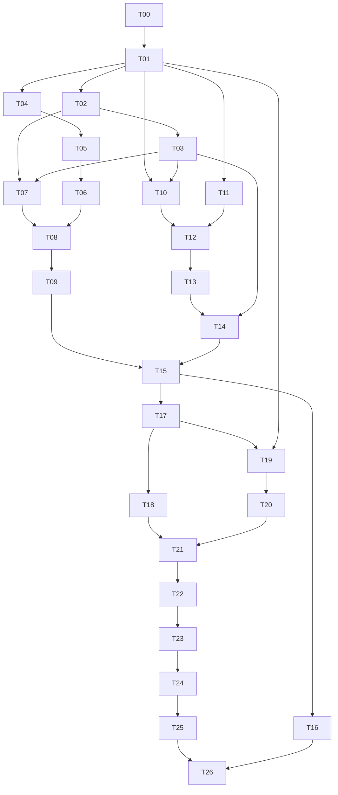

# myQSL v1.1–v1.2 Implementation Plan

> **For agentic workers:** 按任务逐项执行，可使用 `executing-plans` 技能。用户本轮只要求设计与计划，实际编码由接手 AI 完成。本文件不授权本轮设计者开始业务实现。

**Goal:** 在已发布v1.0.0基础上交付本地UDP实时入库、批量矢量PDF与QRZ邮箱电子发卡。

**Architecture:** 沿用模块化Worker/D1/R2/Access。Node代理负责本地协议与durable队列；浏览器Worker负责矢量PDF；云端目录和邮件模块通过D1 outbox + Workflows完成外部发送与回执。

**Tech Stack:** 已有TypeScript、Node24、pnpm10.15、React19、Hono4、Zod、Vitest、Playwright；新增node:dgram/node:sqlite、pdf-lib/fontkit、受控字体、XML parser及Resend/Svix兼容验签。新增依赖在T00/T11/T22审计后锁精确版本，不擅自整体升级技术栈。

## Global Constraints

- 仓库根为 `/Users/zhangneil/WorkBuddy/HAM/eqsr`，路径均相对此根；本计划代码基线 `5bdcffa2a0f9190cc8154d15a368caec4078385b`。
- 先读[需求与技术设计](../specs/2026-09-05-myqsl-v1.1-v1.2-design.md)及[验收矩阵](../specs/2026-09-05-myqsl-v1.1-v1.2-test-matrix.md)。协议、数据模型、限额、错误code以设计为准。
- 不修改历史0001–0003迁移；新增表保持原 `qsl_cards` TEXT id、draft/ready/published/void、`qsos.source=api`兼容。
- `qsl_design_samples`不属于项目，不导入、不添加Git；用户已有变更必须保留。
- v1.1交付UDP与A4四拼；v1.2交付单卡出血、批制卡、QRZ邮件；不做CAT、LoTW、QRZ日志同步、地图、多租户。
- 不改变既有 `/api/v1` 前缀、Owner身份范围和单卡公开URL；新增Agent/签名Webhook明确隔离。
- 单事件HTTPS最大64KiB、打印200张、邮件50张/批、PNG≤5MiB、预览15分钟；不通过扩大限制掩盖容量失败。
- 单项任务约0.5–1.5人日是工程估计，不等同AI运行时间；每项只拥有明确文件责任。共享契约由T01统一，数据库按T02/T10/T17/T19串行迁移。
- 业务编码由接手AI编写；这里给出接口签名说明、具体输入/预期和测试命令，不提供业务实现代码。
- 完成任务应在工作记录中记HEAD、改动文件、验证命令/结果、未验证项；只有实际绿色结果可标记完成。

## 1. 执行方式、命令与质量门禁

任务步骤统一使用复选框；每个task先实现指定失败用例，再最小实现，测试实际通过后提交可审查变更。用户未要求推送/发布时，编码AI先完成本地提交与验收材料，外部发布按项目交付授权执行。

项目已有常用命令：`pnpm run check`、`pnpm generate:openapi`、`pnpm generate:api`、`pnpm test:e2e`、`pnpm check:bundle`、`pnpm check:placeholders`、`pnpm db:migrate:local`、`pnpm verify:production --strict`、`pnpm verify:backup`。

按测试归属运行（以下路径pattern由对应任务创建）：

| 代号 | 命令模板 | 通过标准 |
|---|---|---|
| PKG | `pnpm exec vitest run --config vitest.config.ts --project packages <测试文件>` | 指定文件用例全部通过；新增包必须加入include范围，不能因0用例退出0 |
| API | `pnpm exec vitest run --config apps/worker/vitest.config.ts <测试文件>` | workerd/D1实际测试，不能仅mock repository来证明原子性 |
| WEB | `pnpm exec vitest run --config apps/web/vitest.config.ts <测试文件>` | 正常/错误/取消和权限交互通过 |
| AGENT | `pnpm --filter @myqsl/agent test -- <测试文件>`（T05新增脚本） | Node24、真实临时SQLite/loopback UDP、无真实云凭据 |
| E2E | `pnpm exec playwright test <测试文件>` | 浏览器用例和trace有效；浏览器崩溃属于验证未完成 |
| PRINT | `pnpm verify:pdf -- <产物.pdf> --manifest <预期清单.json>`（T13新增） | 页数/尺寸/字体/文字/QR/截图/元素类型满足标准，非仅PDF能打开 |

T00新增 `docs/phase-2/execution-log.md` 记录任务证据。测试fixtures使用虚构呼号/邮箱，无真实用户token或整库数据。需要实机/账号的任务可先完成fake链路，但相应发布门禁保持未通过，不能以mock替代真机确认。

## 2. 文件结构与任务依赖

| 责任区域 | 新增文件组织 | 修改既有入口 |
|---|---|---|
| 协议/领域 | `packages/domain/src/{radio,printing,delivery}.ts`、`packages/radio-codec/src/{wsjtx,n1mm,binary-reader,mapper}.ts` | domain/index、api-paths、openapi、ADIF公共mapper |
| Agent | `apps/agent/src/{cli,config,receiver,outbox,uploader,diagnostics}.ts`、`outbox-worker.ts` | 根测试/打包/CI配置 |
| 入库/设备 | `apps/worker/src/modules/{integrations,ingest}/{routes,service,repository}.ts` | QSO statement builder、index、env、auth、audit |
| 打印 | `packages/card-pdf/src/{index,layout,preflight,fonts,render}.ts`、`worker/modules/printing/*`、`web/features/printing/*` | card-renderer场景、卡片资产、列表选择、router/i18n |
| 目录/发送 | `worker/modules/directory/{client,service,repository}.ts`、`worker/modules/deliveries/{routes,service,repository,prepare-workflow,workflow,provider,webhook}.ts` | 批制卡、cron/Env、router、OpenAPI、Secrets检查 |
| 交付 | 新迁移0004–0007、`scripts/verify-pdf.mts`、`scripts/build-agent.mts`、`docs/runbooks/{agent,printing,email}.md` | CI、backup fixtures/manifest、Workers Builds手册 |

T00–T15为v1.1，T16–T26为v1.2；T19–T20可以在v1.1收尾时预研，但v1.2发布仍依赖T15。一个AI顺序执行全部任务即可；图仅表达依赖，不要求启动并行子代理。

## 3. 工作包A：v1.1实时UDP入库

### Task T00：确认基线、协议样本与兼容性探针

版本v1.1；依赖无；估计1人日。

**文件责任：**新建 `docs/phase-2/execution-log.md`、`docs/phase-2/protocol-compatibility.md`、`packages/radio-codec/test/fixtures/manifest.json`、`tests/fixtures/radio/`；只读现有PRD、迁移、部署配置。

**接口：**消费当前HEAD/设计；产出固定WSJT-X版本、schema/type、N1MM版本、Node24补丁、测试平台、fixture来源/sha256/授权的兼容矩阵。

- [ ] 记录HEAD、dirty状态和当前check结果；核对旧迁移、Card状态、source CHECK，不把旧评审当当前错误清单。
- [ ] 收集合法脱敏type5/type12/heartbeat、N1MM contactinfo/delete/replace/AppInfo fixtures；保留时间/频率单位与原始包结构，源代码手造fixtures标为synthetic，不能冒充抓包。
- [ ] Node24四个平台做node:sqlite WAL/FULL/reopen探针；按设计SQLite替代条件记录结论，不在失败平台降级为纯内存队列。
- [ ] 明确WSJT type5 schema3与type12 schema2/3的支持范围；N1MM实际版本记录可复现下载/版本号。
- [ ] **验收：**兼容矩阵每个“支持”单元有fixture或实机证据；未得样本单元标“未验证，阻断该兼容声明”；测试矩阵U01–U04具备输入文件。

### Task T01：公共契约、规范化映射与OpenAPI基线

版本v1.1；依赖T00；估计1人日。

**文件责任：**新建 `packages/domain/src/radio.ts`、`printing.ts`、`delivery.ts`、`packages/domain/test/phase2-contracts.test.ts`、`packages/adif-codec/src/qso-mapper.ts`；修改domain/index、api-paths、openapi、adif-codec/index及现有 `apps/web/src/features/imports/adif-mapper.ts` 的兼容包装。生成openapi和api-types。

**接口：**定义设计中的 `RadioEventV1`、`IngestReceipt`、`PrintProfileV1`、`PrintManifestV1`、`DeliveryPreview/DeliveryStatus`；纯 `mapAdifRecordToQso(record,stationContext)`返回QsoInput或issues，`hashRadioEvent(event)`固定排序语义。

- [ ] 为负RST、频率Hz/MHz、FT8、submode空值、排序hash、同key异payload和缺站台建立PKG契约用例。
- [ ] 从Web mapper抽取平台无关字段映射；Web保持原接口/四桶行为，禁止Node包引用Web文件。
- [ ] 为新增路径/请求/返回/error code建立OpenAPI注册，Owner/Agent/Webhook安全scheme分离。
- [ ] 定义响应data envelope及所有版本/size限制；禁止泛型Record掩盖核心业务字段，所有外部输入schema运行时校验。
- [ ] **验收：**PKG phase2-contracts和原ADIF/import用例全绿；generate两次无diff；路径与设计一致，API客户端方法由后续任务显式补齐。

### Task T02：设备、来源和幂等收据迁移

版本v1.1；依赖T01；估计1人日。

**文件责任：**新建 `infra/migrations/0004_agent_ingest.sql`、`apps/worker/src/modules/integrations/repository.ts`、`apps/worker/src/modules/ingest/repository.ts`（建模部分）、`apps/worker/test/integrations/schema.test.ts`；同步 `platform/schema.ts`。

**接口：**表agent_devices/agent_profiles/ingest_events/qso_source_links；repository提供 `findReceipt(deviceId,eventId)`、`findSourceLink(sourceKind,sourceInstance,recordId)`。

- [ ] 先在v1.0 fixture应用0004，验证旧QSO/卡片/导入和source CHECK完全保留。
- [ ] 建立设计§7联合唯一键、FK、复合索引、最小墓碑字段；绑定nullable值必须为null。
- [ ] 建立并发相同receipt/source key的约束用例；QSO永久删除后source link仍保留墓碑。
- [ ] 更新schema类型；不得修改0001来让新装正常、升级失败。
- [ ] **验收：**API schema测试通过；新装/旧库升级都可读旧数据；重复key硬约束阻止双写；迁移检查使用local配置。

### Task T03：Owner/Agent/Webhook安全分组及设备管理

版本v1.1；依赖T02；估计1.5人日。

**文件责任：**新建 `apps/worker/src/platform/agent-auth.ts`、`modules/integrations/{routes,service}.ts`、`apps/worker/test/integrations/auth.test.ts`；修改index.ts/env.ts/access.ts/origin.ts、生产配置校验脚本和测试、runbooks/access-paths。

**接口：**`requireAgent`输出 `device_id,profile_ids,actor`；Owner设备create/list/revoke/rotate/config/heartbeat见设计§8。

- [ ] 写机器token访问Owner删除/备份/发信必须拒绝、Owner不能假造Agent、缺issuer/aud生产失败、所有嵌套路由CSRF用例。
- [ ] 分组挂载路由，避免先注册广域Owner fallback导致Agent被拦，也避免Agent分支给未知路径放行。
- [ ] 实现token随机生成/hash/90天有效期/吊销；审计只记录device ID，rotate响应no-store且不能在重放时返旧secret。
- [ ] 更新部署文档：独立AGENT_ACCESS_AUD、Service Auth路径、scope、workers.dev直访仍应用验证；预览只用明确fake身份。
- [ ] **验收：**API auth测试及原鉴权测试全绿；设备撤销后下一次上报失败；服务端只承认固定issuer/aud；生产strict脚本拒绝authDisabled。

### Task T04：WSJT-X与N1MM纯协议解码

版本v1.1；依赖T01；估计1.5人日。

**文件责任：**新建 `packages/radio-codec/package.json`、`tsconfig.json`、`src/{index,binary-reader,wsjtx,n1mm,mapper}.ts`、`test/{wsjtx,n1mm,fuzz}.test.ts`；修改根测试include和dependency-cruiser边界。

**接口：**`decodeDatagram(bytes,sourceKind,context)`返回 `logged event / external change / heartbeat / ignored / ParseIssue`；无文件/网络副作用。

- [ ] 用U01–U08 fixtures断言大端、null QByteArray、DateTime UTC/offset、毫秒、TimeOn、Hz/10Hz、负报告、N1MM delete/replace不自动CRUD。
- [ ] 实现按剩余字节计数的reader，单包≤64KiB，XML禁DTD/ENTITY、限深32、元素数量1000、字段长度上限；未知尾字段忽略。
- [ ] 明确type12优先候选关联key，单独产生type5 candidate；DateTime歧义/未知模式返回可解释issue。
- [ ] 运行固定种子的1万随机/截断输入，不能崩溃/无限循环/越界分配；不在codec执行任意UDP控制命令。
- [ ] **验收：**PKG wsjtx/n1mm/fuzz全部通过；官方样本与人工expected匹配；tests不能调用解析器自身生成expected值。

### Task T05：本地SQLite outbox与代理运行骨架

版本v1.1；依赖T04；估计1人日。

**文件责任：**新建 `apps/agent/package.json`、`tsconfig.json`、`vitest.config.ts`、`src/{config,outbox,outbox-worker}.ts`、`test/{outbox,recovery,config}.test.ts`。

**接口：**`Outbox.enqueue(event)`承诺durable后返回；`claimDue(now,limit)`、`ack(eventId,receipt)`、`retry(eventId,when,error)`、`quarantine(eventId,issue)`、`stats()`；SQLite数据目录由配置显式指定。

- [ ] 用真实tmp SQLite写事件、kill/reopen、inflight恢复、磁盘满/锁冲突用例，不用Map替代持久层。
- [ ] 实现独立worker thread单写者、WAL/FULL、event payload不可变、candidate持久化和schema版本。
- [ ] 加50k/256MiB容量、80%告警、acked7天清理、未确认不淘汰；凭据配置不和outbox日志混存。
- [ ] 发布 `@myqsl/agent test`/typecheck/build脚本；root check纳入agent而非passWithNoTests。
- [ ] **验收：**AGENT outbox/recovery/config全绿；重启后事件ID/hash完全一致；满额明确停止且旧记录保留。

### Task T06：UDP接收、合并及HTTPS补传

版本v1.1；依赖T05；估计1.5人日。

**文件责任：**新建 `apps/agent/src/{receiver,uploader,cli,diagnostics}.ts`、`test/{receiver,uploader,cli}.test.ts`。

**接口：**CLI命令 `myqsl-agent init/run/status/doctor/quarantine export`；uploader消费Outbox、服务端config与receipt；不监听本地HTTP管理口。

- [ ] 用真实loopback发送type5/type12与N1MM重放；重复candidate在断电后也只得到一个语义事件。
- [ ] 实现绑定默认地址、显式LAN白名单、端口占用错误、最小Heartbeat协商、状态计数；非日志Decode不写outbox。
- [ ] 实现固定origin HTTPS、禁凭据重定向、超时、401暂停、429 Retry-After、5xx指数抖动、最大2并发/同profile串行。
- [ ] `status/doctor`输出队列深度、最老年龄、last_packet/logged/cloud、配置缺项、端口占用；诊断export脱敏。
- [ ] **验收：**AGENT三文件用例通过；回包丢失重发相同ID；重试不会提高云端写权限；不启用调频/发射控制。

### Task T07：实时入库事务与双层去重

版本v1.1；依赖T02/T03；估计1.5人日。

**文件责任：**新建 `apps/worker/src/modules/ingest/{routes,service}.ts`、`apps/worker/src/modules/qsos/write-statements.ts`、`apps/worker/test/ingest/{events,concurrency}.test.ts`；修改ingest/repository、QsoRepository仅提取statement builder。

**接口：**`ingest(event,agentContext): IngestReceipt`；`commitCreatedEvent`/`commitDuplicateEvent`拥有单个D1 batch；复用normalizeQso/makeDedupeKey。

- [ ] 写并发10次同event、同event异hash、不同event同QSO、手工建QSO与上报竞争、审计插入失败、软删后重放用例。
- [ ] 代理station只从profile取，拒绝报文本台不符，source固定api，不触发QsoService自动建台。
- [ ] 把receipt+QSO+source link+audit放同batch；竞争失败重读/重组重复batch≤3次；受影响行0不能当自动rollback。
- [ ] 实现结构422/幂等409/业务rejected200区分；external change持久化review，不执行update/delete。
- [ ] **验收：**API events/concurrency通过；重复请求只有一个QSO和一次创建审计；失败batch不留孤立receipt；旧手工/导入QSO测试无回归。

### Task T08：集成状态与异常收件箱UI

版本v1.1；依赖T06/T07；估计1人日。

**文件责任：**新建 `apps/web/src/features/integrations/{AgentSettingsPage,IngestInboxPage}.tsx`及对应测试；修改router/AppLayout/i18n/api-client；补 `integrations/routes.ts` Owner分页/dismiss。

**接口：**设计§8设备与事件Owner API；页面只显示masked凭据，一次性token显示后不本地持久保存。

- [ ] 实现设备创建/绑定/轮换/撤销、CLI配置指南、复制token一次展示及清理。
- [ ] 实现cursor分页事件列表，筛选review/rejected、显示字段差异/已删标记，跳到现有QSO操作；dismiss需reason。
- [ ] 前台每5秒轮询配置/状态与新日志，隐藏tab暂停，恢复自动刷新；离线区分客户端网络与代理offline。
- [ ] **验收：**WEB两页面测试通过；U09–U13 UI验收通过；暂停/撤销不会删本地待传数据，提示可恢复流程。

### Task T09：代理跨平台分发和真机入库验收

版本v1.1；依赖T08；估计1人日+真机窗口。

**文件责任：**新建 `scripts/build-agent.mts`、`.github/workflows/agent-release.yml`、`docs/runbooks/agent.md`、`tests/e2e/agent-ingest.spec.ts`；更新CI节点矩阵、execution-log。

**接口：**tag `agent-v1.1.x` →编译JS/依赖ZIP+SHA256SUMS+license+runtime manifest；用户自备Node24。与Worker静态资产构建分离。

- [ ] 为四平台验证install/run/stop/upgrade/reopen，数据目录不在安装目录；Windows ACL和POSIX权限检查可复现。
- [ ] 实机WSJT保存FT8、N1MM新增记录、两源重复、断网24小时后补传与ADIF补录流程，记录版本/时间与唯一行数。
- [ ] CI只构建/测试产物，发布tag才上传Release；从非main伪造tag不得读取production secrets。
- [ ] **验收：**U14/U15实机记录和E2E通过；SHA校验可复现；已接收落盘记录100%最终可归类，未接收UDP丢包明确有补录流程。

## 4. 工作包B：v1.1矢量PDF与v1.2印刷扩展

### Task T10：冻结打印批次与私有资产接口

版本v1.1；依赖T01/T03；估计1.5人日。

**文件责任：**新建 `infra/migrations/0005_print_batches.sql`、`apps/worker/src/modules/printing/{routes,service,repository}.ts`、`apps/worker/test/printing/{manifest,assets}.test.ts`；修改Env/index/OpenAPI/schema与api-client。

**接口：**设计§5.4 PrintBatch API；items分页≤20；create采用有序IDs+版本+Idempotency-Key；快照/asset固定。

- [ ] 写0/5/200/201张、同key异输入、QSO版本变化、模板变化、缺资产、ready卡QR、void卡用例。
- [ ] 事务冻结所有条目后再进入ready，失败不得返回部分ready manifest；记录逐item hash和整体序列hash。
- [ ] 资产读取按batch引用查R2，Owner/no-store，禁止任意R2 key/URL；冻结引用存续期间禁止旧背景清理。
- [ ] complete记录client_reported hash/page_count，expired410；print batch绝不创建公开卡。
- [ ] **验收：**API manifest/assets通过；创建后改QSO/模板仍输出旧快照；未授权不能取背景；200条在D1绑定限制内运行。

### Task T11：纯场景、字体资产与真正入口预算

版本v1.1；依赖T01；估计1人日。

**文件责任：**新建 `packages/card-renderer/src/scene.ts`、`packages/card-renderer/test/scene.test.ts`、`apps/web/public/fonts/manifest.json`和授权字体/许可证；修改render/format/index、Vite manifest配置、`scripts/check-bundle.mts`及测试。

**接口：**`resolveCardScene(template,qsoSnapshot,publicContext)`输出无DOM场景；font manifest定义fontAlias→asset/hash/glyph coverage；`check:bundle`解析entry静态import闭包。

- [ ] 先对旧Canvas渲染建立黄金用例；新增场景对齐、基线、max_width缩字号、空QR、缺字检测。
- [ ] 固定字体别名和简繁中文覆盖清单，许可证随资产；不同机器不得使用system font兜底。
- [ ] Vite manifest区分entry/imports与dynamicImports/worker；入口≤250KiB、PDF lazy≤1.5MiB、总静态≤15MiB、单文件≤5MiB。
- [ ] **验收：**PKG scene及旧render测试通过；bundle门禁能正确失败“把pdf-lib直接导入首页”的回归fixture；字体缺字明确报错。

### Task T12：独立矢量PDF渲染与预检引擎

版本v1.1；依赖T10/T11；估计1.5人日。

**文件责任：**新建 `packages/card-pdf/{package.json,tsconfig.json}`、`src/{index,layout,preflight,fonts,render}.ts`、`test/{layout,preflight,render}.test.ts`；修改workspace测试include。

**接口：**`preflight(manifest,assets): PreflightReport`、`renderPdf(manifest,assets,{onProgress,signal}): {bytes,report}`；profile a4-four-up-v1。

- [ ] 写四slot精确mm坐标、5张2页、200张50页、排版顺序、DPI不足、比例超差、missing font、QR空内容用例。
- [ ] 直接绘文本与QR矩阵，嵌入复用背景，字体subset，PDF原点转换与max_width统一；图片不转整卡。
- [ ] 实现≤200张、≤10背景/30MiB、输出≤50MiB、按页进度/中断；不把200份背景重复embed。
- [ ] **验收：**PKG三组测试通过；PDF页面mm误差≤0.1；文字可提取、字形嵌入，QR矢量放大仍清晰；相关能力还需T13独立验证。

### Task T13：PDF独立结构/视觉验证工具

版本v1.1；依赖T12；估计1人日。

**文件责任：**新建 `scripts/verify-pdf.mts`、`scripts/verify-pdf.test.ts`、`tests/fixtures/printing/`、`docs/runbooks/printing.md`；修改根 `verify:pdf` 脚本、CI安装检测工具。

**接口：**PRINT命令输出JSON证据：page_count、page_boxes、embedded_fonts、extracted_text、QR decoded values、vector/text operators、render comparison。

- [ ] 使用独立引擎PDF.js/Poppler解析和栅格化（开发测试依赖，不打进业务首页）；golden expected手工按几何计算。
- [ ] 增加“PNG整页包PDF”的反例，验证工具必须拒绝；中文缺字/二维码错误/顺序翻转也必须失败。
- [ ] 保留标准A4样稿，100%打印后尺测140×90mm（允许物理打印误差≤1mm），记录驱动缩放和纸张方向。
- [ ] **验收：**P01–P12自动证据齐全；打印真机样稿没有Fit缩放；qrcode被另一解码器解出正确URL，不能只比较二维码像素。

### Task T14：打印选择、预览、后台生成与取消

版本v1.1；依赖T10/T12/T13/T03；估计1.5人日。

**文件责任：**新建 `apps/web/src/features/printing/{PrintPage,PrintPreview}.tsx`、`print-controller.ts`、`pdf.worker.ts`、对应WEB测试与 `tests/e2e/printing.spec.ts`；修改QsoListPage/CardListPage/router/i18n/api-client。

**接口：**选择集为有序id+version，后台worker消息 `start/progress/completed/failed/cancelled`；预览输入与实际PDF同manifest。

- [ ] 实现跨分页显式勾选、最多200、选择计数，按清单固定顺序；不提供未定义“所有搜索结果全选”。
- [ ] QR缺已发布卡时明确两种操作；每个预检warning可定位卡/元素；用户确认降质仅本batch有效。
- [ ] Web Worker懒加载，受控prefetch、WebP转PNG、取消/retry/object URL清理；重新打开可取7天内冻结批次重新生成。
- [ ] **验收：**WEB/E2E通过；首页不下载PDF/font大包；取消后停止CPU工作；修改模板不改变已有批次；100张性能证据满足目标或据实阻断容量声明。

### Task T15：v1.1集成回归和发布准备

版本v1.1；依赖T09/T14；估计1人日。

**文件责任：**修改 `.github/workflows/ci.yml`、`wrangler.jsonc`、`wrangler.test.jsonc`、`docs/runbooks/{deploy,rollback,production-checklist,backup,restore}.md`、PRD/README；更新backup SQL/manifest fixtures。

**接口：**FEATURE_AGENT_INGEST、FEATURE_PRINT与owner-only能力配置；v1.1发行记录。

- [ ] 本地新库/旧库迁移+旧版读取兼容+新表恢复验证，冻结资产保留检查。
- [ ] 运行check/generate drift/bundle/placeholders/新增E2E；CLI四平台与PDF样稿作为独立required checks。
- [ ] staging配置Access设备通道，feature先关后单设备开；验证来源伪造、worker直访、站台scope。
- [ ] 更新PRD v1.1准确能力边界，去掉“打印PNG就是矢量/UDP绝不丢/500条chunk”等与代码不符叙述；QSL_PRD.MD如果继续保留则同步生成并加一致性检查。
- [ ] **验收：**验收矩阵v1.1列无未完成阻塞项；回滚只关feature/回退应用、不删迁移，旧手工/ADIF/单卡/公开验证/备份可用。

### Task T16：v1.2单卡出血交印预设

版本v1.2；依赖T15；估计0.5人日。

**文件责任：**修改 domain/printing、card-pdf layout/preflight/render及tests、PrintPage/PrintPreview、verify-pdf、printing runbook。

**接口：**profile `single-bleed-v1`，每页146×96，TrimBox140×90偏移3，BleedBox整页；原A4 profile行为不变。

- [ ] 写page boxes、3mm bleed、3mm safe inset、背景cover、非全出血警告/缺字用例。
- [ ] UI区分家用A4与单卡印厂稿，导出前展示页数和RGB/非PDF-X事实；不自动给A4四拼加会裁掉的出血。
- [ ] **验收：**P13–P14通过；印厂或独立印前工具验证TrimBox/BleedBox；不承诺未实现的CMYK/双面套准。

## 5. 工作包C：v1.2 QRZ邮箱发卡

### Task T17：卡片冻结资产读取与批量草稿幂等

版本v1.2；依赖T15；估计1人日。

**文件责任：**新建 `infra/migrations/0006_card_batches.sql`、`modules/cards/batch-service.ts`、`batch-repository.ts`、`apps/worker/test/cards/batch.test.ts`；修改cards service/repository/routes、api contract。

**接口：**POST/GET card-batches，GET cards/:id/background；输入qso_versions/template_version，返回ordered card ids。

- [ ] 写相同Idempotency-Key重放、50/51条、版本冲突、途中审计失败、背景更改后快照读取用例。
- [ ] 抽取单卡createDraft的snapshot builder；新增批量建draft与items/audit统一D1 batch；旧单卡也重用该builder。
- [ ] 背景读取从template_snapshot_json取immutable key/hash，不能用最新template URL；新卡snapshot频率精度与字段完整保留。
- [ ] **验收：**API batch/旧cards测试通过；重复批次不增卡；任何失败不留下被当成功的半批；qsl_cards状态和ID未变。

### Task T18：浏览器批制卡与单卡快照一致性

版本v1.2；依赖T17；估计1人日。

**文件责任：**新建 `apps/web/src/features/cards/card-batch-controller.ts`及test、`CardBatchPage.tsx`；修改CardCreatePage、renderer调用、router/api-client/i18n。

**接口：**draft快照→PNG→attach→publish，最多2张并发；已有ready跳过渲染、published跳过发布；失败不自动新建draft。

- [ ] 针对“取snapshot而非列表活数据”建立回归用例，card_token/public_url注入卡片自身ID；背景改动不影响渲染。
- [ ] 实现字段完整渲染、asset hash验证、每卡可恢复状态/单卡错误；上传前≤5MiB检查并提示后续email限制。
- [ ] 修复当前单卡链路使用列表QSO/当前Template的问题；保持外部URL和已发布PNG不改。
- [ ] **验收：**WEB controller/CardCreate旧新用例通过；关闭/重开批次继续原card id；半批失败可只重试失败项，公开卡保持正确状态。

### Task T19：邮件数据、PII封装与配额事务

版本v1.2；依赖T01/T17；估计1.5人日。

**文件责任：**新建 `infra/migrations/0007_directory_deliveries.sql`、`platform/pii.ts`、`modules/directory/repository.ts`、`modules/deliveries/repository.ts`、`apps/worker/test/deliveries/{schema,privacy,quotas}.test.ts`；修改env/schema/audit脱敏与restore fixtures。

**接口：**设计§7所有目录/批次/items/delivery/attempt/event/suppression/quota表；`encryptContact/decryptContact/hashRecipient`；`reserveDispatch(deliveryId,day,limit)`。

- [ ] 写AES-GCM错key/nonce、key_version轮换、邮箱domain规范化（local-part保留）、日志/audit无地址用例。
- [ ] 为payload/hash/状态/preview_version定义持久类型；添加unique provider key、logical delivery key和due索引。
- [ ] 事务预约配额与delivery状态必须同时成功；100限额下并发101次最多100个排队，取消未调用外部才退额，unknown不退；增加全局dispatch_throttle和跨日reservation转移字段。
- [ ] **验收：**API三组用例通过；D1明文搜索无真实邮箱/正文；新表恢复+密钥恢复解密证明通过；旧表迁移不受影响。

### Task T20：QRZ目录适配与受控缓存

版本v1.2；依赖T19；估计1人日。

**文件责任：**新建 `modules/directory/{client,service}.ts`、`apps/worker/test/directory/{qrz,cache}.test.ts`；修改delivery-settings状态接口/env/生产预检。

**接口：**`lookupCardRecipient(cardSnapshot): DirectoryResult`；返回ready或设计§6.1错误类型，不提供任意公开email lookup。

- [ ] 用模拟HTTP响应测试XML 1.34正常/无邮箱/缺订阅/Session失效/命名空间变化/未知字段/HTML500，确保只有一次重登录。
- [ ] 固定HTTPS POST表单目标、禁止跨域重定向、超时10秒、response≤256KiB、DTD/ENTITY禁用；不在URL日志放账号/session。
- [ ] 实现会话single-flight与有限缓存、alias检查；后缀/别名需Owner确认，完整call查不到不自动猜email。
- [ ] **验收：**API qrz/cache通过；两次同呼号有效缓存最多一次lookup；账号缺失返回feature-unavailable而非影响QSO；真实授权QRZ自测留脱敏证据。

### Task T21：异步收件人预览与发送提交

版本v1.2；依赖T18/T20；估计1.5人日。

**文件责任：**新建 `modules/deliveries/{service,routes,prepare-workflow}.ts`、`apps/worker/test/deliveries/{preview,submission}.test.ts`；修改repository/Env/index/OpenAPI/api-client。

**接口：**POST delivery-batches返回202/preparing；`EmailPreparationWorkflow`消费batch_id，产出逐item preview；POST send消费明确delivery_ids+preview_version+key。

- [ ] 准备流程最多2个目录查询并发，已经准备的item不重做；workflow step只返回ID/脱敏状态，不把邮箱/secret放持久step日志。
- [ ] 写同卡重复批次复用/已发阻止、无邮箱blocked、预览15分钟过期、用户只选择ready子集、卡片void/QRZ地址变化场景。
- [ ] 冻结每封payload/hash/recipient/附件；提交不接受客户端To/From/body；预约配额+outbox+审计原子完成；实现confirm-alias精确路径，只授权当前preview item、版本递增，不改全局目录授权。
- [ ] **验收：**API preview/submission通过；创建preview无一封外发；同preview多次send只有一条delivery任务；50项目不挤进单HTTP请求50次外部查询。

### Task T22：Resend adapter、附件与幂等窗口

版本v1.2；依赖T21；估计1人日。

**文件责任：**新建 `modules/deliveries/provider.ts`、`email-template.ts`、`apps/worker/test/deliveries/provider.test.ts`；修改依赖/Env/status预检与runbooks/email.md。

**接口：**`EmailProvider.send(envelope,key)`/`getStatus(id)`；Resend实现，Fake实现只测试；供应商key=delivery_id固定不变。

- [ ] 验证标题/HTML/Reply-To转义，单To、无CC/BCC、PNG原始≤5MiB、Base64总payload与服务商上限；link-only需要预览确认。
- [ ] 测同key同body返回同provider_id，同key异body409终止，超时/429可重试；provider error转换稳定code无secret。
- [ ] 用部署白名单自测邮箱验证SPF/DKIM/DMARC与附件/查验链接，测试开关禁止发至真实友台。
- [ ] **验收：**API provider通过；一次真实自测的请求ID/provider回执可关联，错误时不伪造sent；公开R2地址不被作为附件获取来源。

### Task T23：邮件Workflow、租约与cron补偿

版本v1.2；依赖T22；估计1.5人日。

**文件责任：**新建 `modules/deliveries/workflow.ts`、`scheduler.ts`、`apps/worker/test/deliveries/{workflow,recovery}.test.ts`；修改index scheduled分派、Env/workflow binding及test配置。

**接口：**`EmailDispatchWorkflow`仅接delivery_id，D1 claim/attempt为事实源；`dispatchDue(now,limit=50)`补偿未触发workflow、preparing batch。

- [ ] 写provider受理后D1失败、workflow创建失败、重入、租约过期旧执行回写、超过23小时、最大8次、cancel与claim竞争用例。
- [ ] 发送前检查card published且QSO未删/suppression/额度；HTTP前持久attempt并取得全局1秒时槽、跨日转移reservation，固定key；unknown不得自动新key重试。
- [ ] 每分钟cron只处理mail/maintenance；每日20:00才走既有backup，设计controller.cron分支并测试两类schedule。
- [ ] **验收：**API workflow/recovery通过；所有accepted外发至多同key重试；外部结果未知有明确状态；故障注入重启不重复发卡；backup触发频率没变。

### Task T24：Webhook回执、乱序合并与退信抑制

版本v1.2；依赖T23；估计1人日。

**文件责任：**新建 `modules/deliveries/webhook.ts`、`apps/worker/test/deliveries/{webhook,suppression}.test.ts`；修改路由挂载/Access路径说明、repository/PII日志策略。

**接口：**原body签名验证→规范事件入库→状态reduce；provider_event_id幂等，未知provider_id先orphan保存。

- [ ] 测原始字节修改、JSON键重排、过期签名、重复ID、不同type乱序、回执早于send响应；无效必须401。
- [ ] complaint/hard bounce与suppression同事务；delivered不能解除；sent不降级delivered；soft delay不抑制。
- [ ] 存储成功才ACK，orphan由scheduler补偿；Webhook限长/无Owner身份仍必须签名，不能让此bypass覆盖其他路径。
- [ ] **验收：**API两组测试通过；重复1,000次回执只一行事件且一次状态影响；被抑制地址的新卡也不能发送。

### Task T25：发卡UI、补发/取消与错误解释

版本v1.2；依赖T24；估计1.5人日。

**文件责任：**新建 `web/features/deliveries/{DeliveryPage,DeliveryPreview,DeliverySettingsPage}.tsx`、`delivery-controller.ts`及WEB测试、`tests/e2e/email-dispatch.spec.ts`；修改cards入口/router/i18n/api-client。

**接口：**预览轮询→明确勾选delivery_ids→send；GET状态含可操作动作，cancel/retry/resend按设计区分。

- [ ] 实现单卡预览后一键、50张批量就绪/跳过数、历史呼号/alias确认、无邮箱/订阅不足说明，不能显示“已读”。
- [ ] 取消只queued/retry_wait；unknown进入待核实；resend要求reason和明确可能重复确认并由服务端生成revision。
- [ ] 不显示token/password/未授权完整邮箱，页面没有来自第三方的任意HTML；语言/主题沿用原组件。
- [ ] **验收：**WEB/E2E通过；双击发送/刷新/多个tab不会多发；所有blocked项有原因；lookup预览不自动发送。

### Task T26：v1.2恢复演练、集成验收与交付文档

版本v1.2；依赖T16/T25；估计1人日+账号/实物验收窗口。

**文件责任：**修改CI、wrangler配置、backup/restore/rollback/deploy/production-checklist、PRD/README、execution-log；新增 `docs/phase-2/v1.2-release-evidence.md`。

**接口：**双Workflow bindings、feature mail开关、QRZ/Resend/PII key版本和rollback运行约定。

- [ ] 自动门禁覆盖三个新包/agent、API/WEB/E2E、PDF结构、依赖audit、OpenAPI生成；当前已有单卡/导入/公开撤销/backup都回归。
- [ ] staging邮件自测及有限真实经Owner确认发卡；保留provider提交/回执、退信测试、配额与unknown恢复证据，不用虚拟200代替。
- [ ] 还原D1+R2+单独PII key；恢复sending到unknown，核对provider后再恢复队列；证明恢复不会批量补发旧邮件。
- [ ] 按设计发布开关和Access路径，GitHub main到Workers Builds仅一发布通道；回滚暂停外发但继续收Webhook，迁移表不DROP。
- [ ] **验收：**测试矩阵全部release-blocking项通过或明确未满足并阻止相关功能发布；交付README/安装包/PDF样稿/运行手册齐全；PRD版本边界与代码一致。

## 6. 里程碑与交接完成定义

| 里程碑 | 完成任务 | 可演示交付 | 放行标准 |
|---|---|---|---|
| M0 契约/兼容 | T00–T03 | 已知协议样本、scope验证、迁移可用 | 无关键协议/身份歧义 |
| M1 实时入库 | T04–T09 | 真机QSO入库、断网补传、审阅与代理包 | U系列全部支持范围验证 |
| M2 v1.1 | T10–T15，且M1 | 标准A4矢量PDF、200张上限内可用、旧流程回归 | v1.1 gate通过 |
| M3 邮件基础 | T17–T22 | 快照批制卡、异步目录预览、自有邮箱发卡 | 无隐式外发；幂等和配额成立 |
| M4 v1.2 | T16、T23–T26 | 出血稿、批量发卡、Webhook、恢复演练 | v1.2 gate通过 |

估算总量约29–34人日，实机/字体印刷/账号开通可能影响日历时间。依赖门禁和验收优先于日期；任务不能靠“实现了某个函数”自动完成。每次交接至少提供：任务ID、提交HEAD、精确改动列表、测试结果、截图/样稿或协议fixture、功能开关与迁移状态。

需求追溯：U01–U10→T00–T09；P四拼/字体/快照→T10–T15；P出血→T16；批制卡→T17–T18；QRZ→T19–T21；发信/幂等→T22–T23；回执/抑制→T24；用户发送流程→T25；GitHub/Cloudflare与恢复→T15/T26。全部验收输入/预期见验收矩阵，避免只覆盖happy path。
