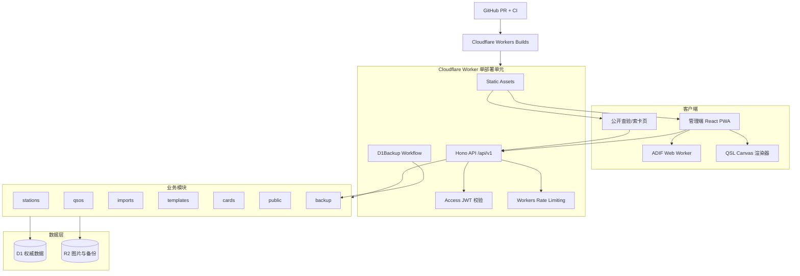

# eQSR 最终技术架构设计

> 文档状态：评审稿
> 决策日期：2026-09-03
> 输入方案：`eQSL_Solution.md`、`eQSL_Solution1.md`
> 适用范围：首个可上线版本（核心闭环）及后续演进
> 目标执行者：Luna Max 或具备 TypeScript/Cloudflare Workers 经验的开发者

## 0. 最终结论

本项目采用**分阶段模块化单体**，而不是照搬任一原方案：

- 部署形态采用第二份方案的 **单个 Cloudflare Worker + Static Assets**，前端与 API 同域、同版本发布；不采用 Pages + Functions 双部署单元。
- 产品范围采用第一份方案的轻量思路，首版只完成：单用户管理端、QSO CRUD、ADIF 双向互通、QSL 模板与卡片、公开查验、备份恢复、GitHub 自动部署。
- 管理端认证改用 **Cloudflare Access**，应用内仍校验 Access JWT；首版不自研密码、登录、JWT、KV 吊销体系。
- 公开接口使用**不可枚举卡片令牌 + 精确条件索卡**，不提供模糊呼号查询。
- ADIF 解析和卡片位图渲染放到浏览器 Web Worker/Canvas；Worker 只做校验、持久化和对象流式传输。
- D1 是结构化业务数据的唯一权威库；R2 保存模板背景、已发布卡片和长期备份。卡片保存生成时的业务快照，避免后续修改 QSO 或模板导致已发卡片漂移。
- GitHub 是代码、迁移和架构决策的唯一源；PR 通过 CI 后才能合并，合并 `main` 后由 Cloudflare Workers Builds 自动执行兼容性迁移并发布。

产品名称统一为 **eQSR（electronic QSO & QSL Record）**；“eQSL”仅表示其中的电子卡片能力。仓库、Worker 和包名前缀统一使用 `eqsr`。

## 1. 业务目标与范围

### 1.1 首版必须达成

| 编号 | 能力 | 可验收结果 |
|---|---|---|
| G1 | 多端 QSO 管理 | 手机、平板、电脑可新增、查看、筛选、编辑、移入回收站和恢复 QSO |
| G2 | ADIF 双向互通 | 支持当前 ADIF 3.1.7 的 `.adi` 导入、重复分类、错误定位和全量导出；合规未知字段语义无损保留 |
| G3 | 电子 QSL | 模板配置、浏览器预览、PNG 导出、发布到 R2、生成二维码与公开链接 |
| G4 | 公开查验/索卡 | 持令牌可直接查验；无令牌时使用“完整呼号 + UTC 日期”精确索卡 |
| G5 | 数据主权 | D1 每日 SQL 导出到 R2；管理端随时导出 ADIF；有验证过的恢复手册 |
| G6 | 自动交付 | GitHub PR 自动检查；`main` 合并后 Cloudflare 自动迁移和部署；可回滚 Worker 版本 |

### 1.2 首版明确不做

- 不开放注册，不做多租户和复杂 RBAC。
- 不做 eQSL.cc、Club Log、LoTW 自动同步；仅保证未来可通过模块和 API 接入。
- 不做邮件投递，先提供可复制公开链接和二维码。
- 不做离线写队列和多端冲突合并；首版 PWA 只缓存静态应用壳。
- 不做 DXCC/WAS 奖项引擎、CAT、WSJT-X UDP 网关、打印级 CMYK/PDF。
- 不承诺 `workers.dev` 在中国境内的可达性；生产必须使用 Cloudflare 托管的自定义域名。

### 1.3 不变式

1. D1 中的 QSO/模板/卡片元数据是权威数据；R2 图片是版本化派生物，R2 备份是灾备副本。
2. 所有 QSO 时间以 UTC 保存；ADIF 原生日期/时间字段与内部排序时间同时保存。
3. 已发布卡片展示创建时快照，不随 QSO 或模板后续修改。
4. 所有数据库变更都来自仓库中的不可改历史迁移；生产禁止在 Dashboard 手工改表。
5. 外部服务故障不得阻塞 QSO 录入、导出、卡片查看等核心链路。

## 2. 两份方案拆解

### 2.1 方案 A：`eQSL_Solution.md`

**核心目标**：以最低基础设施成本快速完成个人日志、ADIF、卡片模板和公开索卡闭环。

**架构分层**：

1. React/Tailwind 管理端与公开端；
2. Cloudflare Pages/CDN 接入；
3. Pages Functions 或 Workers 上的 Hono API；
4. D1 三张核心表与 R2 图片存储；
5. 可选 QRZ/HamQTH 数据富化。

**关键选型**：React 19、Vite、Tailwind、Hono、Zod、D1、R2、Canvas + Worker SVG。

**实现路径**：先建最小表结构与 CRUD，再做客户端预检/服务端批量 ADIF、公开按呼号查询和 Canvas 即时渲染，最后补统计、外部集成与 PWA 离线。

**方案特征**：业务流程直观、模板 JSON 示例具体、MVP 节奏清楚，但部署方式、认证、数据模型、审计和长期恢复设计不完整。

### 2.2 方案 B：`eQSL_Solution1.md`

**核心目标**：建设一套可长期维护、可演进到多用户和外部确认同步的 Cloudflare 原生个人日志平台。

**架构分层**：

1. React PWA；
2. 单 Worker + Static Assets；
3. Hono 模块化业务层与 platform 基础设施层；
4. D1、R2、KV、Durable Object；
5. eQSL.cc、Club Log、LoTW、Resend 等外部适配器；
6. GitHub Actions CI/CD。

**关键选型**：在方案 A 基础上增加 Drizzle、jose、nanoid、KV、Durable Objects、结构化审计、OpenAPI 和依赖边界检查。

**实现路径**：一次性建立账户、台站、QSO、卡片、API Key、同步状态、审计、备份等完整领域模型，再同时交付外部同步和邮件。

**方案特征**：模块边界、API 版本、错误协议、游标分页、审计和演进意识更强，但首版范围过大，部分 Cloudflare 数值和运行时假设不成立。

## 3. 实质分歧与裁决

| 议题 | 方案 A | 方案 B | 最终裁决与依据 |
|---|---|---|---|
| 部署单元 | Pages + Functions/Workers，描述混用 | 单 Worker + Assets | **选 B**。同域、同版本、一次发布，Cookie/CORS 和回滚更简单；Cloudflare 当前支持 Worker 与静态资源一体部署 |
| 首版范围 | CRUD/ADIF/卡片/公开查询 | 同时含外部同步、邮件、统计、完整账户 | **选 A 的节奏**。用户已确认首版“核心闭环”，外部依赖后置 |
| 管理端认证 | 自研 JWT/Master Key，可选 Access | PBKDF2 + JWT + KV 吊销 | **两者都不直接采用**。单用户首版用 Access，Worker 二次验证 Access JWT；减少密码安全面和 KV 依赖 |
| API 认证 | Bearer JWT | Cookie JWT + API Key | 浏览器走 Access；程序化 API Key 在第二阶段按需增加，不污染首版 |
| ADIF 计算位置 | 文档同时出现服务端解析和客户端预检 | 客户端完整解析、服务端复验 | **选 B 并加强**：浏览器 Web Worker 解析；服务端逐记录 Zod 校验；每 HTTP 批次最多 40 条 |
| ADIF 保真 | 核心字段模型，无未知字段旁路 | 声称 v1 无损，但 `extra_json` 放到 v1.1 | **首版加入 `adif_extra_json`**；保证语义往返无损，修复 B 的自相矛盾 |
| 卡片渲染 | Canvas 优先 + 服务端 SVG 兜底 | Canvas 生成 PNG 并上传 R2 | **首版只做 Canvas**。服务端 SVG 会引入双渲染一致性问题；需要无浏览器生成时再独立立项 |
| 卡片数据 | QSO 直接关联模板，按需渲染 | 独立卡片生命周期与 R2 成品 | **选 B**，并保存 QSO/模板快照和内容哈希，确保已发卡片不可漂移 |
| 公共查验 | GET 按呼号查询，支持模糊/精确 | 主要依赖不可枚举 `public_id` | **令牌优先 + 精确索卡**。禁止模糊搜索，索卡用 POST body 避免呼号进入 URL 日志 |
| 数据模型 | 3 张表，单用户 | 8 张以上，预留多用户 | **折中**：保留 station、qso、template、card、import、audit、backup；不建 users/auth/KV 表 |
| ID | QSO UUID v4 | 内部自增、卡片 nanoid | **选 B**：D1 内部自增改善索引局部性；公开卡片使用 22 字符 nanoid |
| 去重 | 多字段唯一索引 | `dedup_hash` 唯一 | 使用规范化 `dedupe_key + duplicate_ordinal` 唯一约束；默认返回重复，明确覆盖时允许保留合法重复通联 |
| 限流 | WAF | Durable Object 令牌桶 | **改用 Workers Rate Limiting binding**。首版不需要强一致全局计数，也无需 DO；WAF 再作外围规则 |
| 备份 | 定时 Worker 全量生成 ADIF | Worker 全表 SELECT 拼 SQL + CI 补充 | **都不采用**。D1 SQL 使用官方 Export API + Workflows 写 R2；ADIF由管理端分页拉取后在浏览器序列化 |
| CI/CD | 手工 Wrangler/Pages 发布 | GitHub Actions 自动发布，声称 OIDC | **GitHub CI + Workers Builds CD**。官方 GitHub Actions 仍要求 API Token，不能假设 Cloudflare OIDC 已可用 |

## 4. 横向评价

评分为 1–5，5 最优；“开发成本”和“落地难度”分数越高表示越省成本、越容易。

| 维度 | 方案 A | 方案 B | 结论 |
|---|---:|---:|---|
| 可扩展性 | 3 | 5 | B 的模块边界、版本 API、OpenAPI 与独立卡片模型明显更好；A 扩展时容易修改核心表和路由 |
| 性能 | 3 | 4 | A 的服务端 ADIF/SVG 路径可能撞 Worker CPU；B 的计算下沉更合理，但 500 条导入批次不符合免费版单次调用约束 |
| 可靠性 | 3 | 4 | B 有审计、幂等、同步状态与恢复意识；但两案的全库备份实现都需替换 |
| 安全性 | 2 | 4 | A 的 Master Key/JWT 过于简化；B 更完整，但自研密码会扩大维护责任，且公开呼号面临枚举风险 |
| 开发成本 | 5 | 2 | A 最快；B 首版一次建设过多非核心能力 |
| 落地难度 | 4 | 2 | A 流程少但部署描述冲突；B 对单人/AI 开发来说任务面过宽 |
| 数据可迁移 | 3 | 4 | 两者都有 ADIF/D1 思路；只有加入未知 ADIF 字段旁路和验证恢复演练后才能真正满足“可离场” |

### 4.1 方案 A 的适用前提

- 只需要快速原型或短期个人工具；
- 可以接受后续重构认证、迁移、卡片生命周期和部署结构；
- QSO 数量小、导入文件小、无审计或恢复要求。

### 4.2 方案 B 的适用前提

- 首版资金/时间允许建设完整平台；
- 已确认各外部平台 API 的授权、稳定性和服务条款；
- 团队能持续维护账号安全、外部连接器、邮件和复杂备份。

### 4.3 最终方案的适用前提

- 首版是单所有者系统，公开端只承担卡片查验和精确索卡；
- 接受生产数据位于 Cloudflare 境外基础设施；
- 有一个托管到 Cloudflare 的自定义域名和 GitHub 仓库；
- 将“自动部署”定义为：受保护的 `main` 合并后自动上线，而不是任意 push 直接绕过测试上线。

## 5. 最终总体架构



### 5.1 分层

| 层 | 职责 | 禁止事项 |
|---|---|---|
| Web 展示层 | 路由、表单、列表、导入进度、模板编辑、卡片预览、公开页面 | 不直接访问 D1/R2；不复制领域校验规则 |
| 共享领域层 | Zod schema、枚举、规范化、去重键、API 类型 | 不依赖 Cloudflare、DOM、React |
| 浏览器计算层 | ADIF 解析/序列化、Canvas 渲染、二维码、文件下载 | 不持有生产密钥；不作为最终数据校验者 |
| Worker 接入层 | 路由、中间件、Access JWT、Origin 校验、限流、错误映射 | 不写业务 SQL；不吞掉异常 |
| 业务模块层 | 用例编排、授权、幂等、审计事件、事务边界 | 模块之间不得导入内部 repository；只调用公开 service |
| 平台适配层 | Drizzle/D1、R2、时间、ID、哈希、结构化日志 | 不包含业务判断 |
| 数据层 | D1 结构化权威数据，R2 版本化对象与备份 | D1 不存图片；R2 不作为 QSO 权威库 |

### 5.2 模块与职责

| 模块 | 首版职责 | 对外接口 |
|---|---|---|
| `stations` | 本台呼号、Grid、QTH、设备、天线、功率；默认台站 | StationService + `/api/v1/stations` |
| `qsos` | CRUD、规范化、去重、游标分页、软删除、乐观锁 | QsoService + `/api/v1/qsos` |
| `imports` | 导入任务、40 条分块、四桶分类、幂等、恢复进度 | ImportService + `/api/v1/imports` |
| `templates` | 模板 schema、背景图版本、布局 JSON、预览元数据 | TemplateService + `/api/v1/card-templates` |
| `cards` | 生成快照、接收 PNG、发布/作废、R2 键、公开令牌 | CardService + `/api/v1/cards` |
| `public` | 卡片查验、精确索卡、公开字段投影、缓存和限流 | `/c/:token` + `/api/v1/public/*` |
| `backup` | 触发/记录 D1 导出、R2 保留策略、恢复演练信息 | Workflow + `/api/v1/backups` |
| `audit` | 记录写操作、导入、导出、发布、备份与拒绝事件 | platform service，不提供删除接口 |

## 6. 仓库与代码边界

```text
apps/
  web/src/
    app/                 # 路由与应用壳
    features/            # stations/qsos/imports/templates/cards/public
    workers/             # adif.worker.ts
    pwa/                 # manifest + 静态应用壳缓存
  worker/src/
    index.ts             # fetch/workflow 入口，只装配
    platform/            # db/access/errors/audit/rate-limit/r2/logger
    modules/<name>/      # routes.ts service.ts repository.ts mapper.ts
packages/
  domain/src/            # 无平台依赖的 schema/type/rules
  adif-codec/src/        # parse/serialize/fixtures
  card-renderer/src/     # Canvas 渲染和模板 schema
infra/
  migrations/            # 只增不改的 SQL
  seeds/                 # 本地/测试种子，不含真实数据
docs/
  adr/                   # 关键架构决策
  runbooks/              # deploy/rollback/backup/restore
scripts/                 # 校验和运维脚本
.github/workflows/       # CI；CD 由 Workers Builds 触发
```

强制规则：

1. `packages/*` 不得依赖 `apps/*` 或 Cloudflare 运行时。
2. `modules/*` 只能依赖 `platform`、`packages/*` 及其他模块的 `service.ts` 公共入口。
3. repository 返回领域类型，不把 Drizzle row 泄漏到 service/routes。
4. 路由只做解析、调用 service、映射 HTTP；事务与业务判断必须在 service。
5. 例外的原生 SQL只允许存在于 repository，并必须有注释说明为何 Drizzle 无法安全表达。

## 7. 核心数据模型

### 7.1 表清单

| 表 | 关键内容 |
|---|---|
| `stations` | 台站资料；仅一条可为默认台站 |
| `qsos` | ADIF 核心字段、台站快照、未知字段 JSON、排序时间、去重键、版本、软删除 |
| `import_jobs` | 文件名、SHA-256、总数、四桶统计、状态、最后确认 chunk |
| `import_chunks` | job + chunk_index 唯一、checksum、结果摘要；保证重放不重复写 |
| `card_templates` | `schema_version`、画布尺寸、布局 JSON、不可变背景 R2 key/hash |
| `qsl_cards` | QSO/模板快照、状态、公开令牌、图片键/hash、发布时间/作废时间 |
| `audit_events` | actor、action、entity、entity_id、request_id、detail_json、时间；只追加 |
| `backup_runs` | workflow instance、导出 bookmark、对象键、R2 ETag/大小、离线校验 SHA-256、状态、错误、开始/结束时间 |
| `app_settings` | 非敏感单用户设置；敏感值不得进入此表 |

### 7.2 QSO 关键字段与约束

- 内部主键：`INTEGER PRIMARY KEY AUTOINCREMENT`；只在受保护 API 中暴露。
- `call`、`station_callsign`：trim 后大写；长度 3–16；保留 `/P`、`/M` 等合法后缀。
- `qso_date`：`YYYYMMDD`；`time_on`：统一为 `HHMMSS`；输入 `HHMM` 时补 `00` 秒。
- `qso_at`：UTC Unix 秒，用于 `(qso_at DESC, id DESC)` 游标索引。
- `freq_hz`：以整数 Hz 保存，避免 JS/SQLite 浮点显示漂移；API 另返回格式化的 `freq_mhz` 字符串。
- `adif_extra_json`：保存所有未映射 ADIF 字段，字段名大写；对合规 ADI 字段保证语义往返无损，但不保证原文件字节、字段顺序和大小写完全相同。
- `dedupe_key`：SHA-256(`station_callsign|call|qso_date|time_on|band|mode|submode`)。
- `duplicate_ordinal`：默认 0；唯一约束 `(dedupe_key, duplicate_ordinal)`。仅用户明确“保留为合法重复”时分配 1、2……。
- `version`：从 1 开始；PATCH 必须携带 `If-Match: W/\"qso-{id}-{version}\"`，冲突返回 412。
- `deleted_at`：DELETE 只做软删除；恢复接口清空该字段。

### 7.3 卡片稳定性

创建卡片时写入：

- `qso_snapshot_json`：卡面允许显示的 QSO 字段；
- `template_snapshot_json`：布局版本、画布尺寸和背景内容哈希；
- `render_version`：例如 `canvas-v1`；
- `content_sha256`：上传 PNG 的 SHA-256；
- `public_id`：22 字符加密安全 nanoid，至少约 128 bit 熵。

模板背景采用内容寻址键：`templates/{template_id}/{sha256}.{ext}`。已存在对象不覆盖；更新模板生成新对象键。卡片键为 `cards/{card_id}/{render_version}/{sha256}.png`。

## 8. 关键数据流

### 8.1 手工录入

1. Web 使用共享 Zod schema 做即时提示。
2. `POST /api/v1/qsos` 到 Worker。
3. 中间件依次设置 request id、校验 Origin、验证 Access JWT、解析 JSON。
4. QsoService 规范化字段、计算 `qso_at` 和 `dedupe_key`。
5. D1 transaction/batch 写入 QSO 和 audit event。
6. 重复返回 RFC 9457 的 409；成功返回 201、实体和 ETag。

### 8.2 ADIF 导入

1. 浏览器计算文件 SHA-256，在 Web Worker 中解析 ADIF；UI 主线程只接收增量进度。
2. 前端建立 `import_job`，将记录分为最多 40 条/HTTP 批次，按 chunk 顺序上传，最多并发 2。
3. 每批带 `Idempotency-Key`、`chunk_index`、`chunk_checksum`。
4. 服务端重新校验并分类为 `ready / warning / duplicate / rejected`；未知字段进入 `adif_extra_json`。
5. 每次 Worker 调用最多执行 50 个 D1 查询；40 条批次为重复预取、写入、chunk 记录和审计预留余量。原方案的 500 条不能直接照用。
6. 网络中断后，前端读取 import job 的最后成功 chunk 继续；同 checksum 重放返回已有结果，不再次写库。

### 8.3 ADIF 导出

1. 管理端按游标每页拉取最多 200 条完整 QSO。
2. 浏览器 Web Worker 使用 `adif-codec.serialize()` 生成文件，首部标注 ADIF 版本和 eQSR 版本。
3. 导出包含已映射字段与 `adif_extra_json`；不包含回收站记录，除非用户明确勾选。
4. `.adi` 按 ADIF 3.1.7 严格输出 ASCII；若选中记录含不能映射为标准 ADI 字段的非 ASCII 内容，预检列出记录和字段并阻止导出，不得替换、截断或静默丢弃。国际化数据使用 ADX 的能力单独进入后续版本。
5. 完成后写 audit event（数量、筛选条件、文件 SHA-256），不上传导出文件。

### 8.4 卡片生成与发布

1. 选择 QSO 和模板，服务端创建 draft 并固化两类快照。
2. 浏览器等待 `document.fonts.ready`，按模板原始像素尺寸 Canvas 渲染；二维码指向 `/c/{public_id}`。
3. 浏览器计算 PNG SHA-256 后上传；Worker 校验 Content-Length、MIME、PNG magic bytes、最大 8 MiB，并写 R2 版本化键。
4. 发布后状态为 `published`；公开页只读卡片快照和对应 R2 对象。
5. 作废状态返回 410；不物理删除图片，直到保留期结束。

### 8.5 公开索卡

1. 持卡者通过二维码直接访问 `/c/{public_id}`。
2. 无链接者向 `POST /api/v1/public/card-lookup` 提交完整呼号与 UTC 日期；不支持模糊匹配。
3. Rate Limiting binding 以 `route + IP 哈希 + 呼号哈希` 为 key 做宽松限流；WAF 配一条外围规则。
4. 只返回已发布、未作废卡片的最小字段；永不返回备注、邮箱、设备私密信息、内部 ID。
5. 对命中和未命中使用相近响应结构与固定最小延迟，降低枚举信号；出现滥用后再启用 Turnstile，不将其列为首版硬依赖。

### 8.6 备份与恢复

1. 每日 UTC 20:00（北京时间次日 04:00）由 Cloudflare Workflow 调用 D1 Export REST API，轮询完成后把官方 SQL dump 流式写入私有 R2；导出期间 D1 会短暂阻塞，因此选择最低流量窗口，API 在该窗口遇到数据库忙时返回可重试 503。
2. `backup_runs` 在在线链路记录 export bookmark、对象 key、R2 ETag 和大小；Workflow 直接流式写 R2，不为计算摘要而把整个 dump 读入内存。恢复演练下载后计算 SHA-256，并回填 `content_sha256` 与验证时间。失败由 Workflow 自带重试，最终失败进入结构化日志并告警。
3. R2 使用 `backups/daily/YYYY/MM/DD/*.sql` 与 `backups/monthly/YYYY/MM/*.sql` 两类前缀。每日保留 30 天，每月保留 12 个月；容量达到免费额度 70% 告警，80% 阻止生成可再生卡片副本。
4. D1 免费版 Time Travel 只作为近 7 天快速恢复，不替代 R2 长期备份。
5. 每季度将最近 SQL dump 恢复到独立 dev D1，校验表数量、QSO 行数、随机 20 条哈希和 ADIF 导出，形成演练记录。

## 9. API 契约

### 9.1 全局约定

- 前缀：`/api/v1`。
- JSON 字段：`snake_case`；媒体类型 `application/json; charset=utf-8`。
- 错误：RFC 9457 `application/problem+json`。
- 分页：`limit` 最大 200；cursor 为 base64url 编码的 `{qso_at,id}`，禁止 offset。
- 写入：返回 `ETag`；PATCH 使用 `If-Match`。
- 批量导入：每批最多 40 条，必须有幂等键和 checksum。
- OpenAPI 3.1 由共享 Zod schema 生成并提交仓库；前端 client 类型由 OpenAPI 生成。

### 9.2 管理端

| 方法 | 路径 | 说明 |
|---|---|---|
| GET/POST | `/api/v1/stations` | 列表/新建台站 |
| PATCH | `/api/v1/stations/{id}` | 修改台站；保证最多一个默认台站 |
| GET/POST | `/api/v1/qsos` | 游标查询/新建 |
| GET/PATCH/DELETE | `/api/v1/qsos/{id}` | 详情/乐观锁更新/移入回收站 |
| POST | `/api/v1/qsos/{id}/restore` | 从回收站恢复 |
| POST | `/api/v1/imports` | 创建导入任务 |
| POST | `/api/v1/imports/{id}/chunks` | 上传 40 条以内的解析记录 |
| POST | `/api/v1/imports/{id}/complete` | 完成并固化统计 |
| GET/POST | `/api/v1/card-templates` | 模板列表/创建 |
| PATCH | `/api/v1/card-templates/{id}` | 生成新模板版本，不覆盖背景对象 |
| PUT | `/api/v1/card-templates/{id}/background` | 上传背景图 |
| POST | `/api/v1/cards` | 根据 QSO + template 创建快照 draft |
| PUT | `/api/v1/cards/{id}/image` | 上传 Canvas PNG |
| POST | `/api/v1/cards/{id}/publish` | 发布并返回公开 URL |
| POST | `/api/v1/cards/{id}/void` | 作废，公开端返回 410 |
| GET | `/api/v1/backups` | 最近备份和演练状态 |
| POST | `/api/v1/backups/run` | 手工触发 Workflow，需防重复 |

### 9.3 公开端

| 方法 | 路径 | 说明 |
|---|---|---|
| GET | `/c/{public_id}` | SPA 卡片页 |
| GET | `/api/v1/public/cards/{public_id}` | 最小卡片快照 |
| GET | `/api/v1/public/cards/{public_id}/image` | 经 Worker 读取私有 R2，可长期缓存 |
| POST | `/api/v1/public/card-lookup` | 完整呼号 + UTC 日期精确索卡 |
| GET | `/healthz` | 只检查进程；不得暴露绑定和版本秘密 |
| GET | `/readyz` | 受 Access 保护，检查 D1 `SELECT 1` |

## 10. 技术选型结论

| 领域 | 最终选择 | 理由 |
|---|---|---|
| 运行时/托管 | Cloudflare Workers + Static Assets | 单部署单元，同源，原子版本；符合 Cloudflare 当前推荐路径 |
| API | Hono 4 | Web 标准原生、体积小、Workers 生态成熟 |
| 前端 | React 19 + Vite 7 + Tailwind 4 | 生态成熟，适合 SPA/PWA 和 AI 后续开发；不引入 SSR |
| 包管理/运行时 | Node 24 LTS + pnpm 10 workspace | 单仓库共享包、确定性锁文件、较低安装成本 |
| 数据库 | D1 + Drizzle + 可审 SQL migration | 类型安全且不隐藏 SQL；便于迁出 SQLite |
| 对象存储 | 私有 R2 | 版本化图片/备份，免费档 10 GB-month，零出网费 |
| 认证 | Cloudflare Access + Worker 内 `jose` 验签 | 单用户场景不自研密码；仍防伪造 Access header |
| 限流 | Workers Rate Limiting binding + WAF | 无需 DO；对防滥用足够，接受按 Cloudflare location 最终一致 |
| 领域校验 | Zod 4 | 前后端共享 schema，生成 OpenAPI |
| ID | D1 INTEGER + nanoid 22 | 内部索引高效；公开 ID 不可枚举 |
| ADIF | ADIF 3.1.7 严格 ADI codec + golden fixtures | 需要解析/序列化和未知字段保真；非 ASCII 显式阻断，避免生成看似成功但不合规的 `.adi` |
| 渲染 | 浏览器 Canvas 2D + qrcode | 不消耗 Worker CPU；预览与导出使用同一实现 |
| 测试 | Vitest 4.1+ + Cloudflare Vitest plugin + Testing Library + Playwright | 同时覆盖纯领域、Worker bindings、组件和核心浏览器路径；不再采用已被替换的 `vitest-pool-workers` |
| 交付 | GitHub Actions CI + Workers Builds CD | GitHub 负责质量门禁，Cloudflare 负责原生自动发布；避免双重部署 |

版本只作为 2026-09 基线；精确小版本必须由 lockfile 固定。首版使用 Wrangler 4.128.0 以覆盖 Workflow `schedules` 配置；未来不得低于 4.36，因为 Rate Limiting binding 的硬性最低版本是 4.36。

## 11. 安全设计

1. Access 只保护 `/admin/*`、`/api/v1/stations*`、`/api/v1/qsos*`、`/api/v1/imports*`、`/api/v1/card-templates*`、`/api/v1/cards*`、`/api/v1/backups*`、`/readyz`；公开路由单独配置最窄 Bypass。
2. Worker 必须验证 `Cf-Access-Jwt-Assertion` 的 RS256 签名、issuer、audience、exp；不可只信任 header 存在。
3. 状态变更请求必须校验 `Origin` 等于生产域名，并要求 `X-EQSR-Request: 1`；所有数据请求设置 `Cache-Control: no-store`。
4. 模板文本只作为 Canvas 字符串，不解析 HTML；React 禁止 `dangerouslySetInnerHTML`。
5. R2 桶保持私有；公开图片只从令牌路由读取。
6. 所有 SQL 参数化；运行 `PRAGMA foreign_keys=ON`；生产代码禁止字符串拼 SQL。
7. 上传只允许 PNG/JPEG 背景和 PNG 成品；同时校验长度、MIME、magic bytes、扩展名，键由服务端生成。
8. CSP 至少包含 `default-src 'self'`、`object-src 'none'`、`base-uri 'none'`、`frame-ancestors 'none'`；地图和字体域按实际启用能力最小放行。
9. 日志不记录 Access JWT、完整公开令牌、原始 ADIF、评论或 R2 签名 URL；IP 仅以日盐哈希写审计。
10. Cloudflare Build/API Token 使用最小权限并定期轮换；GitHub 仓库和 Cloudflare Secrets 中不得出现同一明文复制到代码。

## 12. 性能、可靠性和容量边界

### 12.1 性能目标

| 指标 | 目标 | 测量方式 |
|---|---|---|
| 管理 API p95 | < 500 ms | Cloudflare Logs，排除客户端网络 |
| 公开卡片元数据 p95 | < 300 ms | 生产合成探针 |
| SPA LCP | < 2.5 s | 中档移动设备、4G 模拟、冷缓存 |
| 10,000 条 ADIF 解析 | < 10 s，UI 不冻结 | Playwright performance 测试，Web Worker |
| 40 条导入批次 | < 2 s | Worker integration test + staging |
| 卡片 1264×848 PNG | < 3 s | 中档移动设备，字体已缓存 |

### 12.2 容量门槛

- Workers 免费版：100,000 请求/日、HTTP CPU 10 ms、50 个子请求/调用、128 MB 内存。
- D1 免费版：单库 500 MB、账户合计 5 GB、5 百万行读/日、10 万行写/日、Time Travel 7 天。
- R2 免费档：10 GB-month、每月 100 万 Class A、1,000 万 Class B，标准存储零出网费。

按 30,000 条 QSO、每条含索引约 2–4 KB 估算，D1 使用 60–120 MB，仍有余量；容量达到 60% 开始月度趋势审查，70% 告警，80% 执行归档/升级/迁移决策。不得再写“免费版单库 10 GB”。

### 12.3 可靠性机制

- 创建与导入写操作有幂等键或去重键；更新有乐观锁；删除可恢复。
- QSO + audit、card metadata + audit 使用同一 D1 batch/transaction。
- 外部网络调用统一有超时、最多 3 次指数退避和 jitter；首版仅备份 Workflow 使用。
- R2 对象内容寻址，不覆盖同名文件；D1 引用成功前不得删除旧对象。
- 生产变更必须兼容旧 Worker 与新数据库同时存在的短暂窗口。

## 13. GitHub 与 Cloudflare 自动部署

### 13.1 流程

```text
feature branch
  -> Pull Request
  -> GitHub Actions: install / lint / typecheck / unit / worker integration / migration-local / build / e2e
  -> required checks 全绿 + 人工合并 main
  -> Cloudflare Workers Builds 监听 main
  -> 再次 frozen install + check
  -> wrangler d1 migrations apply --remote
  -> wrangler deploy
  -> health smoke test
  -> 成功：新版本上线；失败：构建标红，未执行 deploy 时旧版本继续服务
```

### 13.2 关键门禁

- `main` 禁止直接 push，至少要求 CI 绿；个人仓库也保留 PR 流程。
- Cloudflare 只配置**一个**生产部署来源：Workers Builds。GitHub Actions 不再调用 `wrangler deploy`，避免竞态和重复发布。
- Workers Builds 使用自定义最小权限 user token，至少包含 Workers Scripts Edit、D1 Edit、R2 Edit、Workers Routes Edit；默认自动 token 是否含 D1 权限必须在首次连接时实测，不能假设。
- Build command：`corepack enable && pnpm install --frozen-lockfile && pnpm ci`。
- Deploy command：`pnpm db:migrate:prod && pnpm deploy:prod`。
- 非生产分支自动部署默认关闭；如需要在线预览，建立独立 `eqsr-staging` Worker、`eqsr-staging` D1/R2 和 `staging` 分支，绝不让预览版本绑定生产数据。
- 数据库迁移使用 expand-contract：版本 N 只新增兼容字段/表并双读写；版本 N+1 切流；版本 N+2 才删除旧结构。
- Worker 回滚使用 Cloudflare 版本；数据库不做自动向下迁移，只做 forward fix 或从 Time Travel/R2 恢复。

## 14. 关键技术难点与解决思路

### 14.1 ADIF 保真与大文件

- parser 采用状态机而非单个大正则，严格按 `<FIELD:length[:type]>value` 的字符长度读取。
- golden fixtures 覆盖 ASCII、CRLF、无 EOH、APP_ 字段、未知类型、截断记录、非法非 ASCII 和 10,000 条压力用例。
- “无损”定义为合规 ADI 字段名和值语义无损；不承诺原字节、空白、字段顺序完全相同。严格 `.adi` 不能承载国际化字符，首版发现后必须给出可操作错误，ADX 国际化支持列入后续版本。
- Web Worker 增量上报进度；主线程取消操作通过 AbortSignal/消息协议传递。

### 14.2 重复 QSO

- 硬重复：规范化字段完全一致，默认拒绝并指向现有记录。
- 软重复：相同呼号/波段/模式且时间 ±3 分钟，只警告不阻断。
- 合法重复：用户明确确认后增加 `duplicate_ordinal`，保留两条且审计原因。

### 14.3 卡片一致性

- 坐标使用相对值（0–1）并保留模板 base width/height；渲染时按目标尺寸缩放。
- 字体加载成功前禁止导出；失败显示可操作错误，不静默替换字体。
- Canvas 只做 RGB 电子 PNG。仓库外素材库 `/Users/zhangneil/WorkBuddy/HAM/qsl_design_samples` 中的现有样张实际为 1264×848，与 140×90 mm 比例和 300 DPI 像素要求不一致，因此首版不得宣称“印刷级 300 DPI”。素材库不属于本项目、不得加入 Git，运行系统也不得依赖其本地路径；需要的图片由所有者通过管理端人工上传到 R2。真正印刷版需独立输出 144×94 mm 出血尺寸约 1701×1110 px（300 DPI）并处理 CMYK/ICC，放后续版本。

### 14.4 中国境内访问波动

- 自定义域名是生产硬要求；静态资源全部同域、哈希长缓存，减少跨境请求数。
- 首次上线从上海移动/联通/电信各做一次实测，记录 LCP/API p95。
- 若连续 14 天可用性低于 99.5% 或 p95 超过 2 秒，触发离场 ADR：优先迁移同一 Hono/React 应用到境内合规平台或境外 VPS，而不是临时堆缓存掩盖问题。

## 15. 分阶段实施与风险控制

| 阶段 | 交付物 | 退出条件 | 主要风险控制 |
|---|---|---|---|
| P0 基线 | Git 仓库、monorepo、本地 CI、Worker Assets hello、dev D1/R2 | 本地质量检查和 `wrangler deploy --dry-run` 通过 | 记录 GitHub/Cloudflare 账号、域名和权限前置条件；不在基线阶段写生产资源 |
| P1 数据核心 | domain、D1 migration、stations、QSO CRUD、游标、乐观锁、回收站 | 集成测试通过；1000 条数据查询和更新正确 | schema review；禁止未迁移字段进入 UI |
| P2 ADIF | codec、Web Worker、导入 job/chunk、导出、golden fixtures | 10,000 条导入；未知字段往返；断点重放不重复 | 40 条批次；CPU/查询数测量；坏记录隔离 |
| P3 卡片 | template、Canvas、R2、card snapshot、二维码、公开 token | 至少 3 个仓库外样张可通过管理端上传并配置；卡片发布后修改原 QSO 不影响已发布页 | 素材不进 Git；不宣称印刷级；对象内容寻址；上传校验 |
| P4 公开索卡与安全 | Access、JWT 二次验证、精确索卡、限流、CSP、审计 | 未登录不能访问管理 API；公开接口不可模糊枚举；安全用例通过 | Access Bypass 只覆盖明确公开路径；默认拒绝 |
| P5 备份与发布 | Workflow SQL 备份、保留策略、恢复手册、生产 CI/CD | 从 R2 在 dev 库恢复成功；main 合并自动上线；回滚演练完成 | 先恢复演练后宣布可用；token 最小权限 |
| P6 稳定化 | 性能预算、生产监控、容量告警、文档 | 连续 7 天无 P1 错误，核心 SLO 达标 | 错误预算；未达标不得开启外部集成 |

第二阶段候选按价值排序：ADX 国际化导入导出 → PWA 离线队列 → 程序化 API Key/WSJT-X 网关 → 统计地图 → eQSL/Club Log → LoTW 回读 → 邮件。每项必须单独 ADR，不得重新耦合进 QSO 写入主链路。

## 16. 风险登记

| 风险 | 概率/影响 | 触发条件 | 处置 |
|---|---|---|---|
| Cloudflare 境内访问不稳 | 中/高 | 14 天 SLO 不达标 | 执行离场 ADR，Hono/Drizzle 保持适配层可替换 |
| Worker 10 ms CPU 超限 | 中/高 | Error 1102 或 p99 突增 | 移出计算、缩小批次；必要时评估 Workers Paid，不静默失败 |
| D1 单库 500 MB 接近上限 | 低/高 | 60/70/80% 阈值 | 清理派生数据、归档、Paid 或迁移；提前验证 SQL 导出 |
| ADIF 未知字段丢失 | 中/高 | golden round-trip 失败 | 阻止发布；`adif_extra_json` 属首版硬要求 |
| Access 路径配置错误 | 中/高 | 公开端被拦或管理端裸露 | 自动未认证探针 + 明确路径矩阵 + Worker 内二次验签 |
| 数据库迁移后 Worker 发布失败 | 低/高 | migration 成功、deploy 失败 | expand-contract；旧版本继续兼容；forward fix |
| R2 备份不可恢复 | 低/高 | 季度演练失败 | P1 事件；修复前暂停破坏性迁移 |
| 样张尺寸/印刷声明不实 | 高/中 | 输出比例或 DPI 不符 | 首版定位电子 PNG；印刷输出单独验收 |

## 17. 验收定义

只有同时满足以下条件才可称首版完成：

- 从空库应用全部迁移可启动；重复执行迁移无错误。
- 管理端所有写接口未通过 Access 时返回拒绝；公开接口仍可访问。
- 10,000 条 ADIF 导入完成，错误可定位、重放无重复、未知字段导出仍存在。
- 两设备同时编辑同一 QSO 时，后提交者收到 412 而非覆盖前者。
- 已发布卡片在原 QSO/模板修改后内容不变，作废后公开页为 410。
- D1 SQL dump 已实际恢复到独立库并通过抽样哈希；不能仅验证“文件存在”。
- GitHub PR 检查失败时无法合并；main 合并后 Cloudflare 自动发布；旧 Worker 版本完成一次回滚演练。
- README、架构文档、OpenAPI、备份/恢复/回滚手册均在仓库内且不存在未决占位内容。

## 18. 已核实的外部依据

- [Cloudflare Workers Static Assets：Worker 与静态资源单次部署](https://developers.cloudflare.com/workers/static-assets/)
- [ADIF 3.1.7 官方规范（当前版本与 ADI/ADX 字符限制）](https://adif.org/adif/)
- [Cloudflare Workers 免费版限制](https://developers.cloudflare.com/workers/platform/limits/)
- [Cloudflare D1 限制：免费版单库 500 MB、Time Travel 7 天](https://developers.cloudflare.com/d1/platform/limits/)
- [Cloudflare D1 定价与免费读写额度](https://developers.cloudflare.com/d1/platform/pricing/)
- [D1 官方导出与导入](https://developers.cloudflare.com/d1/best-practices/import-export-data/)
- [D1 Export API + Workflows 写 R2](https://developers.cloudflare.com/workflows/examples/backup-d1/)
- [R2 免费额度](https://developers.cloudflare.com/r2/pricing/)
- [Workers Rate Limiting binding](https://developers.cloudflare.com/workers/runtime-apis/bindings/rate-limit/)
- [Cloudflare Workers Vitest plugin（要求 Vitest 4.1+）](https://developers.cloudflare.com/workers/testing/vitest-integration/write-your-first-test/)
- [Cloudflare Access 路径优先级](https://developers.cloudflare.com/cloudflare-one/access-controls/policies/app-paths/)
- [Cloudflare Access JWT 必须在 Worker 内验签](https://developers.cloudflare.com/cloudflare-one/access-controls/applications/http-apps/authorization-cookie/validating-json/)
- [Workers Builds GitHub 集成](https://developers.cloudflare.com/workers/ci-cd/builds/git-integration/)
- [Workers Builds 配置与自定义部署命令](https://developers.cloudflare.com/workers/ci-cd/builds/configuration/)
- [GitHub Actions 部署 Workers 仍需 API Token](https://developers.cloudflare.com/workers/ci-cd/external-cicd/github-actions/)
