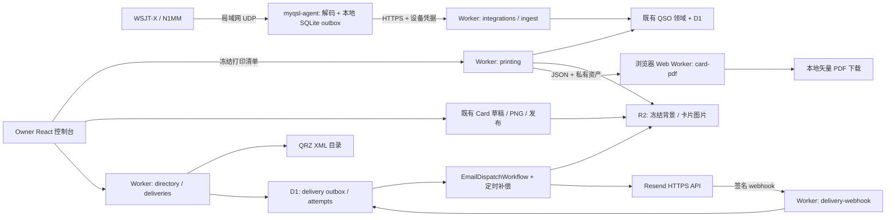

# myQSL 第二阶段需求与技术设计（v1.1–v1.2）

日期：2026-09-05。交付性质：架构与开发规格，未实施业务代码、迁移、外部账号配置或部署。

代码基线：`5bdcffa2a0f9190cc8154d15a368caec4078385b`（v1.0.0）；仓库根目录 `/Users/zhangneil/WorkBuddy/HAM/eqsr`，origin 为 `https://github.com/neilshare/myQSL.git`。下文文件路径均相对此根目录。开发 AI 开始前须记录当时 HEAD，若存在新增实现，先做差异映射。

需求依据：根目录 `PRD.md` §5.1 和本次用户指令。`QSL_PRD.MD` 当前与 `PRD.md` 字节一致。PRD 路线图插图把 QRZ 双向同步/地图写入 v1.2，而 §5.2 将其列为 v1.3–v1.5；本轮以用户列明的三项功能及 §5.1 为准，QRZ 日志同步、LoTW、地图、CAT 控制不进入本轮。

配套交付：[开发计划](../plans/2026-09-05-myqsl-v1.1-v1.2-implementation.md)、[验收矩阵](2026-09-05-myqsl-v1.1-v1.2-test-matrix.md)、[AI 交接入口](../../phase-2/README.md)。本文是新模块协议与边界的事实源，计划负责落实文件和任务。

## 1. 结论和版本边界

保留 React/Vite + Hono 模块化 Worker + D1 + R2 + Access + Workflows。新增本地 Node 24 代理、浏览器矢量 PDF 包、Worker 呼号目录/邮件模块。代理只向云端 HTTPS 推送，PDF 在浏览器生成，邮件通过可靠任务发送。无需另建常驻云服务器。

| 需求编号 | v1.1 必交 | v1.2 必交 | 本轮明确不做 |
|---|---|---|---|
| U：实时入库 | WSJT-X FT8 已保存 QSO、N1MM contactinfo；安全配对、持久本地队列、断网补传、重复判定、异常审阅、诊断与平台发布包 | 运维诊断/回归加固，保留 v1.1 wire protocol | CAT/PTT/自动发射控制、全量解码入库、UDP 自动覆盖/删除云 QSO、多操作员权限 |
| P：批量打印 | 勾选 QSO 或已有卡片；A4 横向 4 张 140×90 mm；文字/QR 矢量、嵌入字体、顺序/余页、进度取消、预检 | 单卡 146×96 mm 含 3 mm 出血的印厂交付预设；批量电子制卡供邮件使用 | PDF/X、自动 CMYK/ICC 转换、双面套准、任意 SVG 导入、照片矢量化 |
| E：QRZ 发卡 | 不显示尚不可用入口 | QRZ 邮箱查询、单张一键发送、显式确认的批量发卡、附件+查验链接、状态查询、退信抑制、幂等/重试/取消 | QRZ Logbook API 双向同步、群发营销、自动向全部历史 QSO 发信、阅读跟踪 |

所有批量操作先展示选中数量、被排除项目及原因。发送操作在用户选择收件人并点击发送后才排队；实时入库绝不连带自动公开卡片或发送邮件。

### 1.1 设计默认值及验收目标

这些是本阶段产品边界/待验收目标，不是声称当前系统已测得的性能。

- 单所有者；代理可绑定多个台站，但每个 source profile 固定一个已存在的 `station_id`；只接受该台站登记的本台呼号。
- 新增配置默认：FEATURE三个开关关闭；`OWNER_EMAIL`、`AGENT_ACCESS_AUD`在启用设备通道前必需；v1.2新增`QRZ_USERNAME/QRZ_PASSWORD/RESEND_API_KEY/RESEND_WEBHOOK_SECRET/PII_KEYRING/RECIPIENT_HASH_KEY`为Secrets，`MAIL_FROM/MAIL_REPLY_TO/EMAIL_TEST_RECIPIENT`为服务端受控配置。`EMAIL_PREPARATION_WORKFLOW`与`EMAIL_DISPATCH_WORKFLOW`为新增bindings，保留`D1_BACKUP_WORKFLOW`不变。无凭据时返回明确不可用状态。
- 本地支持 Windows 11 x64、macOS arm64/x64、Linux x64；N1MM 真机验证在 Windows；WSJT-X 验证 2.6.1 与官方当前 3.0.2。CLI 为正式交付，非托盘 GUI；运行时使用已验证且锁定补丁版本的 Node 24。
- UDP 默认监听 `127.0.0.1:2237`（WSJT-X）和 `127.0.0.1:12060`（N1MM）；仅配置后绑定指定 LAN 网卡和来源 IP。无公网 UDP 端口映射。
- 有网且服务正常、已保存QSO输入≤1条/秒时，从收到合法包至 D1 可读，p95 ≤5 秒；管理页轮询后可见 p95 ≤10 秒。每 source 顺序上传、单条事件一个 HTTPS 请求，默认全代理最多 2 个在途请求，云端每设备 120 请求/分钟（含heartbeat/config预留）。超过持续速率以队列排空为准，不继续承诺5秒。
- 本地待发送记录最大 50,000 条或 256 MiB（先到为限），80% 告警，满额停止接收并明确报错，绝不淘汰未确认记录。日志软件原始日志仍是 UDP 丢包时的补录来源。
- 单次打印最多 200 张、最多 50 张 A4 页、唯一背景最多 10 个、背景累计压缩数据 ≤30 MiB、生成文件 ≤50 MiB；100 张/复用背景/标准字体参考用例在 4 核 8 GB 桌面浏览器目标 ≤30 秒、峰值新增内存 ≤300 MiB。超限要求分批。
- 邮件每批最多 50 张，每张一封、单收件人；同一个邮箱多张卡仍逐卡发送，界面显示预计封数。应用限额默认 100 封/UTC 日、1 封/秒；有效限额为应用限额与服务商实际剩余额度中更小者。
- 附件使用已有卡片 PNG，单张原始文件 ≤5 MiB；发送请求计入 Base64 开销。超限可由用户在预览中明确改选 link-only，不能静默丢附件。
- 功能开关默认关闭：`FEATURE_AGENT_INGEST`、`FEATURE_PRINT`、`FEATURE_EMAIL_DISPATCH`。缺失 QRZ/邮件凭据只禁用邮件，不阻断 v1.0 和打印功能。

## 2. 第一阶段兼容约束（以代码为准）

| 已核对位置 | 实际实现 | 本阶段必须遵循的扩展方式 |
|---|---|---|
| `infra/migrations/0001_core.sql` | 卡片表 `qsl_cards`，id 为 TEXT；状态 `draft/ready/published/void` | 不按 PRD 字典建立另一个 `cards` 表；不改成数字 id 或 `revoked` |
| 同上，`qsos` | source CHECK 仅允许 `manual/adif/api`；`UNIQUE(dedupe_key,duplicate_ordinal)`，软删除不释放键 | 代理写入 `source='api'`；另表保存 wsjtx/n1mm 来源；不直接写 `source='wsjtx'` |
| `modules/qsos/service.ts`、`packages/domain/src/qso.ts` | 已有标准化、严格日期校验、去重、审计；create 可自动找/创建 Station | 重用纯领域校验，代理采用严格 station 解析，禁止调用自动建台路径 |
| `modules/cards/service.ts` | 草稿创建时已经冻结 QSO/template 两份 JSON；PNG 上传后 ready，发布后 published | 所有新输出读取冻结快照；不取最新 QSO/Template 冒充历史卡片 |
| `features/cards/CardCreatePage.tsx` | 当前页面渲染仍取列表中的活数据、背景取当前模板 URL | v1.2 邮件发卡前改用冻结快照+卡片专属背景读取；已存历史 PNG 保持原样 |
| `packages/card-renderer/src/render.ts` | Canvas 文字、PNG 背景和位图 QR；没有 SVG/PDF 输出 | 新增独立 PDF renderer；仅共享格式化与纯几何，保留现有 Canvas 入口 |
| `packages/domain/src/card.ts` | schema_version=1；归一化 x/y；text 与 qr 两种元素，font_size 基于 base_width | 不升级旧模板 JSON；用独立 PrintProfile 表示物理尺寸；不要设计不存在的任意图层能力 |
| `index.ts`、`platform/access.ts`、`platform/origin.ts` | 全 `/api/v1/*` Owner fallback；CSRF 与路由挂载混用；Access 存在禁用/占位 fallback | 新增明确互斥的 Owner/Agent/Webhook 路由组；严格验证固定 issuer/aud，不能用机器 JWT 取得 Owner 权限 |
| `platform/write-unit.ts`、cards routes | 已有 batch helper，但卡片 mutation 与 append 仍分两次 | 扩展触及的写链路须用同一 D1 batch 审计；不把“已有 helper”当成原子性证明 |
| `packages/domain/src/openapi.ts`、`api-paths.ts`、`scripts/generate-api-client.mts` | OpenAPI 与类型生成；`api-client.ts` 仍手写；apiFetch 返回 `{data,next_cursor,etag}` | 加新 schema/路径、生成类型、补手写方法及契约用例；不要假定方法自动生成 |
| `packages/domain/src/import.ts` | 导入 chunk_size=40，ready/warning/duplicate/rejected | 不照搬 PRD “500 条/四桶”描述；实时事件单独协议，不改旧导入协议 |
| `scripts/check-bundle.mts` | 把所有 JS gzip 总和命名为 initial，阈值250 KiB；总资产15 MiB，单文件5 MiB | PDF/fontkit 懒加载前先改指标为真实入口静态依赖闭包，另设懒加载预算，不能直接删门禁 |
| `wrangler.jsonc`、`.github/workflows/ci.yml` | 根配置部署 Worker+assets，已有真实资源和 GitHub remote | 沿用 Workers Builds；新增绑定/secrets/路径策略，不能沿用旧评审“没有 remote”的历史结论 |

本次未再次执行全量代码评审或生产验收；上述为设计依赖点的静态核对，旧评审缺陷是否修复不能直接推断。

## 3. 总体架构与技术取舍

| 决策 | 首选及理由 | 备选与启用条件 |
|---|---|---|
| 本地代理 | TypeScript + Node 24 `node:dgram`、`node:sqlite`，复用领域/ADIF包，SQLite 封装在单独 worker thread | Go 单文件分发更小但增加第二语言/协议重复；仅在 CLI/Node 安装成为实际交付障碍时下一轮评估；不为本轮引入 Electron |
| 本地存储 | SQLite WAL、FULL 同步、单写者、一次事件 durable commit 后才能上传 | Node SQLite 仍非 Stability 2，锁定已测试版本/接口；若目标平台探针失败，替换 outbox adapter 为经审计 better-sqlite3，业务协议不变 |
| PDF | `pdf-lib` + `@pdf-lib/fontkit`、既有 `qrcode` 的模块矩阵；浏览器独立 Web Worker | HTML 打印/Canvas PNG 包 PDF 不能满足矢量文字和严格尺寸；服务端 Chromium 增资源/运行限制，不作为主线 |
| XML | 经版本审计的 `fast-xml-parser`，禁 DTD/entity，字段保持字符串，输入限长 | 不使用 regex 解析 XML；不抓网页代替 QRZ API |
| 邮件 | Resend REST + 官方 SDK/Svix 兼容验签库；已有 Workflows 调度；D1 outbox 为事实源 | Cloudflare Email Service 是当前可用的候选，但单独验证 arbitrary-recipient、回执、附件、幂等能力和套餐后才能替换；不能把传统 Routing 当通用外发 |
| 异步执行 | 每 delivery 一个 Workflow，只传 delivery_id；D1 有补偿扫描 | 本期低吞吐无需新增 Queue；规模超过 1 封/秒或每批50后再评估 Queue，不能同时维护两套事实状态 |

协议事实来源：WSJT-X 官方源定义大端、schema、QSOLogged/LoggedADIF；N1MM 官方文档定义 XML 与频率单位。其余队列、幂等、配额是本项目设计决定。[WSJT-X 协议](https://raw.githubusercontent.com/WSJTX/wsjtx/master/Network/NetworkMessage.hpp)、[N1MM UDP](https://n1mmwp.hamdocs.com/appendices/external-udp-broadcasts/)。

PDF-LIB 支持直接绘制与自定义字体嵌入，因此可保留文字/图形矢量，图片仍为栅格。[PDF-LIB](https://pdf-lib.js.org/)。Node UDP 有原生 API；SQLite 在 v24 的稳定性/补丁应在 T00 固定，不宣称“全部稳定零风险”。[Node dgram](https://nodejs.org/api/dgram.html)、[Node v24 SQLite](https://raw.githubusercontent.com/nodejs/node/v24.x/doc/api/sqlite.md)。

### 3.1 模块及责任

| 新增模块/目录 | 输入/输出与唯一职责 | 依赖 |
|---|---|---|
| `packages/radio-codec` | 有界 Uint8Array → RadioEvent 或 ParseIssue；WSJT-X/N1MM 解码与映射 | domain、adif-codec；无 Node/DOM/HTTP |
| `apps/agent` | UDP 接收、source profile、SQLite outbox、认证 HTTPS、CLI诊断 | radio-codec、domain；不持有 D1/R2 API token |
| `worker/modules/integrations` | Owner 管设备与台站授权、设备 token、status | Access、D1、audit |
| `worker/modules/ingest` | 事件幂等、QSO 原子写入、冲突收件箱 | QSO纯领域逻辑、D1；不依赖HTTP回调自身 |
| `packages/card-pdf` | 冻结 PrintManifest + 字节资产 → PDF bytes + PreflightReport | domain、pdf-lib/fontkit、qrcode；无 DOM/D1 |
| `worker/modules/printing` | 冻结打印批次、私有背景读取、完成审计 | qsos/cards/templates repositories、MEDIA |
| `web/features/printing` | 跨页选择、布局预览、后台生成、取消下载 | api-client、card-pdf 动态载入 |
| `worker/modules/directory` | QRZ 查询、会话重用、邮箱缓存与 Owner 受限预览 | XML adapter、Secrets、D1 |
| `worker/modules/deliveries` | 收件人预览、发送请求/幂等、workflow、回执与退信抑制 | directory、cards、R2、email adapter、D1 |
| `web/features/deliveries` | 批量制卡、收件人确认、发送/结果/重试/取消 | 既有制卡服务、api-client |

禁止 `packages/*` 引用 `apps/*`。本轮不重构整个 QSO/UI；只抽取映射、快照、批处理所需的纯函数，保持原导入与单卡入口的行为。

## 4. U：本地 UDP 代理详细需求与协议

### 4.1 场景、边界和异常

| 编号 | 场景 | 必须行为 |
|---|---|---|
| U01 | WSJT-X 用户确认 Log QSO | 以 LoggedADIF(type12)为主；type5为兼容回退；只有已保存日志产生事件 |
| U02 | 同一次 QSO 同时 type5/type12 | 本地 type5 等待1秒候选窗口并持久化；type12匹配优先；窗口后补到的另包走同一语义键，不新增第二条；字段有差异记告警不自动覆盖 |
| U03 | N1MM 新增日志 | contactinfo 入库；AppInfo 更新 source 上下文；RadioInfo/LookupInfo/spot/score 不入库 |
| U04 | N1MM 修改/删除 | contactdelete 和 contactreplace 持久化为 review_required，绝不自动删云数据；同 ID 聚合显示“外部日志变更”；无时间保证，不能靠等待几秒区分删与改 |
| U05 | 本地断网/请求回包丢失 | durable outbox 重试相同 event_id/hash；服务端重放相同结果；成功回包后才标记 acked |
| U06 | 代理没运行或 UDP 已丢包 | 不承诺找回未收到包；显示 last_packet/last_logged/outbox；提供回到现有 ADIF 导入补录的操作说明 |
| U07 | 端口占用、恶意包、网络广播风暴 | 明确端口冲突，不静默换端口；限长/速率/来源；解析异常不退出进程，不向来源发送放大流量 |
| U08 | 已入库后用户修改/删除 QSO | 重放既有 receipt 返回原引用和当前 deleted 标记；不恢复、不重建、不覆盖 |
| U09 | 两台代理/两个软件同时上报同一 QSO | 同 event 去重 + 既有 exact dedupe 双层保护；180秒软重复只警告，不吞掉真实重复通联 |
| U10 | 台站呼号不匹配/频段或模式歧义 | 进入云端 review_required 或本地 quarantine；不自动建台、不凭最近 RadioInfo 覆盖已记录信息 |

### 4.2 字节协议和映射边界

WSJT-X 解码按官方字段表，头为 magic `0xadbccbda`、schema u32、type u32、ID QByteArray UTF-8；整数大端。UTF-8 null 长度 `0xffffffff` 与空值不同；每次读先检查剩余长度。v1.1 对 schema2/3 的 type12 兼容，type5 支持经 golden fixture 验证的 schema3；schema2/type5 先隔离并提示启用 LoggedADIF。未知尾字段跳过，未知类型忽略计数，未知编码 schema 拒绝并提示升级。

type5 按顺序解码 TimeOff、DXCall/Grid、TxFrequency、mode、report、power、comments/name、TimeOn、operator/mycall/mygrid 等。QDateTime 使用 Julian day + midnight毫秒 + timespec；仅 UTC/显式偏移可转换，local/命名时区在本阶段隔离，不能用代理所在时区猜测。TimeOn 缺失也隔离，不拿 TimeOff/收到包时间冒充开始时间。quint64 用 BigInt 读取，范围校验后转换精确十进制 MHz/Hz。Heartbeat 只向已配置来源回复协议允许的最低共同 schema，无 Replay/HaltTx/Reply 控制指令。

N1MM 必须保留字段字符串后映射：`timestamp` 按日志 UTC 严格解析；`txfreq` 优先、缺失用 `rxfreq`，单位10 Hz，`352519` → `3,525,190 Hz`；频段字符串不是米值，`3.5/3,5` 必须映射80M。USB/LSB → SSB 并保留原模式；FT8 → FT8；其余仅支持显式映射表，未知隔离。负信号报告保留符号；operator/sntnr/rcvnr/contest 信息存命名扩展，`power` 是对方交换信息，不能写本台发射功率。ID 当作有界不透明字符串，不能因文档示例不一致强制假设固定GUID字节长度。

source profile 明确 `{profile_id,source_kind,source_instance,station_id,expected_station_callsign,bind_address,port,allowed_peer_ips}`。N1MM `source_instance` 由用户为本地日志库配置持久 UUID，辅以 contestnr/ID；只靠 StationName/IP 会因转发/搬机器失效。缺 ID 时使用规范化 QSO exact key 的降级策略并告警；收到 AppInfo 显示数据库切换时暂停该 profile，用户确认新的 source_instance。

### 4.3 设备授权与路由边界

1. Owner 在 `/admin/settings/integrations` 创建设备，选可写台站/source profile；服务器生成256-bit随机设备 token，一次显示，用 SHA-256 存摘要（高熵随机 token，不是用户口令）。有效期默认90天，可立即吊销/轮换。
2. 为 `/api/v1/agent/*` 建独立 Cloudflare Access Service Auth 应用、独立 `AGENT_ACCESS_AUD`；一设备一 service token，使用 `CF-Access-Client-Id/Secret`。同时发 `Authorization: Bearer <device-token>` 做应用 scope/吊销控制。设备只保存这些凭据，不保存 Owner Cookie。
3. Worker `requireAgent` 验固定 issuer、独立 audience、JWT到期与设备token摘要/授权station；actor 为 `agent:<device_id>`。不能把未验证 payload 用作 issuer，也不能仅校验 Service token 请求头存在。
4. 浏览器 Owner group 维持 Owner AUD、显式 `OWNER_EMAIL` 精确匹配已验证JWT的email及严格同源 Origin+marker；无email的service身份不能变成Owner。OWNER_EMAIL仅服务端配置，在生产预检校验存在。只为机器 group 省略 CSRF Cookie 假设，不能给整个 `/api/v1/*` 免鉴权；Webhook另走签名路径。
5. `AUTH_DISABLED`、占位 issuer/aud 在 staging/production 启动/预检必须拒绝；本地测试替身仍限制 APP_ENV+测试开关。机器 token 访问 QSOs DELETE、backups、邮件、templates 必须403/401。
6. 代理 HTTPS 固定配置目标 origin，禁止重定向自动携带 secrets，TLS 不得关闭。POSIX配置0600/目录0700；Windows使用当前用户ACL；日志/诊断导出不含token。源IP白名单只缩小LAN风险，不等同于UDP身份认证。

Service tokens 的请求认证头/Service Auth 配置按官方文档实施；单独 audience 和设备级 scope 是本项目的隔离决定。[Cloudflare service tokens](https://developers.cloudflare.com/cloudflare-one/access-controls/service-credentials/service-tokens/)。

### 4.4 上报契约与原子提交

新增 `POST /api/v1/agent/events`，JSON body 最大64 KiB，一请求一个事件：

| 字段 | 约束 |
|---|---|
| protocol_version | 整数1；新产品版本仍沿用 `/api/v1`，不是改成 `/api/v1.1` |
| event_id | 本地 durable 生成UUID；任何重试不变 |
| profile_id / source_instance | 服务器批准profile与持久来源实例，不信任任意station_id |
| source_kind / event_kind | `wsjtx/n1mm`；`qso_logged/external_replace/external_delete` |
| source_record_id | 来源ID或WSJT规范语义键；≤160字符 |
| occurred_at / received_at | UTC ISO8601，分别事件时间与代理接收时间；不是QSO dedupe时间 |
| qso | qso_logged/replace使用规范 `QsoInput`；station从profile解析核对；delete可空 |
| extras | 有界字符串字典，协议特有原值；不接受任意深度JSON |
| payload_sha256 | 对以上业务字段除自身按固定字典序 canonical JSON/UTF8 hash；服务端重算 |

响应遵循 `{data: IngestReceipt}`：`receipt_id,event_id,outcome,qso_id,duplicate_of,issues,committed_at,replayed`。outcome 为 `created/duplicate/review_required/rejected`。新创建返回201，其余稳定结果200；业务校验错误若已持久化 receipt 返回200/rejected，便于停止重试。无有效 envelope 的422不写receipt；401/403暂停上传；409表示同event不同hash，必须隔离；429按Retry-After；5xx/超时重试。

原子性规则：每个事件在一个 D1 `batch()` 中写 event receipt、QSO（如新建）、source link、audit。receipt PK `(device_id,event_id)`；重放同hash返回旧结果、不同hash409。新QSO利用已有唯一键，插入竞争失败则整批回滚、重读exact duplicate、重新组装“重复receipt+link+audit”batch，最多3次竞争重试。不能先调用自带commit的 `QsoService.create` 再补receipt。需要从既有逻辑抽取 QSO insert statement builder，服务编排共享但事务归ingest repository所有。所有需阻断的状态判定进入SQL谓词/唯一约束；affected rows为0本身不触发batch回滚，不能把它当异常。D1 batch 的事务保障以实际失败语句为界。[D1 batch](https://developers.cloudflare.com/d1/worker-api/d1-database/)。

created batch的SQL顺序明确为：先INSERT QSO，再以`dedupe_key/duplicate_ordinal=0`查询该QSO id写receipt/source link，最后写引用receipt的audit。receipt唯一冲突应使整批回滚；不得在多个INSERT之后凭last_insert_rowid猜QSO id。duplicate batch从已查明且SQL内再校验的QSO/link写入结果。

### 4.5 队列、身份去重与保留

- 本地状态 `pending → inflight → acked`；故障 → `retry_wait`；不可修复 → `quarantined`。SQLite writer先落完整规范事件再安排网络；重启把未确认 inflight 恢复pending。间隔full-jitter exponential 1秒到5分钟，网络超时10秒，401/403不无限打接口。
- WSJT-X transport event_id 与 QSO exact dedupe不是同一个键。source语义键不包含type5/12和UDP收到时间；D1 exact key继续使用既有 `makeDedupeKey`（含submode）。以 link 保留多来源到同QSO的关联。相同source key不同内容 → review，禁止改已经ack的事件payload。
- 对 `external_replace/delete` 只进入审阅；首次v1.1只有查看、忽略和跳转既有QSO编辑/回收站，修改身份字段时采用“新建正确QSO并软删旧记录”的现有能力，由Owner显式执行；不扩展自动远端删除。
- 本地 acked保留7天，诊断日志7天/总20MiB；未确认无自动TTL。云端payload90天后清理，receipt保留event/hash/outcome/QSO引用最小墓碑，source link长期保留以防旧离线事件复活。永久删除QSO须保留link墓碑 `qso_id=NULL,tombstoned_at`，不可级联删掉幂等证据。

## 5. P：批量矢量 PDF 需求、尺寸与渲染

### 5.1 用户流程和对象语义

入口一：QSO 列表显式勾选（跨分页保存ID，非“当前DOM行”），选择模板，创建 PrintBatch；服务器冻结QSO/模板，不创建公开卡片、不更改QSO，不产生无效的公开QR。模板含public_url/card_token时，预检返回 `PUBLIC_CARD_REQUIRED`，用户选择去电子制卡，或确认此打印批次省略QR；无默认虚构链接。

入口二：卡片列表勾选，打印 `ready/published` 卡片快照；void拒绝。ready为私有待发布，QR要求published，否则同上明确省略。混合尺寸/比例在一个job中不自动拉伸；v1.1选择单一标准比例模板，或拒绝并列出不兼容卡片。

流程：选择 → 预检/预览 → 创建冻结批次 → 分页取manifest items/受保护资产 → 懒加载PDF worker → 生成与进度 → 下载 → 上报完成hash/字节数。下载完成仅能表示浏览器已生成/触发保存，不能标记实际打印完成。关闭页面后可重新读取冻结批次重新生成；后台浏览器线程不承诺跨关闭继续运行。

### 5.2 物理尺寸与预设

所有物理几何以mm定义，PDF换算 `pt=mm×72/25.4`，不通过DPI改变文字坐标。

| profile | 成品与纸张 | 明确几何及限制 |
|---|---|---|
| `a4-four-up-v1`（v1.1） | A4横向297×210 mm；每张140×90 mm；2×2 | 四个成品左上角(mm)：(6.5,13)、(150.5,13)、(6.5,107)、(150.5,107)。水平/垂直间隙4mm；边距x6.5/y13；0mm出血。切线在槽外0.5mm起长1mm、线宽0.15mm，不穿内容。打印100%/Actual size，关闭Fit |
| `single-bleed-v1`（v1.2） | 一卡一页146×96 mm；成品140×90 mm | 3mm出血，TrimBox=(3,3,140,90)mm，BleedBox/MediaBox整页；成品内安全边3mm；交印厂拼版。背景cover扩展到出血，文字/QR留成品内 |

A4四拼不承诺同时满足家用不可打印边、四边3mm出血和裁切标记；需要出血者选择单卡出血或后续A3，不能悄悄把成品缩成更小。每页只有一个PDF TrimBox，四个成品框由矢量标记/manifest描述，不能声称单页存在4个标准TrimBox。

页排序按用户显示的显式有序ID数组冻结，行优先从左至右、从上至下；末页空槽不复制记录；0张阻止，5张应2页，200张50页。批次中卡片作废：后续在线下载/重新生成拒绝；已下载文件/已印纸卡无法远程撤回，UI显示快照生成时间。

### 5.3 渲染模型与字体

- PrintProfile独立于现有CardTemplate schema_version=1；新增 `PrintManifestV1`：batch_id、kind（qso/card）、profile、renderer_version、font_manifest_version、ordered items、snapshot_hash、created_at、expires_at、可选 omitted_qr确认。item含QSO快照、模板快照、card_id/public_id/status_at_freeze、只读asset_id，不暴露任意R2 key/url。
- 新增 `packages/card-renderer/src/scene.ts` 和共享 `format.ts`：将当前text/qr元素解析为纯场景坐标；Canvas函数签名不变。PDF实现直接drawText、drawRectangle绘QR模块、embedPng/embedJpg绘背景，禁止整张卡toDataURL再入PDF。
- 当前text y是Canvas基线，PDF需转换原点：`xPt = slotX + x×cardW`，`yPt = pageH - slotTop - y×cardH`；字体尺寸 `font_size/base_width×cardWpt`；align用实际字宽；max_width采用统一缩小字体规则，最小6pt仍放不下则预检拒绝，避免Canvas横向压扁和PDF换行产生漂移。旧已发布PNG不重渲染。
- 模板比例与140/90偏差>1%须预览用户确认等比contain留白，默认不拉伸。包含图像/文字越出成品安全边则给可定位warning；QR必须方形、≥18mm、四周至少4模块quiet zone；空token/URL拒绝，public_url仅`PUBLIC_ORIGIN + publicCardPath(public_id)`。
- 背景仍是栅格，目标有效分辨率≥300PPI（140×90mm至少1654×1063px，不计出血）；150–299警告，低于150默认阻断，可显式确认降质家用稿并在preflight记录；不把栅格照片描述为矢量。
- 字体从受控资产嵌入，禁止依赖客户机Arial是否存在；Inter/Noto Sans/sans-serif/Arial/Helvetica映射已随包授权的sans字体，serif/monospace有对应替代；CJK使用可嵌入Noto字体子集，缺字预检阻断，禁止静默方框。manifest记录别名映射和hash，下载字体不加载第三方URL。保留OFL许可证。
- v1.1支持拉丁字符和常见简繁中文/数字标点，复杂脚本、emoji/彩色字形超出支持范围时明确列出缺字；不宣传所有语言排版。固定字体文件静态子集≤5MiB/文件，总静态≤15MiB；嵌入PDF再次subset。
- PDF生成包与字体只在打印路由加载；图片预取有界并复用嵌入对象；WebP背景在浏览器有界转换PNG，最大16M像素，其他格式拒绝。取消终止worker、释放bitmap/object URLs。
- 默认sRGB，不等同于CMYK/PDF-X；印厂是否接收RGB混合矢量PDF需通过样稿验收，不用“300DPI矢量”表述。

### 5.4 打印接口

Owner接口均受Access+CSRF；返回JSON `{data}`、分页 `{data,next_cursor}`，错误application/problem+json，binary独立返回。

| 方法/路径 | 请求/返回与约束 |
|---|---|
| POST `/api/v1/print-batches` | `Idempotency-Key` UUID；body为kind=qso+有序qso_ids+template_id+template_version+qso_versions，或kind=card+card_ids；profile_id；qr_policy=`require_published/omit_confirmed`；返回201 batch摘要；版本冲突409/412，不静默改快照 |
| GET `/api/v1/print-batches/:id` | 摘要/预检结果/状态/过期时间；冻结内容不因当前模板改变 |
| GET `/api/v1/print-batches/:id/items?cursor=&limit=20` | 返回有序manifest items；limit≤20，游标绑定batch；不一次返回200份重复背景 |
| GET `/api/v1/print-batches/:id/assets/:assetId` | 只允许manifest中引用的冻结背景，Owner only、no-store、校验hash；不能根据任意用户URL读取对象 |
| POST `/api/v1/print-batches/:id/complete` | `sha256,size_bytes,page_count,renderer_version,preflight_report_hash`；相同结果幂等；存`client_reported`证据，不声称服务端验证PDF内容 |
| POST `/api/v1/print-batches/:id/cancel` | 停止在线生成会话；允许后续新批次；完成文件已下载不回收 |

创建批次用一个D1 batch执行条件快照INSERT SELECT/版本守卫、items、audit；任务中所有item必须冻结成功才ready。设计可新增build状态隔离未完成批次，但任何部分manifest都不得暴露为ready。批次最多200条，SQL每句≤实际D1参数上限；使用JSON输入+json_each或逐条语句，不能构造200×全字段的一个VALUES语句。冻结资产引用存在时不能清理对应背景。清单与引用TTL7天，到期410；操作摘要保留90天。

## 6. E：QRZ 登记邮箱发卡需求与可靠执行

### 6.1 查询权限和身份语义

QRZ XML是呼号目录接口，邮箱字段不是QRZ Logbook API提供的发信能力。按当前公开1.34规格，采用 `https://xmldata.qrz.com/xml/1.34/`，POST表单，agent=`myqsl/1.2`；用Worker Secrets保存QRZ_USERNAME/PASSWORD。会话复用直至失效；每次查询最多刷新登录一次，IP变更可能使会话失效，所以不把跨地域全局KV token当永远有效。[QRZ当前规格](https://www.qrz.com/page/current_spec.html)。

- 查询对象只能来自Owner选中的已存在QSO/卡片，不开放公共任意呼号邮箱搜索接口。
- 先按完整呼号查询。返回 `call` 与请求不一致时检查aliases/xref；无明确映射不自动接受；`BA1ABC/P`等后缀不得直接截掉自动给基础呼号发信；UI展示候选，Owner确认后才可用。
- `not_found/no_email/subscription_required/auth_error/temporarily_unavailable/ambiguous/ready`分开显示；没有邮箱、订阅失效、429、HTML替代XML都不是发送成功。
- email只接受一个经过校验的地址，CRLF/列表/显示名混入禁止；不得从姓名猜邮箱，不抓QRZ网页、不把QSL manager当同一收件人。
- 本期缺QRZ邮箱就阻止该卡，用户仍可复制查验链接自行联系；不以用户随填任意邮箱绕过“QRZ登记邮箱”边界。
- QRZ连接池同Worker实例重用session、single-flight登录，返回失效重试一次；跨isolate偶发重新登录可接受。若staging证明会话IP限制频繁出现，启用单账号协调adapter并实测，固定出口代理属于额外基础设施方案，不能假定Durable Object天然固定出口IP。
- QRZ资料仅为当前目录登记，不证明历史QSO时呼号持有人仍相同；历史卡发送预览必须展示QSO日期、完整呼号、返回呼号及邮箱来源时间，由Owner确认。

### 6.2 用户流程

单卡：已published卡 → 查QRZ并显示收件人/快照缩略图/附件大小 → 用户点击“发送卡片” → delivery进入queued → 页面展示“排队/服务商已接收/收件服务器已接收/退信/结果待核实”。目录数据已预览且仍有效时，发送只需一次点击；不把“提交API成功”写成“对方已读”。

批量：选择最多50条QSO → 选择模板 → 服务器按版本冻结批量draft → 浏览器最多2张并发PNG渲染上传 → 逐卡ready→publish → 对可发送卡做QRZ预览 → 显示ready与跳过原因 → 点击确认仅发送明确的ready delivery ids。失败制卡可从draft/ready继续，不重新生成另一批卡。打印批次不会自动成为公开卡片，制卡批次与打印批次分开。

公开卡片被void、删除QSO或退信名单新增：预览之后至发送claim之前重新检查；不再符合条件则skipped。claim发生后已经在途的邮件不能承诺可撤回，正文提示以公开页当前状态为准，PNG附件已经送达不可删除。

### 6.3 邮件通道结论与内容

首选Resend v1.2只实现一个adapter：`send(DeliveryEnvelope, idempotencyKey) -> provider_message_id`、`getStatus(provider_message_id)`、`verifyWebhook(rawBody,headers)`。不用SMTP端口，不让浏览器持有API key。

发件域先验证SPF/DKIM并配置DMARC，固定 `MAIL_FROM`/`MAIL_REPLY_TO`，不得把QRZ用户邮箱当From。正文中英模板、简要QSO UTC字段、公开查验链接和PNG附件；单封一个To，不CC/BCC其他呼号；所有自由文本HTML转义、无跟踪像素，不附完整ADIF库/内部metadata。资产从R2私有binding读，禁止让第三方下载服务用未受控公开URL。

传统Cloudflare Email Routing只向已验证地址发送的用法不满足任意友台邮箱；当前Cloudflare Email Service已提供arbitrary-recipient外发，官方计费要求Workers Paid。故把它保留为可替换通道，不能沿用旧断言“Cloudflare永远不能发外部邮箱”，也不承诺PRD所谓“永久免费”。[Cloudflare Email Service发送](https://developers.cloudflare.com/email-service/get-started/send-emails/)、[套餐约束](https://developers.cloudflare.com/email-service/platform/pricing/)。Resend配额和QRZ订阅均需部署前以实际账户验证，设计不创建或购买账户。

### 6.4 发送幂等、outbox与故障处理

- `POST /delivery-batches`返回202/preparing，不外发；`EmailPreparationWorkflow`按最多2个并发QRZ查询逐项准备，服务器冻结recipient密文、规范recipient HMAC、card/content hash、language、attachment mode、已许可payload。完成后batch进入ready（允许部分项blocked）并开始15分钟preview有效期；提交时过期409需重新查预览，不静默改收件人。单张同样沿用此协议，界面轮询即可；不在一次HTTP响应里执行50次目录查询。
- `POST /delivery-batches/:id/send`带Idempotency-Key与明确delivery_ids。一个batch可部分提交，未勾选项保持preview到期。事务中检查状态、预约日配额、创建delivery outbox、audit；落库后创建固定Workflow ID=`email-<delivery_id>-<generation>`。触发失败由定时扫描补偿，不能回滚已写outbox假装未排队。
- provider key固定为delivery_id，不随workflow重试/generation变化；冻结每个外发payload，后续模板/QRZ邮箱改变不能改变该delivery。`UNIQUE(card_id,recipient_hmac,content_sha256,dispatch_revision)`，首次revision=1。重复点击命中既有delivery；再次人工补发必须显式新revision和reason。
- 状态：`preview → queued → sending → submitted → delivered`；旁支`retry_wait/failed/unknown/skipped/cancelled/bounced/complained/suppressed`。submitted指服务商已受理，delivered指收件服务器接受，不是阅读证明。
- Workflow使用D1条件claim，worker lease=60秒、HTTP超时15秒；网络调用发生前持久化attempt与provider key；每次更新带lease token防旧执行覆盖。重新claim须在上次调用最大超时+余量后；即便短暂重叠也以provider key防重复。
- 429、5xx、超时在首次send_started_at后23小时内按同key重试，full jitter 30秒到30分钟，最多8次；超过窗口或供应商无法判定时进入unknown，不自动改key重发。Resend官方去重保留24小时，故数据库长期去重与unknown状态不可省略。[Resend幂等](https://resend.com/docs/dashboard/emails/idempotency-keys)。
- provider接受后D1更新失败：同key重试获得同一message_id；如果已超窗口，只允许查询/人工核实，不盲重发。用户主动resend前UI提示可能重复并要求reason。
- Cron每分钟扫描due outbox ≤50条，确保workflow存在；同时补偿preparing batch，固定prepare workflow ID并持久化逐项结果，失败重试不重复查询已完成项；每天原有20:00备份仅在对应cron分支执行，不能因新增每分钟cron把备份也每分钟触发。Workflow不是投递状态事实源，D1 delivery/attempt才是。
- 取消仅对queued/retry_wait且从未发生结果不明的provider调用时可成功；sending/submitted或已有不明调用返回409/in_flight，不能声称取消已送达邮件。日配额在同D1事务计入预约；cancel等明确未调用供应商的可退回预约，unknown不退回。以UTC计数；queued跨日未外发时，claim必须事务地退回旧日reservation并申请当前日额度，未获额度继续等待。
- 每次实际provider调用（包括同key重试）都需取得D1 `dispatch_throttle`单行的下一时槽，原子条件推进next_send_at≥now+1000ms，未取得则sleep后再claim；不能把“每Workflow并发1”当成全局1封/秒。日计数区分逻辑delivery预约与实际provider尝试计数，外部429/剩余额度仍优先。

### 6.5 Webhook、安全及资料最小化

新增公开精确路径 `/api/v1/webhooks/resend`，Cloudflare Access仅对该路径放行。Worker校验原始body和 `svix-id/svix-timestamp/svix-signature`，默认300秒窗口，body≤256KiB；先验签再解析。无效401、不返回签名细节。[Resend验签说明](https://resend.com/docs/webhooks/verify-webhooks-requests)。

- `provider_event_id`唯一，持久存储后回200；重复200。未知message先存orphan，后补偿关联，不能丢弃早于send response的回执。
- 回执乱序使用状态归并：complaint/hard bounce优先于delivered/submitted，普通sent不得降级delivered；soft delay不是永久退信。状态事件入库与suppression同事务。
- complaint/hard bounce加入recipient HMAC suppression，未来任何卡发送都阻止；后到delivered不解除。Owner可查看原因并人工解除，解除必须审计，投诉默认不允许普通一键解除。
- 邮箱/QRZ会话不进audit detail、URL查询日志、公开卡片/ADIF导出；audit只记masked email+HMAC+card/delivery id。应用中不采集完整QRZ地址/生日等无关字段。
- directory cache正向≤24小时、无邮箱/不存在≤1小时（这是本项目TTL，不是QRZ授权保证）；到期删除。recipient和必要payload采用AES-GCM加密，Secret中`PII_KEYRING`保存版本化key，D1存key_version/nonce/ciphertext；HMAC另用`RECIPIENT_HASH_KEY`保证索引稳定。密钥备份与D1备份分开，恢复演练必须含解密验证。
- delivery终态30天清除明文/密文payload，保留最小hash/状态/时间/人工补发原因；webhook原始body不存，存归一化最小事件90天；suppression保留HMAC到Owner明确解除。PRD更新说明新增个人联系信息和第三方发送处理边界。

## 7. 新增数据模型（迁移设计，不执行DDL）

所有时间D1用INTEGER毫秒，API ISO日期字段按接口另行定义；外键明确、json字段带应用校验，二进制凭据不入表。新迁移编号从现有0003之后顺排；上线前如编号被占，顺延而非覆盖历史迁移。

| 迁移/表 | 关键列 | 索引/约束与保留 |
|---|---|---|
| 0004 `agent_devices` | id TEXT PK, name, token_sha256 UNIQUE, token_expires_at, revoked_at, created_at,last_seen_at | token摘要高熵；设备摘要保留审计引用 |
| 0004 `agent_profiles` | id TEXT PK, device_id FK, station_id FK, source_kind CHECK, source_instance, expected_station_callsign, enabled,version | UNIQUE(device_id,id)；修改绑定需停旧profile建新profile，避免重试映射到另一台站 |
| 0004 `ingest_events` | id TEXT PK,device_id FK,event_id,payload_sha256,profile_id,source_kind,source_record_id,event_kind,payload_json,outcome,qso_id nullable,issues_json,created_at,payload_expires_at | UNIQUE(device_id,event_id)；review/time索引；qso FK SET NULL但保留墓碑hash |
| 0004 `qso_source_links` | source_kind,source_instance,source_record_id,qso_id nullable,payload_sha256,last_event_id,tombstoned_at,created_at | 联合PK前三项；index qso_id；N1MM ID附contestnr；防软删/永久删后的自动复活 |
| 0005 `print_batches` | id PK,idempotency_key UNIQUE,request_hash,kind,profile_json,status,renderer_version,font_manifest_version,manifest_hash,result_hash/result_size/page_count nullable,created_at,expires_at | status preparing/ready/completed/cancelled/expired/failed；同key异payload409；完整ready后才可下载items |
| 0005 `print_batch_items` | batch_id FK,position,qso_id/card_id可空,snapshot_json,snapshot_hash,background_key/hash,public_url nullable | PK(batch_id,position)，同batch position连续；冻结输入，引用资源至TTL结束 |
| 0006 `card_batches` / `card_batch_items` | batch(id,request_key UNIQUE,request_hash,created_at)；item(batch_id,position,qso_id,template_version,card_id FK) | PK(batch_id,position)，UNIQUE(batch_id,qso_id)；卡片状态以qsl_cards为准，不重复另一套状态 |
| 0007 `directory_contacts` | id PK,requested_call,resolved_call,status,email_ciphertext/key_version/nonce,email_hmac,masked_email,lookup_at,expires_at | UNIQUE(requested_call)，expires索引；无关QRZ字段不落库；alias授权不全局缓存 |
| 0007 `delivery_batches` | id PK,request_key UNIQUE,request_hash,status,version,request_items_json,language,attachment_mode,created_at,ready_at,expires_at,error_code | preparing/ready/failed/expired；ready起preview TTL15分钟，摘要计数由items聚合 |
| 0007 `delivery_batch_items` | batch_id FK,position,card_id FK,preparation_status,directory_contact_id nullable,delivery_id nullable,existing_delivery_id nullable,alias_confirmed_at/confirmed_resolved_call nullable,error_code,updated_at | PK(batch_id,position)；pending/ready/blocked，保存QRZ缺邮箱等尚未产生delivery的失败项；alias确认仅绑定当前预览 |
| 0007 `card_deliveries` | id PK,batch_id FK,card_id FK,recipient_ciphertext/key_version/nonce,recipient_hmac,masked_email,content_sha256,payload_json_encrypted,dispatch_revision,reason,status,provider_id nullable,provider_key UNIQUE,next_attempt_at,attempt_count,quota_day_utc,lease_token/lease_until,first_send_at,workflow_generation,version,created_at,updated_at | UNIQUE(card_id,recipient_hmac,content_sha256,dispatch_revision)；due(status,next_attempt_at)，provider_id UNIQUE非空；preview即占逻辑发送身份，过期预览再次准备时复用可安全未发送delivery并显式换preview关联 |
| 0007 `delivery_attempts` | id PK,delivery_id FK,attempt_no,lease_token,started_at,finished_at,error_code,provider_id nullable | UNIQUE(delivery_id,attempt_no)，不记录邮箱/正文/API token |
| 0007 `delivery_webhook_events` | provider_event_id PK,provider_id,type,occurred_at,received_at,applied_at | orphan按provider_id索引，90天TTL |
| 0007 `email_suppressions` | recipient_hmac PK,reason,source_event_id,created_at,released_at | 发送前检查；不存收件人原文 |
| 0007 `dispatch_daily_quotas` | day_utc TEXT PK,reserved_count,attempted_count | 事务预约：限额条件+delivery状态绑定，竞争不超额 |
| 0007 `dispatch_throttle` | id INTEGER PK CHECK(id=1),next_send_at INTEGER | 全局1秒时槽，条件更新与attempt claim关联，不为每Workflow建单独限流器 |
| 本地 SQLite | outbox(event_id PK,profile_id,payload/hash,status,attempt_count,next_retry_at,receipt_json,created_at,acked_at)、source_candidates、schema_meta | WAL/FULL；未ack不自动删；序列化事件格式独立protocol_version |

注意全局逻辑唯一键与批次复用：若该卡已存在queued/submitted/delivered或unknown的delivery，preview返回existing_delivery_id和不可默认重发原因，不重新插入revision1。若existing为未提交过期preview，可用版本条件更新到新batch预览；同一item不能同时归两次发送，提交前检查batch/version。人工补发只通过专用resend接口创建revision+1。

D1所有跨行约束采用batch+唯一键+条件DML，不能在REST请求中使用普通`BEGIN`保持跨调用事务；发送workflow/HTTP/R2操作不包在D1事务里，采用outbox与补偿。

## 8. 新增接口总表和错误约定

新增Owner UI路由：`/admin/settings/integrations`、`/admin/integrations/events`、`/admin/print`、`/admin/settings/delivery`、`/admin/deliveries`。所有菜单/异常提供现有中英字典key，使用既有三主题变量；不另起UI框架。

| 类别 | 接口 | 主要请求/响应 |
|---|---|---|
| Owner设备 | POST/GET `/api/v1/integrations/agents` | name、profiles授权；一次性token / 列表masked配置；201/200 |
| Owner设备 | POST `/api/v1/integrations/agents/:id/revoke`、`/:id/rotate-token` | 撤销/90天新token；当前版本条件，token只显示一次；重放不返回旧secret |
| Agent | GET `/api/v1/agent/config` | protocol_version、已授权profiles、server_time、limits；no-store |
| Agent | POST `/api/v1/agent/heartbeat` | agent_version、last_packet_at、queue_depth、last_error_code；无QSO/秘密 |
| Agent | POST `/api/v1/agent/events` | §4.4规范事件和receipt |
| Owner事件 | GET `/api/v1/integrations/events?outcome=&cursor=`，POST `/:id/dismiss` | 分页≤50；reason必填/审计，只忽略提示不改QSO |
| Owner打印 | `/api/v1/print-batches...` | §5.4完整契约 |
| Owner卡片资产 | GET `/api/v1/cards/:id/background` | 读取冻结template_snapshot里的背景；draft/ready/published可读，void按管理策略仍允许Owner诊断；Owner only |
| Owner批制卡 | POST `/api/v1/card-batches`，GET `/:id` | ordered qso_ids≤50、qso_versions、template_id/version、Idempotency-Key；201/200返回ordered card ids；存在项不重复创建 |
| Owner发送设置 | GET `/api/v1/delivery-settings/status`，POST `/api/v1/delivery-settings/test` | 仅配置状态/脱敏错误；test只验证连接与固定自测邮箱（仅部署配置），不能接受任意To |
| Owner发信预览 | POST `/api/v1/delivery-batches`，GET `/:id` | card_ids≤50且不重复、language=zh/en、attachment_mode=png/link_only；Idempotency-Key；POST202 preparing，GET返回状态/逐项delivery_id、masked/resolved邮箱（Owner专属）、原因和ready后15分钟到期时间 |
| Owner别名确认 | POST `/api/v1/delivery-batches/:id/items/:position/confirm-alias` | preview_version、resolved_call、confirmed=true；仅接受服务器已返回候选且邮箱有效；更新当前item确认、版本+1，不延长TTL，不改变其他批次授权 |
| Owner确认 | POST `/api/v1/delivery-batches/:id/send` | delivery_ids、preview_version、Idempotency-Key；202摘要，可部分选择，不接受客户端覆写To/From/body |
| Owner记录 | GET `/api/v1/deliveries?cursor=`，GET `/:id` | 脱敏收件人、状态、attempt、provider关联、可执行操作 |
| Owner取消/重试 | POST `/api/v1/deliveries/:id/cancel`、`/:id/retry`、`/:id/resend` | cancel只未外发；retry同key且窗口内；resend新revision需reason/明确重复风险确认；429/unknown不允许普通retry绕过 |
| Owner抑制 | GET `/api/v1/email-suppressions`，POST `/:recipientHash/release` | 脱敏列表、原因；人工解除需reason/审计/二次确认 |
| Public webhook | POST `/api/v1/webhooks/resend` | 只签名鉴权；200已接收/重复；401无效签名 |

所有业务错误补稳定 `code` 与 `retryable`扩展，继续兼容当前ProblemError。必要code：`STATION_SCOPE_MISMATCH,UNSUPPORTED_RADIO_SCHEMA,EVENT_KEY_REUSED,SOURCE_CHANGE_REVIEW,PRINT_ASSET_MISSING,PRINT_PROFILE_MISMATCH,GLYPH_UNSUPPORTED,PUBLIC_CARD_REQUIRED,QRZ_SUBSCRIPTION_REQUIRED,QRZ_NO_EMAIL,PREVIEW_EXPIRED,RECIPIENT_SUPPRESSED,DELIVERY_UNKNOWN,DELIVERY_IN_FLIGHT,DAILY_QUOTA_EXCEEDED,FEATURE_DISABLED`。授权失败401/403；未找到404；失效410；版本412；状态409；大小413；输入422；配额429；外部暂不可用503。

## 9. 发布、成本、回滚和可观测性

- 保持GitHub `main` → Cloudflare Workers Builds现有链路，PR检查包含新增模块；production只在受保护main合并后发布，不能再额外新增另一个Actions自动部署争抢生产。文档中需要平台控制台完成的Access应用、DNS、secret和workflow binding必须列为发布检查项，不能把本地测试假定成控制台已配置。
- v1.1先部署兼容迁移0004/0005、代码开关关闭→配置Agent Service Auth→Owner单设备/10条QSO与PDF样稿→开启feature。v1.2先0006/0007与邮件代码关闭→QRZ订阅/已验证发件域/webhook→仅自有测试收件人→小批真实经Owner确认的卡→按额度放开。
- 新功能GET配置只暴露可用状态，不暴露Secrets；开发/预览绑定fake directory/email，不发送真实邮件。新增Agent JWT AUD/key ring等secrets与staging资源分离。
- 回滚先关feature、停止创建新任务；邮件已提交provider的继续收回执，不能整体关闭webhook；暂停outbox新外发，保留unknown。随后回退应用，新增表保留不DROP。旧版本不得删除代理来源墓碑/卡片快照。
- 增加每分钟cron时显式按controller.cron dispatch，并保留现有每日20:00备份。新表加入backup manifest和restore校验；PII加密key独立安全备份；恢复时所有sending变unknown并与provider核对，绝不恢复后重发全队列。
- 初始JS gzip250KiB；PDF懒加载JS总gzip≤1.5MiB；静态文件≤5MiB/总≤15MiB；超预算通过字体分片/复用优化，不无依据放大。Agent产物与Web assets分开，不能部署Windows包到前端首屏资源。
- Github `agent-v1.1.x` tag生成带校验和/许可证/版本清单的ZIP包（编译JS+锁定依赖，用户使用Node24），不自动更新或提升权限；安装目录和SQLite数据目录分离；升级旧队列schema需备份与向前迁移。Windows启动脚本/macOS launchd/Linux systemd为可选用户安装说明，默认普通用户手动run。
- 监控：ingest_created/duplicate/review/rejected、queue_oldest_age、parse_error按source/type、printed_pages/generation_ms、directory_error_by_code、delivery_submitted/delivered/bounced/unknown、outbox_age/quota。日志只含request/device/delivery ID，不含邮箱、payload或API key。
- SLO告警默认：代理在线但队列最老>10分钟；邮件最老queued>10分钟；unknown≥1；连续QRZ认证失败≥3；24小时hard bounce≥3；打印连续失败≥3。阈值后续依据实测校准。
- 新成本来源为QRZ XML订阅、邮件额度/可选Workers Paid、存储/Workflow执行；不要继续使用“终身0成本”的无条件承诺。各项按实际账户额度设置软硬限额，本设计不要求购买付费资源才能继续本地开发。

## 10. 实施顺序与设计自检结论

依赖顺序：基线/协议样本 → 共享契约与安全路由 → UDP与PDF两条独立工作包 → v1.1验收 → 快照批量电子卡 → QRZ目录 → delivery事务/outbox →邮件adapter/workflow/webhook →v1.2验收。执行任务与验收编号见配套文件。

关键取舍已经固定：v1.1不做外部删除自动同步；A4四拼零出血与单卡3mm出血分开；打印不隐式公开；邮件只取QRZ授权目录；Resend首实现；D1事实状态+长期幂等；机器权限不复用Owner；旧card schema/状态/source约束保持兼容。实机协议、印刷样稿、账号能力属于各模块首个验收门禁，失败时按上文备选限定范围调整，不能假装通过后继续扩展。
