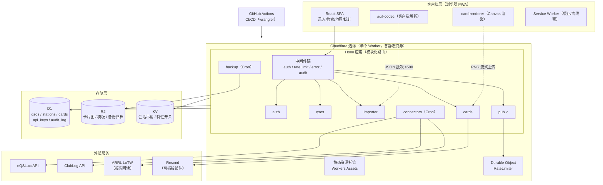
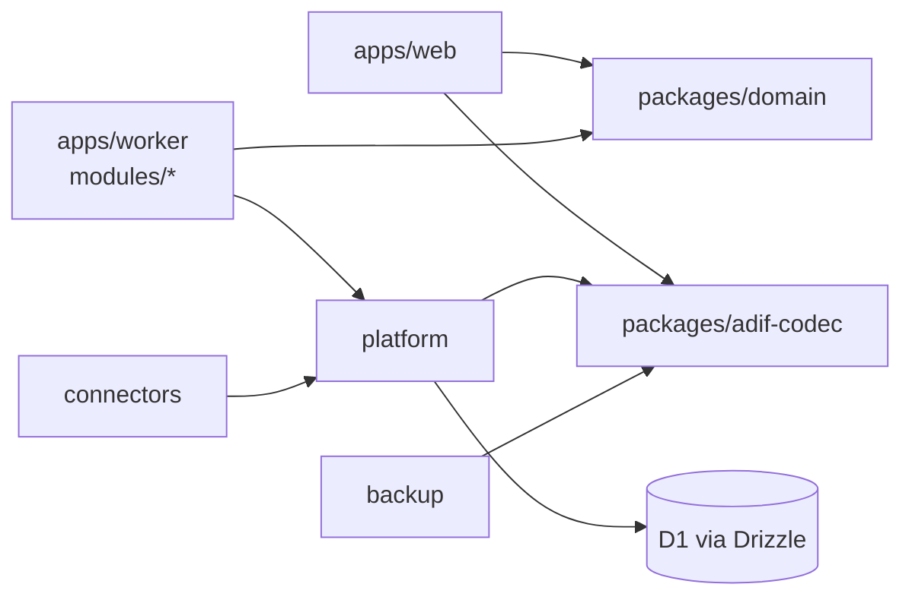
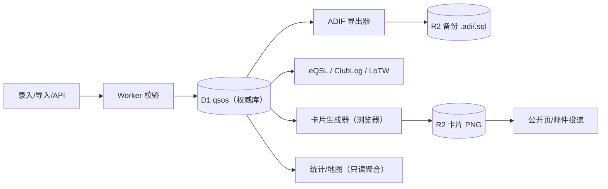
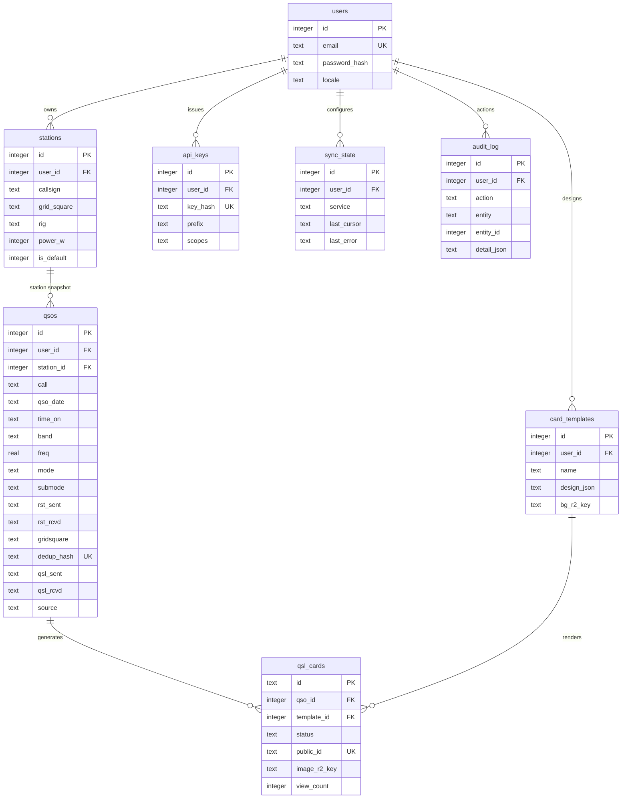

# eQSR 技术解决方案 v1.0

> **eQSR** = electronic QSO & QSL Record（电子通联与 QSL 记录系统）
> 方案路线：**方案二 —— Cloudflare 原生自建（Workers + D1 + R2 + KV）**
> 文档版本：v1.0（2026-09-03） · 状态：待评审
> 前置调研：《qsl_study.md》（2026-09-03）
> 面向读者：系统所有者（本人）、后续维护的 AI 辅助工程师

---

## 目录

1. [背景与目标](#1-背景与目标)
2. [整体架构设计](#2-整体架构设计)
3. [核心技术选型](#3-核心技术选型)
4. [关键业务流程与数据流](#4-关键业务流程与数据流)
5. [数据模型](#5-数据模型)
6. [接口设计](#6-接口设计)
7. [非功能性设计](#7-非功能性设计)
8. [部署架构](#8-部署架构)
9. [风险与演进规划](#9-风险与演进规划)
10. [附录](#10-附录)

---

## 1. 背景与目标

### 1.1 背景

调研结论（《qsl_study.md》）已确认：

- 成熟 Web 通联日志系统（Wavelog/Cloudlog）均为 PHP + MySQL 架构，**无法运行在 Cloudflare Workers/Pages 免费层**；
- GitHub 上不存在"成熟且 Cloudflare 原生"的 QSO 日志项目，现代栈候选（ollog、HamLog、ham-log 等）均为个位数 star 的个人项目，不足以托付多年通联数据；
- Cloudflare 免费额度（Workers 10 万请求/日、D1 5 GB 存储 + 500 万行读/日、R2 10 GB 零出网费）对个人通联日志的预估用量有 2 个数量级以上的富余。

因此选择**在 Cloudflare 免费层上自建轻量系统**：牺牲"开箱即用"，换取零月费、零运维、全球边缘可达、数据 100% 归自己掌控。

### 1.2 目标（v1 范围）

| 编号 | 目标 | 验收标准 |
|---|---|---|
| G1 | 通联记录（QSO）在线 CRUD | 手机/平板/电脑浏览器均可录入、检索、编辑，p95 响应 < 500 ms |
| G2 | ADIF 全量双向互通 | 导入 .adi（含去重与预检分类）、一键导出全量 .adi，字段往返无损（见附录 D） |
| G3 | 电子 QSL 卡片生成与投递 | 自定义模板 + 浏览器内渲染 PNG + 公开链接/邮件投递 + 收卡人可查看 |
| G4 | 个人备份闭环 | 每日自动 ADIF + SQLite 导出归档到 R2；可随时整库迁移离场 |
| G5 | 外部确认通道（半自动） | eQSL / ClubLog 定时同步；LoTW 支持签名前导出 + 确认报告回读 |
| G6 | 数据主权 | 所有原始数据仅存于本人 Cloudflare 账号（D1 + R2），任意时刻可完整导出 |

### 1.3 非目标（v1 明确不做）

- 不做多用户注册体系（单用户 + 预留多用户表结构）；
- 不做奖项自动跟踪（DXCC/WAS 计数器放 v2，v1 仅提供按实体/波段统计）；
- 不做 CAT 电台控制、WSJT-X 实时联动（v1 提供 REST API 供第三方日志软件推送，如 WSJT-X 的 UDP→HTTP 网关脚本）；
- 不做纸质 QSL 卡片打印排版（沿用现有 qsl_design_samples 的设计稿，v1 仅输出 PNG）；
- 不替代 LoTW 的签名体系（TQSL 仍在桌面端完成）。

### 1.4 核心约束

| 约束 | 内容 |
|---|---|
| C1 成本 | 月度运行成本为 0（Cloudflare 免费层）；仅域名约 ¥70/年 |
| C2 平台 | 全部组件运行于 Cloudflare 边缘（Workers 生态），无常驻服务器 |
| C3 标准 | QSO 数据以 **ADIF 3.1.4** 为权威交换格式；时间一律 **UTC / RFC 3339** |
| C4 合规 | 数据存储于境外节点；系统定位个人自用，不公开注册；个人信息最小化收集 |
| C5 可离场 | 不产生对 Cloudflare 私有数据格式的依赖：D1 即标准 SQLite（可 `wrangler d1 export` 导出 .sql），业务数据可全部降级为 ADIF + JSON |

---

## 2. 整体架构设计

### 2.1 架构总览



**设计要点**：全系统只有一个部署单元（单个 Worker + 绑定资源），客户端与 API 同域（无 CORS、Cookie 天然可用）；重 CPU 工作（ADIF 解析、卡片位图渲染）**下沉到浏览器端**，以规避 Workers 免费层单请求 10 ms CPU 限制。

### 2.2 分层与模块划分

| 层 | 模块 | 职责 | 代码位置（monorepo） |
|---|---|---|---|
| 展示层 | `web` | React SPA：录入表单、日志表格、Leaflet 地图、统计、卡片设计器 | `apps/web/src/` |
| 展示层 | `web/pwa` | Service Worker：静态缓存、离线壳（v1.1 扩展为离线录入队列） | `apps/web/src/pwa/` |
| 边缘应用层 | `platform` | 横切基础设施：DB 访问（Drizzle）、JWT 签发校验、统一错误（RFC 9457）、结构化日志、限流客户端 | `apps/worker/src/platform/` |
| 边缘应用层 | `modules/auth` | 注册（仅初始化开放）、登录、登出、会话、API Key 管理 | `apps/worker/src/modules/auth/` |
| 边缘应用层 | `modules/qsos` | QSO CRUD、去重、检索（游标分页）、统计聚合 | `apps/worker/src/modules/qsos/` |
| 边缘应用层 | `modules/importer` | 批量导入（服务端校验 + 分类：ready/warning/duplicate/rejected）、ADIF 导出生成 | `apps/worker/src/modules/importer/` |
| 边缘应用层 | `modules/cards` | 卡片元数据、模板 CRUD、R2 对象读写、投递、公开查看 | `apps/worker/src/modules/cards/` |
| 边缘应用层 | `modules/connectors` | eQSL / ClubLog / LoTW 外部同步（仅被 Cron 与管理 API 触发） | `apps/worker/src/modules/connectors/` |
| 边缘应用层 | `modules/backup` | 定时备份：ADIF 导出 + D1 逻辑导出 → R2 | `apps/worker/src/modules/backup/` |
| 共享内核 | `packages/adif-codec` | ADIF 3.1.4 编解码器（parse/serialize，前后端共用） | `packages/adif-codec/src/` |
| 共享内核 | `packages/domain` | zod schema、类型、常量（波段表/模式表）、dedup_hash 定义 | `packages/domain/src/` |
| 部署 | `infra` | wrangler.toml、D1 migrations SQL、GitHub Actions workflow | `infra/` |

### 2.3 模块依赖关系与边界规则



**边界规则（强制，CI 以 dependency-cruiser 校验）**：

1. 业务模块（auth/qsos/importer/cards/connectors/backup）**禁止横向相互 import**，跨模块调用只能经由对方暴露的 service 接口（同仓库内直接函数调用，但必须走 `modules/<m>/service.ts` 公共入口）；
2. 业务模块只允许依赖 `platform` 与 `packages/*`，**禁止直接使用 `env.DB` 之外的绑定**（R2/KV/DO 一律经 platform 封装，便于测试替身）；
3. `connectors` 与 `backup` 中的外部网络调用必须经过统一的 `httpClient`（platform 提供，带超时与重试），禁止裸 `fetch`；
4. `packages/*` 不得依赖任何 Cloudflare 运行时 API（保证可移植、可单测）。

### 2.4 关键调用链路

**链路 A —— 浏览器手工录入一条 QSO**

```
浏览器表单
  → zod 前置校验（packages/domain）
  → POST /api/v1/qsos （Cookie: __Host-eqsr_session）
  → Hono 中间件链: requestId → logger → rateLimit(user) → auth(JWT)
  → QsoService.create()
      ├─ 组装 dedup_hash = sha256(station_callsign|call|band|mode|qso_date|time_on 去空格大写)
      ├─ INSERT INTO qsos ... ON CONFLICT(user_id, dedup_hash) → 命中则返回 409 + duplicate_of
      └─ INSERT audit_log (action=qso.create)
  → 201 { id, ... } → 浏览器乐观更新表格
```

**链路 B —— ADIF 批量导入（大文件）**

```
浏览器选择 .adi 文件
  → adif-codec.parse()（客户端，零 Worker CPU）
  → 按 500 条/批切分
  → 循环 POST /api/v1/qsos:batchImport { records: [...] }（携带 Idempotency-Key=批次UUID）
  → ImporterService.classify()
      ├─ zod 服务端再校验（拒绝畸形记录 → rejected）
      ├─ dedup_hash 批量查 D1 已存在 → duplicate
      ├─ 波段/模式不在字典但可解析 → warning（默认入库，标记 needs_review）
      └─ ready → INSERT（事务，每批一个事务）
  → 前端聚合各批结果 → 汇总面板（ready/warning/duplicate/rejected 四桶计数）
```

**链路 C —— QSL 卡片生成与投递**

```
设计器: 模板 = 背景图 + 字段坐标/字号/颜色 (design JSON, 存 D1 card_templates)
  → card-renderer 在 <canvas> 按 300 DPI 尺寸渲染 PNG（复用 qsl_design_samples 设计稿）
  → PUT /api/v1/cards/{cardId}/image （Worker 流式转发 R2, Content-Type 校验 image/png, ≤4 MB）
  → POST /api/v1/cards/{cardId}:send { channel: "email"|"link" }
      ├─ email → MailSender(ResendProvider) 发送查看链接
      └─ link  → 直接返回 https://<域名>/c/{publicId}
收卡人打开 /c/{publicId}
  → Worker 路由 public.viewCard
  → RateLimiter DO: 按 IP 令牌桶（60 req/min）
  → 渲染公开页（仅卡片内容 + 我方呼号，无其他 PII）
  → UPDATE qsl_cards SET first_viewed_at / view_count（异步即发即弃）
```

**链路 D —— 每日备份（Cron Trigger，UTC 20:00）**

```
scheduled('0 20 * * *')
  → BackupService.run()
      ├─ SELECT 全量 qsos → adif-codec.serialize() → R2: backups/{uid}/adif/YYYYMMDD.adi
      ├─ wrangler 侧逻辑导出（见 8.4：D1 逻辑 dump → R2: backups/{uid}/sql/YYYYMMDD.sql）
      └─ R2 Lifecycle: backups/ 前缀 30 天后自动清理（保留每月 1 日永久版本需另列）
  → 写 audit_log + Workers Logs 结构化事件
```

---

## 3. 核心技术选型

### 3.1 选型总表

| 层面 | 选型 | 版本基线 | 替代方案（未选原因） |
|---|---|---|---|
| 运行时 | Cloudflare Workers（V8 Isolate，JS/TS） | wrangler ^4 | Cloudflare Containers（常驻负载约 $33–58/月，违反 C1）；VPS（放弃零运维） |
| Web 框架 | **Hono** | ^4.9 | itty-router（生态与中间件弱）；Express（非 Workers 原生） |
| ORM / 迁移 | **Drizzle ORM + drizzle-kit** | ^0.44 / ^0.31 | Prisma（D1 适配需 adapter，驱动体积大）；Kysely（无迁移工具链） |
| 数据库 | **D1**（SQLite，带 Time Travel） | — | Supabase/Neon（引入第二家供应商，违反 C2） |
| 对象存储 | **R2**（S3 兼容，零出网费） | — | D1 存 BLOB（10 GB 上限挤占关系数据） |
| 缓存/开关 | Workers KV | — | D1（写配额 10 万行/日会被会话类高频写吃掉） |
| 限流 | Durable Object（令牌桶） | — | KV（免费层 1000 写/日不够）；WAF Rate Limiting（免费层规则数少且不可编程） |
| 认证 | 自研：PBKDF2(WebCrypto) + JWT(jose) HttpOnly Cookie；API Key | — | Cloudflare Access（覆盖交互端好用，但程序化 API 仍需自定义密钥体系，且移动浏览器 OTP 体验一般）→ 作为可选叠加层 |
| 参数校验 | **zod**（前后端共享 schema） | ^4.1 | ——（事实标准） |
| 前端 | React + Vite + Tailwind CSS | ^19 / ^7 / ^4.1 | ——（生态最大，与 Workers Assets 集成顺畅） |
| 地图 | Leaflet + OpenStreetMap 瓦片 | ^1.9 | MapLibre GL（矢量瓦片更炫但 bundle 更大，个人日志无必要） |
| 时间 | dayjs（UTC 插件） | ^1.11 | 原生 Date（时区处理易错）；Temporal（尚需 polyfill） |
| ID | nanoid（卡片/批次）；D1 自增（行主键） | ^5.1 | UUIDv4（长且无序，索引局部性差） |
| 邮件 | Resend（REST，免费档 100 封/日） | fetch 直调 | MailChannels Workers 免费通道（2024 年已终止）；SMTP（Workers 无原生 TCP） |
| 测试 | Vitest + @cloudflare/vitest-pool-workers | ^3 / ^1.x | Jest（Workers 环境支持差） |
| CI/CD | GitHub Actions + wrangler-action | — | ——（免费公开/私有仓配额充足） |

### 3.2 逐项选型理由

**(1) 单 Worker + Workers Assets，而不是 Pages + Functions。**
Workers 静态资源托管已成为 Cloudflare 官方主推形态：一个部署单元同时服务 SPA 与 API，同源部署免去 CORS 与 Cookie 跨站配置；`wrangler deploy` 一次发布全部资源。Pages 仍可用作替代，但官方重心已迁移。

**(2) Drizzle ORM。**
D1 是 SQLite，Drizzle 对 D1 有一等绑定支持（`drizzle(env.DB)`）、SQL 风格声明式 schema、`drizzle-kit generate` 产出纯 SQL 迁移文件（落库到 `infra/migrations/`，可人工审查）——满足"迁移文件必须可读可审"的运维要求。生成的 SQL 保持标准 SQLite 方言，配合 C5 的可离场约束。

**(3) 认证不引入第三方库之外的重框架，采用"平台原生 + jose"。**
- 密码散列：WebCrypto `PBKDF2-SHA256`（100,000 轮，随机 16 字节盐，格式 `pbkdf2$100000$<b64salt>$<b64hash>`）。不引入 bcryptjs 的原因：bcrypt 是 CPU 密集实现，在 Workers 10 ms CPU 限制内有超时风险，PBKDF2 由原生 crypto 实现更快。
- 会话：JWT（HS256，`jose` 签发校验），`exp` 7 天，存放于 `__Host-eqsr_session` Cookie（`Secure; HttpOnly; SameSite=Lax; Path=/`）。吊销名单存 KV（`logout:<jti>`，TTL = 剩余有效期），满足登出即时失效。遵循 RFC 7519 与 RFC 8725（JWS 最佳实践：显式 `alg` 白名单、短密钥轮换周期）。
- 程序化访问：API Key 形如 `eqsr_<32 字节随机 base64url>`，D1 仅存 SHA-256 散列 + 前 8 位明文前缀（展示用），校验用常数时间比较。

**(4) 重计算下沉浏览器。**
ADIF 解析与卡片位图渲染都在客户端完成：前者是纯字符串处理（10 万行 QSO 约 20 MB 文本，Worker 端解析会撞 CPU 上限），后者需要字体光栅化。两端共享 `packages/adif-codec` 与 `packages/domain`，保证校验逻辑单源。

**(5) 邮件 Provider 抽象（`MailSender` 接口）。**
历史上 MailChannels 免费通道关停的教训：外部服务必须可插拔。`ResendProvider` 仅 ~40 行 fetch 封装；若配额或条款变化，新增 Provider 或降级为"仅链接投递"模式。

### 3.3 自研模块清单与"为什么不复用"

| 自研模块 | 规模 | 无法复用现有组件的原因 |
|---|---|---|
| `packages/adif-codec` | ~400 行 + 测试 | npm 上的 TS ADIF 库（adif-parser-ts、hamlib-adif 等）普遍仅支持解析、不支持序列化，维护停滞（最后更新 3 年前+），且不覆盖 ADIF 3.1.4 的 `HDR/EOH/EOR` 结构、`APP_` 自定义字段透传。ADIF 规范本身简单（长度前缀的 `<FIELD:len>value` 文法），自研 + 黄金用例测试（往返无损）成本低于改造旧库 |
| `card-renderer`（浏览器端） | ~300 行 | 服务端渲染方案（satori + resvg-wasm）需打包中文字体（≥5 MB）且位图生成有 CPU 超时风险；客户端 Canvas 渲染零后端成本且所见即所得。无成熟开源"QSL 卡片浏览器渲染器"可复用（调研见 qsl_study.md §3.2） |
| `modules/connectors` | ~600 行 | 无统一维护的多平台确认同步库：eQSL（表单式 HTTP + AG 身份）、ClubLog（REST + API Key）、LoTW（登录会话 + 报告下载）三者协议互不兼容，必须逐家适配并各自维护重试/游标状态 |
| dedup_hash 去重策略 | ~60 行 | 各家日志软件去重口径不一（时间窗/频段容差）；采用 ADIF 精确字段组合 + 前端"时间±3 分钟"软提示，属业务规则而非可复用组件 |

---

## 4. 关键业务流程与数据流

### 4.1 QSO 录入（三入口合一）

| 入口 | 链路 | 去重行为 |
|---|---|---|
| 手工表单 | 链路 A（§2.4） | 唯一约束硬去重，409 + `duplicate_of` |
| REST API | `POST /api/v1/qsos`（API Key） | 同上；支持 `?on_duplicate=return_existing` 返回 200 |
| ADIF 导入 | 链路 B | 批量预检分类，duplicate 桶默认跳过，可选强制导入（标记 `forced_import=1`） |

录入表单字段分三组（对齐 ADIF 语义）：
1. **台站快照**（`my_callsign / my_grid / my_rig / tx_power`，取自默认 station，可覆盖）；
2. **通联数据**（`call / qso_date / time_on / band / freq / mode / submode / rst_sent / rst_rcvd / gridsquare / name / qth / comment / prop_mode / sat_name / contest_id`）；
3. **软校验提示**（不阻断）：波段-频率匹配表、A 类操作权限功率上限（>25 W 于 30–3000 MHz 时提示，依据国内操作权限分级）、网格坐标格式（Maidenhead 4/6/8 位正则）。

### 4.2 QSL 卡片生命周期

```
draft（创建，绑定 qso + template）
  → ready（PNG 上传 R2 成功）
  → sent（生成 publicId + 可选邮件投递）
  → viewed（收卡人首次打开公开页）
  → exchanged（收卡人回卡，手工标记或 v2 双向匹配）
任一状态可 void（作废，公开页返回 410）
```

publicId 采用 22 字符 nanoid（URL-safe，不可枚举）；公开页不暴露收件人邮箱等 PII。

### 4.3 外部确认同步（connectors）

| 平台 | 方向 | 机制 | 触发 |
|---|---|---|---|
| eQSL.cc | 上行 | 官方 ImportADIF 接口（表单 POST，需 AG 认证账号）；每批 ≤100 条 | Cron 每日 1 次 + 手动 |
| eQSL.cc | 下行 | DownloadInBox 下载收件 ADIF，回写 `eqsl_rcvd` | 同上 |
| ClubLog | 上行 | 官方 REST（`POST /realtimeapi/qso/upload`，API Key），返回去重结果 | 同上 |
| LoTW | 上行 | **无开放上传 API**（需 TQSL 数字签名）：系统提供"待签名 ADIF 导出"清单，桌面 TQSL 签名后经 ARRL 页面上传 | 手动 |
| LoTW | 下行 | `lotwreport.adi` 确认报告下载（账号会话），按 `call+band+qso_date` 回写 `lotw_rcvd` | Cron 每日 1 次 |

同步状态持久化在 `sync_state` 表（游标 + 最近错误），失败重试遵循统一 httpClient 的指数退避（最多 3 次）。

### 4.4 数据流总图



**不变式**：D1 中的 `qsos` 表是唯一权威数据源（Source of Truth）；R2 中一切对象（卡片、备份）均为**可再生的派生物**——删库重建时，只要 D1 + 模板 JSON 在，卡片可重渲染，备份可重导出。

---

## 5. 数据模型

### 5.1 存储职责划分

| 存储 | 存什么 | 不存什么 |
|---|---|---|
| D1 | 全部结构化业务数据（下节 DDL） | 二进制（图片/文件） |
| R2 | 卡片 PNG、模板背景图、每日备份（.adi/.sql） | 任何权威业务数据 |
| KV | JWT 吊销名单、特性开关 | 高频写数据（配额 1000 写/日） |

### 5.2 ER 图



### 5.3 核心 DDL（`infra/migrations/0001_init.sql`，SQLite 方言）

```sql
PRAGMA foreign_keys = ON;

CREATE TABLE users (
  id            INTEGER PRIMARY KEY AUTOINCREMENT,
  email         TEXT NOT NULL UNIQUE,
  password_hash TEXT NOT NULL,                      -- pbkdf2$100000$salt$hash
  display_name  TEXT,
  locale        TEXT NOT NULL DEFAULT 'zh-CN',
  created_at    TEXT NOT NULL DEFAULT (datetime('now')),
  updated_at    TEXT NOT NULL DEFAULT (datetime('now'))
);

CREATE TABLE stations (
  id             INTEGER PRIMARY KEY AUTOINCREMENT,
  user_id        INTEGER NOT NULL REFERENCES users(id) ON DELETE CASCADE,
  callsign       TEXT NOT NULL,
  station_callsign TEXT,
  operator       TEXT,
  grid_square    TEXT,                               -- Maidenhead，如 PM01GC
  qth            TEXT, city TEXT, country TEXT,
  cq_zone        INTEGER, itu_zone INTEGER,
  rig            TEXT, antenna TEXT, power_w INTEGER,
  is_default     INTEGER NOT NULL DEFAULT 0,
  created_at     TEXT NOT NULL DEFAULT (datetime('now')),
  updated_at     TEXT NOT NULL DEFAULT (datetime('now'))
);
CREATE INDEX idx_stations_user ON stations(user_id);

CREATE TABLE qsos (
  id           INTEGER PRIMARY KEY AUTOINCREMENT,
  user_id      INTEGER NOT NULL REFERENCES users(id) ON DELETE CASCADE,
  station_id   INTEGER NOT NULL REFERENCES stations(id),
  -- ADIF 3.1.4 核心字段（字段名对齐 ADIF 大写规范，存小写）
  call         TEXT NOT NULL,
  qso_date     TEXT NOT NULL,                       -- YYYYMMDD
  time_on      TEXT NOT NULL,                       -- HHMMSS
  band         TEXT, freq REAL,
  mode         TEXT, submode TEXT,
  rst_sent     TEXT, rst_rcvd TEXT,
  gridsquare   TEXT, name TEXT, qth TEXT, comment TEXT,
  tx_power     REAL, prop_mode TEXT, sat_name TEXT, contest_id TEXT,
  -- 台站快照（ADIF MY_* 字段）
  my_callsign  TEXT, my_grid TEXT, my_rig TEXT, my_power REAL,
  -- 派生与状态
  dedup_hash   TEXT NOT NULL,
  qsl_sent     TEXT NOT NULL DEFAULT 'N',           -- N|R|S|V (ADIF QSL_SENT 枚举)
  qsl_rcvd     TEXT NOT NULL DEFAULT 'N',
  eqsl_rcvd    INTEGER NOT NULL DEFAULT 0,
  lotw_rcvd    INTEGER NOT NULL DEFAULT 0,
  clublog_synced INTEGER NOT NULL DEFAULT 0,
  forced_import INTEGER NOT NULL DEFAULT 0,
  source       TEXT NOT NULL DEFAULT 'manual',      -- manual|api|adif|connector
  created_at   TEXT NOT NULL DEFAULT (datetime('now')),
  updated_at   TEXT NOT NULL DEFAULT (datetime('now')),
  -- 展示用 UTC 时间（RFC 3339），由生成列从 qso_date/time_on 派生
  datetime_utc TEXT GENERATED ALWAYS AS (
    substr(qso_date,1,4) || '-' || substr(qso_date,5,2) || '-' || substr(qso_date,7,2)
    || 'T' || substr(time_on,1,2) || ':' || substr(time_on,3,2) || ':' || substr(time_on,5,2) || 'Z'
  ) STORED,
  UNIQUE (user_id, dedup_hash)
);
-- 关键索引：默认查询 = 按用户 + 时间倒序游标分页
CREATE INDEX idx_qsos_user_date ON qsos(user_id, datetime_utc DESC);
CREATE INDEX idx_qsos_call      ON qsos(user_id, call);
CREATE INDEX idx_qsos_band      ON qsos(user_id, band, mode);

CREATE TABLE card_templates (
  id         INTEGER PRIMARY KEY AUTOINCREMENT,
  user_id    INTEGER NOT NULL REFERENCES users(id) ON DELETE CASCADE,
  name       TEXT NOT NULL,
  design_json TEXT NOT NULL,                        -- 字段坐标/字号/颜色布局描述
  bg_r2_key  TEXT,                                  -- R2 背景图对象键
  created_at TEXT NOT NULL DEFAULT (datetime('now'))
);

CREATE TABLE qsl_cards (
  id           TEXT PRIMARY KEY,                    -- nanoid
  user_id      INTEGER NOT NULL REFERENCES users(id) ON DELETE CASCADE,
  qso_id       INTEGER NOT NULL REFERENCES qsos(id) ON DELETE CASCADE,
  template_id  INTEGER REFERENCES card_templates(id),
  status       TEXT NOT NULL DEFAULT 'draft',       -- draft|ready|sent|viewed|exchanged|void
  public_id    TEXT NOT NULL UNIQUE,                -- nanoid(22)，公开页令牌
  image_r2_key TEXT,
  recipient_email TEXT,
  sent_at      TEXT, first_viewed_at TEXT,
  view_count   INTEGER NOT NULL DEFAULT 0,
  created_at   TEXT NOT NULL DEFAULT (datetime('now'))
);
CREATE INDEX idx_cards_user ON qsl_cards(user_id, created_at DESC);
CREATE INDEX idx_cards_qso  ON qsl_cards(qso_id);

CREATE TABLE api_keys (
  id           INTEGER PRIMARY KEY AUTOINCREMENT,
  user_id      INTEGER NOT NULL REFERENCES users(id) ON DELETE CASCADE,
  name         TEXT NOT NULL,
  key_hash     TEXT NOT NULL UNIQUE,                -- sha256(key)
  prefix       TEXT NOT NULL,                       -- 前 8 位明文，展示定位用
  scopes       TEXT NOT NULL DEFAULT 'qsos:read,qsos:write',
  last_used_at TEXT, expires_at TEXT, revoked_at TEXT,
  created_at   TEXT NOT NULL DEFAULT (datetime('now'))
);

CREATE TABLE sync_state (
  id           INTEGER PRIMARY KEY AUTOINCREMENT,
  user_id      INTEGER NOT NULL REFERENCES users(id) ON DELETE CASCADE,
  service      TEXT NOT NULL,                       -- eqsl|clublog|lotw
  last_sync_at TEXT,
  last_cursor  TEXT,
  last_error   TEXT,
  UNIQUE (user_id, service)
);

CREATE TABLE audit_log (
  id          INTEGER PRIMARY KEY AUTOINCREMENT,
  user_id     INTEGER REFERENCES users(id) ON DELETE SET NULL,
  action      TEXT NOT NULL,                        -- qso.create / card.send / auth.login ...
  entity      TEXT NOT NULL,
  entity_id   TEXT,
  detail_json TEXT,
  ip_hash     TEXT,                                 -- sha256(ip+day_salt)，仅安全审计用
  created_at  TEXT NOT NULL DEFAULT (datetime('now'))
);
CREATE INDEX idx_audit_user ON audit_log(user_id, created_at DESC);
```

### 5.4 R2 对象键规范

```
cards/{user_id}/{card_id}.png                 # 卡片成品（300 DPI）
templates/{user_id}/{template_id}/bg.{ext}    # 模板背景
backups/{user_id}/adif/YYYYMMDD.adi           # 每日 ADIF 备份
backups/{user_id}/sql/YYYYMMDD.sql            # 每日逻辑导出
backups/{user_id}/monthly/YYYYMM.adi          # 每月 1 日永久归档（不清理）
```

### 5.5 容量与配额估算（对齐免费层）

| 资源 | 预估用量（重度个人使用 10 年） | 免费额度 | 余量 |
|---|---|---|---|
| D1 存储 | 3 万条 QSO × 1 KB ≈ 30 MB | 5 GB（帐户总额） | >100× |
| D1 行读 | 日均 500 次查询 × 50 行 ≈ 2.5 万行/日 | 500 万行/日 | 200× |
| D1 行写 | 日均 50 条写入（含审计） | 10 万行/日 | 2000× |
| R2 存储 | 卡片 1 万张 × 500 KB + 备份 ≈ 6 GB | 10 GB | ~1.6×（见 9.1 R-4 治理） |
| Workers 请求 | 日均 < 2000 | 10 万/日 | 50× |
| Workers CPU | 单请求平均 < 3 ms（重活已下沉客户端） | 10 ms/请求 | 充足 |
| KV 写 | 日均 < 20（登出/开关） | 1000/日 | 50× |

---

## 6. 接口设计

### 6.1 全局规范

| 项 | 约定 | 遵循标准 |
|---|---|---|
| 版本 | URI 版本 `/api/v1`，破坏性变更升 v2 并行 ≥ 6 个月 | 语义化版本 SemVer 2.0（API 层面沿用） |
| 媒体类型 | 请求/响应 `application/json; charset=utf-8`；ADIF 导出端点返回 `text/x-adif`（`attachment; filename=*.adi`） | RFC 9110 |
| 时间 | 一律 UTC，RFC 3339 格式；ADIF 字段保持 `YYYYMMDD/HHMMSS` 原生格式 | RFC 3339 / ISO 8601 |
| 错误 | RFC 9457 Problem Details（`type/title/status/detail/instance` + 业务扩展字段） | RFC 9457 |
| 分页 | 游标分页：`?limit=50&cursor=<base64(datetime_utc,id)>`，响应含 `next_cursor`，禁止 offset 翻页（防深翻页全表扫描） | —— |
| 幂等 | `POST` 批量端点必须携带 `Idempotency-Key`（UUID，5 分钟窗口去重）；QSO 去重由 `dedup_hash` 唯一约束兜底 | IETF draft-ietf-httpapi-idempotency-key-header |
| 字段命名 | JSON `snake_case`（与 ADIF 字段名直接对应，降低映射成本） | —— |
| 认证 | 浏览器：`__Host-eqsr_session` Cookie（JWT）；程序化：`Authorization: Bearer eqsr_...` 或 `X-API-Key` | RFC 6750（Bearer 用法参照） |

**错误响应示例**：

```json
{
  "type": "https://eqsr.example/errors/duplicate-qso",
  "title": "Duplicate QSO",
  "status": 409,
  "detail": "相同台站/呼号/波段/模式/时间的 QSO 已存在",
  "instance": "/api/v1/qsos",
  "duplicate_of": 1042
}
```

### 6.2 认证与账户

| 方法 | 路径 | 说明 |
|---|---|---|
| POST | `/api/v1/auth/bootstrap` | 初始化唯一账户（仅当 users 表为空时可用，之后永久 410） |
| POST | `/api/v1/auth/login` | `{email, password}` → Set-Cookie；失败计数（限流 5 次/分钟/IP） |
| POST | `/api/v1/auth/logout` | 写 KV 吊销名单 |
| GET | `/api/v1/auth/me` | 当前用户 + 默认台站 |
| GET/POST/DELETE | `/api/v1/api-keys`、`/api/v1/api-keys/{id}` | Key 创建时明文仅返回一次 |

### 6.3 台站与 QSO

| 方法 | 路径 | 权限 scope | 说明 |
|---|---|---|---|
| GET/POST | `/api/v1/stations` | stations:read/write | 台站档案 CRUD（PATCH/DELETE 略） |
| GET | `/api/v1/qsos` | qsos:read | 过滤参数：`call / band / mode / date_from / date_to / qsl_rcvd / grid / contest_id`，游标分页 |
| POST | `/api/v1/qsos` | qsos:write | 单条创建；`?on_duplicate=return_existing` 可选 |
| PATCH/DELETE | `/api/v1/qsos/{id}` | qsos:write | 编辑/删除（删除写审计日志） |
| POST | `/api/v1/qsos:batchImport` | qsos:write | 已解析记录数组 ≤ 500 条/批 + `Idempotency-Key`；响应四桶分类结果 |
| POST | `/api/v1/qsos:batchDelete` | qsos:write | 按 id 数组 |
| GET | `/api/v1/qsos:stats` | qsos:read | 聚合：按 band/mode/年份/实体计数（GROUP BY，服务端聚合） |
| GET | `/api/v1/export.adif` | qsos:read | 全量/过滤导出，流式生成 |

### 6.4 卡片

| 方法 | 路径 | 说明 |
|---|---|---|
| GET/POST/PATCH/DELETE | `/api/v1/card-templates` | 模板 CRUD（design_json + 背景图） |
| PUT | `/api/v1/card-templates/{id}/bg` | 背景图上传（≤4 MB，png/jpeg） |
| POST | `/api/v1/cards` | `{qso_id, template_id}` → draft |
| PUT | `/api/v1/cards/{id}/image` | 客户端渲染 PNG 上传（image/png, ≤4 MB）→ ready |
| POST | `/api/v1/cards/{id}:send` | `{channel: "email"\|"link", to?}` → sent |
| POST | `/api/v1/cards/{id}:mark` | 手工标记 exchanged / void |
| GET | `/api/v1/cards` | 卡片列表（状态/时间过滤） |

### 6.5 公开接口（无需认证，独立限流）

| 方法 | 路径 | 说明 |
|---|---|---|
| GET | `/c/{public_id}` | 卡片公开查看页（HTML）；void/不存在统一 410/404，防枚举；60 req/min/IP |
| GET | `/api/v1/public/cards/{public_id}` | 卡片数据 JSON（仅卡片可见字段：双方呼号、日期、频率、模式、RST、QTH、卡片图 URL） |

### 6.6 集成与运维

| 方法 | 路径 | 说明 |
|---|---|---|
| POST | `/api/v1/integrations/eqsl:sync`、`clublog:sync` | 手动触发同步（Cron 之外的补充入口） |
| GET | `/api/v1/integrations/status` | 各服务 `last_sync_at / last_error` |
| POST | `/api/v1/backup:run` | 手动触发备份 |
| GET | `/healthz`、`/readyz` | 存活/就绪（readyz 探测 D1 `SELECT 1`） |

### 6.7 契约管理

- OpenAPI 3.1 规范文件由 `zod` schema 经 `zod-openapi` 生成（`packages/domain` 单一来源），随 CI 产出 `openapi.json` 并在仓库内版本化；
- 客户端类型由 OpenAPI 生成（`openapi-typescript`），杜绝前后端字段漂移。

---

## 7. 非功能性设计

### 7.1 性能

| 关注点 | 设计 |
|---|---|
| 延迟 | 边缘执行（V8 Isolate 冷启动 < 5 ms）；D1 建库时指定 `location hint = apac`（主副本置于亚太，贴近国内访问路径）；静态资源走边缘缓存 |
| 查询 | 全部列表查询走覆盖索引 + 游标分页（keyset），无 OFFSET；统计查询 `GROUP BY` 命中 `idx_qsos_band` |
| 前端 | 路由级代码分割；Leaflet 瓦片懒加载；表格虚拟滚动（日志 > 1000 条时） |
| 大导入 | 客户端解析 + 500 条/批，单批事务，失败批次不回滚已成功批次（幂等键防重放） |
| 预算 | API p95 < 300 ms（同区域 D1）、p99 < 800 ms；页面 LCP < 2 s（4G 模拟） |

### 7.2 安全（对齐 OWASP Top 10 2021 与 OWASP ASVS 4.0 L1-L2）

| 域 | 措施 |
|---|---|
| 传输 | 全站 HTTPS，TLS 1.3（RFC 8446），HSTS `max-age=31536000; includeSubDomains`（Cloudflare 边缘自动） |
| 认证 | PBKDF2 10 万轮 + 16 字节随机盐；登录限流 5 次/分/IP（DO 令牌桶）；JWT 短有效期 + KV 吊销 |
| 会话 | Cookie 四属性齐备（`__Host-` 前缀 / Secure / HttpOnly / SameSite=Lax）；CSRF：SameSite + 状态变更请求强制 `X-Requested-With: XMLHttpRequest` 头 + Origin 校验 |
| 注入 | Drizzle 参数化查询，业务代码零字符串拼 SQL（CI grep 检查） |
| XSS | React 默认转义 + CSP 响应头（`default-src 'self'; img-src 'self' data: https://*.basemaps.cartocdn.com; style-src 'self' 'unsafe-inline'`），无 innerHTML |
| 越权 | 所有查询强制 `user_id` 谓词（单用户下仍是纵深防御，为 v2 多用户留底） |
| 密钥管理 | 全部密钥走 `wrangler secret`（JWT_SECRET、RESEND_API_KEY、EQSL_PWD、CLOG_KEY、LOTW_PWD），仓库内零明文；`.dev.vars` 仅本地 |
| 审计 | 认证事件、删除、导出、同步、备份全部落 `audit_log`（不可删，仅追加；个人数据删除权通过整体账户删除行使） |
| 依赖安全 | CI 集成 `npm audit --audit-level=high` + Dependabot 周更 |
| 备份安全 | R2 桶私有，仅经 Worker 校验会话后读；公开卡片 URL 是 Worker 路由而非 R2 直链 |

### 7.3 可扩展性

| 维度 | 策略 |
|---|---|
| 数据量 | D1 单库上限 10 GB（帐户 5 GB），个人场景余量 > 100×；触发阈值（80% 容量告警）后：D1 → 导出 → 任意 SQLite/PostgreSQL（Drizzle 方言切换成本低） |
| 读扩展 | 免费层不提供 D1 读副本；统计类只读查询可加 KV 短 TTL 缓存（5 分钟）削峰 |
| 功能扩展 | 模块边界已隔离 connectors/backup；v2 奖项跟踪仅新增 `modules/awards` 只读聚合模块，不触碰写入链路 |
| 并发 | 单用户场景无并发热点；DO 限流器本身即并发协调点，天然线性 |

### 7.4 可观测与运维

| 域 | 方案 |
|---|---|
| 日志 | `console.log` 结构化 JSON（含 requestId、user_id、action、耗时）；Workers Logs 免费层 20 万事件/日；`wrangler tail` 实时排障 |
| 错误跟踪 | Workers Logs 按错误级别过滤 + 每周 GitHub Actions 汇总巡检报告（Issue 形式） |
| 指标 | `/healthz` 由 UptimeRobot（免费 5 分钟间隔）外拨监控，宕机邮件告警 |
| 备份恢复 | 每日自动（§2.4 链路 D）；**每季度恢复演练**：从 R2 取最近 .sql + .adi，在本地 wrangler dev 中完整重建并比对行数 |
| 变更管理 | 全部基础设施即代码（wrangler.toml + migrations）；生产部署仅经 CI，禁止手工 dashboard 改配置 |

### 7.5 合规

| 项 | 说明 |
|---|---|
| 个人信息最小化（PIPL/GDPR 数据最小化原则） | 系统仅收集：本人账户邮箱、呼号、通联记录（呼号/网格/名称/QTH 为对方在电波中自愿公开的业余无线电业务信息）。不收集手机号、身份证、位置轨迹 |
| 个人信息权利 | 导出权：`/api/v1/export.adif` + 账户全量 JSON 导出（v1.1）；删除权：账户级删除级联清理 D1/R2 |
| 境外存储告知 | 数据存储于 Cloudflare 全球边缘（D1 主副本亚太区），域名解析不涉及境内节点、无需 ICP 备案；本人自用场景 |
| 无线电合规 | 依据《业余无线电台管理办法》及 CRAC 操作权限分级做**软校验提示**（如 A 类功率上限），不阻断录入；频率-波段对照参考 IARU Region 3 波段计划 |
| 日志内容边界 | 系统不校验通联内容合法性（由操作者对通联行为负责），仅提供记录与检索 |

---

## 8. 部署架构

### 8.1 资源清单（单 Cloudflare 帐户）

| 资源 | 名称（示例） | 说明 |
|---|---|---|
| Worker | `eqsr` | 单部署单元：Hono API + 静态资源 + Cron |
| D1 | `eqsr-prod`（`location_hint: apac`）、`eqsr-dev` | 生产/开发各一 |
| R2 | `eqsr-media` | 卡片/模板/备份（生命周期规则：`backups/` 前缀 30 天删除，`monthly/` 除外） |
| KV | `eqsr-meta` | 吊销名单/开关 |
| DO | `RateLimiter` | 单类，多实例（按 key 分片） |
| Cron | 3 条 | `0 12 * * *`（eQSL/ClubLog 同步）、`0 20 * * *`（备份）、`0 2 1 * *`（月度永久归档） |
| 域名 | `log.<自有域名>` | 托管在 Cloudflare DNS；**必须绑定自定义域名**（workers.dev 默认域在境内不可达/极不稳定，见 9.1 R-1） |
| Secrets | 6 个 | 见 7.2 |

### 8.2 环境与 CI/CD

```
GitHub repo（私有）
  ├─ main 分支保护：PR + CI 绿才可合
  ├─ .github/workflows/ci.yml      # lint → typecheck → vitest（vitest-pool-workers 本地起 D1/DO）→ npm audit
  ├─ .github/workflows/cd-dev.yml  # push 到 main → wrangler deploy --env dev（workers.dev 子域）
  └─ .github/workflows/cd-prod.yml # tag v* → d1 migrations apply --remote --env prod → deploy --env prod
```

- CI 凭证：优先 GitHub Actions OIDC（Cloudflare 已支持 GitHub OIDC 信任绑定）；回退方案为最小权限 API Token（仅 Workers Scripts / D1 / R2 / KV 写权限）；
- 数据库变更零手工：迁移只经 CI 的 `wrangler d1 migrations apply`，migration 文件不允许修改历史（只增不改）。

### 8.3 初始化步骤（首次落地，预计 1 个工作日）

1. 域名托管到 Cloudflare DNS，绑 Worker 自定义域；
2. `wrangler d1 create eqsr-prod --location-hint apac` + 建 R2/KV + 配 Secrets；
3. CI 首次部署 + `d1 migrations apply`；
4. 浏览器访问 `/setup` 触发 `auth/bootstrap` 创建唯一账户与默认台站；
5. 导入历史 ADIF（如有）→ 校验四桶报告 → 触发首次备份。

### 8.4 备份与恢复

| 场景 | 操作 | RTO |
|---|---|---|
| 误删部分 QSO | D1 Time Travel 回溯（`wrangler d1 time-travel restore`，保留窗口以官方文档为准，当前口径约 30 天） | < 10 分钟 |
| 整库重建 | R2 取 `sql/YYYYMMDD.sql` → 新 D1 `d1 execute --file` → 重部署 | < 30 分钟 |
| 彻底离场（离开 Cloudflare） | 全量 ADIF（业务层）+ .sql（数据层）+ R2 图像 → 任意 SQLite/PostgreSQL + 静态文件 | < 1 天 |

**D1 逻辑导出的实现**：Workers 运行时内做全表 SELECT → 生成 INSERT 语句流式写 R2（免费层无原生 dump API，`wrangler d1 export` 为 CLI 命令，可由每周 GitHub Actions 定时任务在 CI 环境执行后 `r2 put` 上传，作为每日 Worker 内逻辑导出的补充——双层备份）。

### 8.5 成本核算

| 项 | 月成本 | 说明 |
|---|---|---|
| Workers / D1 / R2 / KV / DO / Cron | ¥0 | 免费层，用量余量见 §5.5 |
| 域名 | ≈ ¥6/月（年付 ~¥70） | 唯一固定支出 |
| Resend 邮件 | ¥0 | 免费档 100 封/日，卡片投递远低于此 |
| UptimeRobot | ¥0 | 免费档 |
| **合计** | **≈ ¥6/月** | 对比方案四（Wavelog + VPS $3–6/月 ≈ ¥25–45/月） |

---

## 9. 风险与演进规划

### 9.1 风险登记表

| ID | 风险 | 概率 | 影响 | 缓解措施 |
|---|---|---|---|---|
| R-1 | **境内访问 Cloudflare 边缘质量波动**（workers.dev 域名基本不可达；自定义域一般可达但偶发慢） | 中 | 高 | 绑定自定义域名（硬性）；SPA 静态资源命中边缘缓存不回源；若长期劣化 → 触发预案 P-2 迁移 |
| R-2 | Cloudflare 免费层条款/额度变更 | 低 | 高 | 每月核对定价页；C5 可离场设计（SQLite + ADIF 双出口）保证 1 天内迁至 VPS（Wavelog 或本系统 Node 部署，Hono/Drizzle 均可脱离 Workers 运行） |
| R-3 | Resend 免费档关停（重演 MailChannels 事件） | 低 | 中 | MailSender 接口抽象；降级为"仅链接投递"模式（零外部依赖） |
| R-4 | R2 备份增长逼近 10 GB | 低 | 中 | 生命周期规则 30 天滚动 + monthly 永久；卡片图可再生（模板 + D1 数据在即可重渲染） |
| R-5 | LoTW 始终无开放上传 API | 高（现状即如此） | 低 | 半自动流程固化（导出→TQSL→上传→回读）；跟踪 ARRL API 动态 |
| R-6 | 单人维护断档 | 中 | 中 | 本文档 + CI 全自动 + 每季度演练写入日历；代码库自述（README + ADR） |
| R-7 | eQSL/ClubLog 接口反爬或改版 | 低 | 低 | connectors 各自独立、失败不阻塞主流程；同步仅是增强，权威数据在本地 |
| R-8 | 10 ms CPU 上限被新功能突破（如服务端报表） | 中 | 中 | 新功能先评估 CPU 预算；报表类计算下放客户端或预聚合落表 |

### 9.2 演进路线

| 版本 | 主题 | 内容 |
|---|---|---|
| **v1.0（本文档）** | 记录与备份 | QSO CRUD / ADIF 双向 / 卡片生成投递 / 每日备份 / eQSL+ClubLog 同步 / LoTW 半自动 |
| v1.1 | 离线与体验 | PWA 离线录入队列（IndexedDB + 后台同步）；账户全量 JSON 导出（个人信息权）；统计仪表盘 |
| v2.0 | 确认与奖项 | eQSL 双向匹配自动化；DXCC/WAS/VUCC 计数器（`modules/awards`，只读聚合）；Passkey（WebAuthn L3）登录 |
| v2.1 | 生态 | WSJT-X → eQSR 的 UDP 网关小工具（转发到 REST API）；对外公开日志 widget（嵌入个人主页，静态 JSON 出口） |
| v3.0 | 扩展 | 多用户（家庭/俱乐部，users 表已预留）；D1 容量治理预案启动条件评估；如境内访问持续劣化 → 执行 P-2（Docker/Node 自托管镜像，同代码库） |

**迁移预案 P-2（离场路径，随 v1 免费获得）**：Hono 可运行于 Node/Bun/Deno，Drizzle 支持 PostgreSQL/MySQL 方言切换，前端为标准 SPA——整体迁移 = 换 runtime adapter + 数据导入，预估 1 个工作日。

---

## 10. 附录

### 附录 A：依赖组件清单（以 `package-lock.json` 锁定为准，版本为 2026-09 基线）

| 组件 | 版本 | 用途 | 许可证 |
|---|---|---|---|
| hono | ^4.9 | Workers 原生 Web 框架（路由/中间件） | MIT |
| drizzle-orm | ^0.44 | 类型安全 ORM（D1 绑定） | Apache-2.0 |
| drizzle-kit | ^0.31 | Schema → SQL 迁移生成 | Apache-2.0 |
| zod | ^4.1 | 运行时校验（前后端共享 schema） | MIT |
| zod-openapi | ^4 | zod schema → OpenAPI 3.1 文档 | MIT |
| jose | ^6.1 | JWT 签发/校验（HS256） | MIT |
| nanoid | ^5.1 | URL-safe 随机 ID（卡片 publicId/幂等键） | MIT |
| dayjs | ^1.11 | UTC 时间处理（+utc 插件） | MIT |
| react / react-dom | ^19.2 | UI 框架 | MIT |
| vite | ^7.1 | 前端构建 | MIT |
| tailwindcss | ^4.1 | 样式 | MIT |
| leaflet / react-leaflet | ^1.9.4 / ^5.0 | 通联地图（OSM 瓦片） | BSD-2 / MIT |
| wrangler | ^4.8 | Cloudflare 开发/部署 CLI | Apache-2.0 / MIT |
| @cloudflare/workers-types | ^4 | Workers 类型 | Apache-2.0 |
| vitest | ^3.2 | 单元/集成测试 | MIT |
| @cloudflare/vitest-pool-workers | ^1.x | Workers 运行时测试池（D1/DO 本地仿真） | Apache-2.0 |
| openapi-typescript | ^7 | OpenAPI → TS 类型 | MIT |
| typescript | ^5.9 | 类型系统 | Apache-2.0 |
| eslint + typescript-eslint | ^9 / ^8 | Lint | MIT |
| dependency-cruiser | ^17 | 架构边界校验（§2.3 规则） | MIT |

> 密码散列、限流、R2 读写均使用平台原生能力（WebCrypto / Durable Objects / R2 Binding），**不引入** bcryptjs、rate-limiter-flexible、@aws-sdk/client-s3（理由见 §3.2）。

### 附录 B：遵循标准索引

| 标准/规范 | 应用位置 |
|---|---|
| ADIF 3.1.4（Amateur Data Interchange Format） | QSO 数据模型与导入导出（§5.3、§6.3） |
| RFC 9110（HTTP 语义） | REST 方法/状态码语义（§6.1） |
| RFC 9457（Problem Details） | 统一错误体（§6.1） |
| RFC 3339 / ISO 8601 | 时间序列化（全系统 UTC） |
| RFC 7519 + RFC 8725 | JWT 格式与 JWS 实现最佳实践（§3.2） |
| RFC 6750 | Bearer Token 用法（API Key 头部约定参照） |
| RFC 8446（TLS 1.3） | 传输安全（边缘默认） |
| OpenAPI 3.1 | API 契约（§6.7） |
| SemVer 2.0.0 | API 版本策略（§6.1） |
| OWASP Top 10（2021）/ OWASP ASVS 4.0 | 安全设计基线（§7.2） |
| W3C CSP Level 3 | 内容安全策略（§7.2） |
| WebAuthn Level 3 | v2.0 Passkey 演进（§9.2） |
| IARU Region 3 波段计划 | 波段-频率软校验（§4.1） |
| 《业余无线电台管理办法》及 CRAC 操作权限分级 | 功率上限软提示（§7.5） |
| PIPL / GDPR 数据最小化原则 | 个人信息收集与权利设计（§7.5） |

### 附录 C：ADIF 字段映射（v1 覆盖集）

| ADIF 字段 | D1 列 | 说明 |
|---|---|---|
| CALL | `call` | 对方呼号（必填） |
| QSO_DATE / TIME_ON | `qso_date` / `time_on` | YYYYMMDD / HHMMSS（必填，UTC） |
| FREQ / BAND | `freq` / `band` | MHz / 波段名（二选一必填，另一自动推导） |
| MODE / SUBMODE | `mode` / `submode` | ADIF 枚举 |
| RST_SENT / RST_RCVD | `rst_sent` / `rst_rcvd` | 信号报告 |
| GRIDSQUARE | `gridsquare` | Maidenhead 4/6/8 位 |
| NAME / QTH / COMMENT | 同名列 | 对方信息与备注 |
| TX_PWR | `tx_power` | 瓦特 |
| PROP_MODE / SAT_NAME | 同名列 | 传播模式/卫星名 |
| CONTEST_ID | `contest_id` | 竞赛 |
| MY_CALL / MY_GRIDSQUARE / MY_RIG / MY_PWR | `my_callsign` / `my_grid` / `my_rig` / `my_power` | 台站快照 |
| QSL_SENT / QSL_RCVD | `qsl_sent` / `qsl_rcvd` | N/R/S/V 枚举 |
| STATION_CALLSIGN | stations 快照 + qsos 冗余 | 多台站溯源 |
| APP_EQSR.* | `forced_import` / `source` | 私有扩展（导出时透传） |

> 未列出的 ADIF 字段（如 IOTA、SOTA_REF、OPERATOR 等）在导入时**透传保留**于 `comment` 之前的原始 JSON 旁路列（`extra_json`，v1.1 增加），保证往返无损。

### 附录 D：术语表

| 术语 | 含义 |
|---|---|
| QSO | 一次双向无线电通联 |
| QSL | 通联确认卡（电子或纸质） |
| ADIF | 业余无线电数据交换格式，.adi 文本文件 |
| LoTW | ARRL Logbook of the World，官方奖项确认体系 |
| dedup_hash | 通联去重指纹（台站+对方呼号+波段+模式+日期时间） |
| R2 / D1 / KV / DO | Cloudflare 对象存储 / 边缘 SQLite / 键值存储 / Durable Objects |
| PWA | 渐进式 Web 应用 |
| Time Travel | D1 时间点回溯能力 |

---

*文档结束。评审通过后，v1.0 冻结，变更走 ADR（architecture decision records）追加。*
